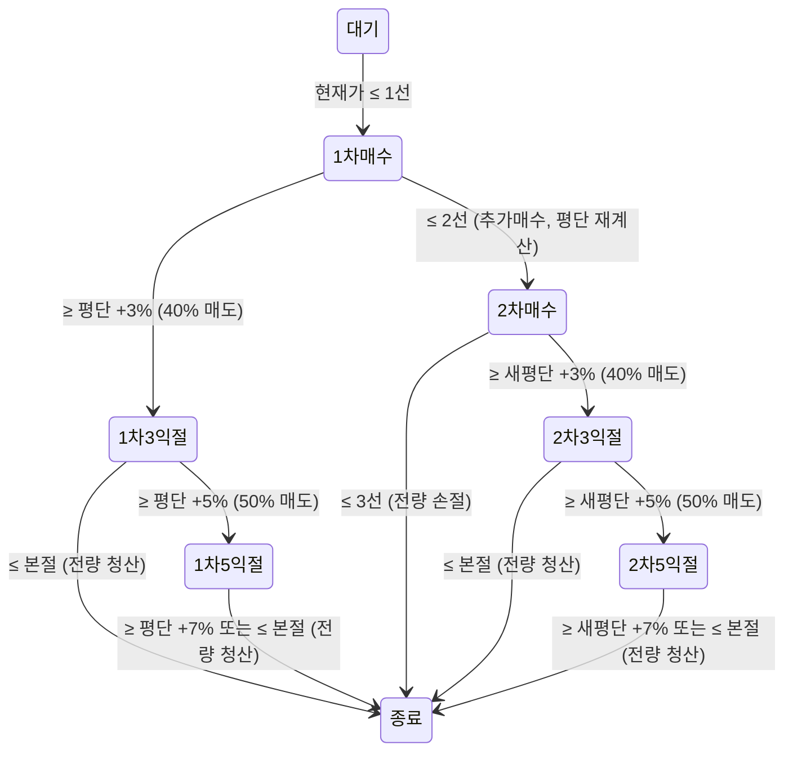

# 3선 자동매매 (three-line-trader)

관심종목의 실시간 시세를 감시하고, 종목별 상태 머신에 따라 자동으로 매수 · 부분 익절 · 청산을 수행하는 국내주식 자동매매 프로그램.

- 증권사 연동: **키움증권 REST API + WebSocket**
- 저장소: **SQLite** (상태 영속화, 장애 복구, 매매 통계)
- 알림: **Discord 봇** (이벤트 발생 시 실시간 수신, 추후 봇 명령어 연동 예정)
- 패키지 관리: **uv**

---

## 1. 전략 개요

관심종목에 편입된 각 종목은 사용자가 직접 설정한 **3개의 기준선**을 가진다.

```
현재가 > 1선 > 2선 > 3선
```

- 가격이 **1선 이탈** 시 1차 매수, **2선 이탈** 시 2차 매수(물타기, 평단 재계산), **3선 이탈** 시 전량 손절
- 상승 시 평단가 대비 **+3% → +5% → +7%** 에서 단계적으로 부분 익절
- 익절 시작 이후에는 추가 매수 없음. 익절 진행 중 **평단가(본절) 이탈 시 잔량 전량 청산**

### 자금 관리와 종목별 설정값

전역 자금 설정: **총 운용금액 ÷ 최대 보유 종목 수 = 종목당 배분 금액**이며, 1·2차 매수 금액은 배분 금액의 절반씩 자동 채움(직접 수정 가능, 합계 ≤ 종목당 배분). 매수 수량은 **매수 트리거 시점의 체결가로 `floor(금액 ÷ 가격)` 즉석 계산**한다. 매수는 항상 기준선 이하에서 발동하므로 "금액 ≥ 기준선"이면 최소 1주 매수가 보장된다 (등록 시 검증).

| 항목                | 설명                                                                                         | 기본값                  |
| ------------------- | -------------------------------------------------------------------------------------------- | ----------------------- |
| 1선 / 2선 / 3선     | 종목마다 개별 설정 (1선 > 2선 > 3선)                                                         | 필수 입력               |
| 1차 / 2차 매수 금액 | **전역 설정** (메인 화면). 적용 시 '대기' 종목에 즉시 반영, 보유 중 종목은 진입 시점 값 유지 | 종목당 배분의 50% / 50% |
| 익절 트리거 %       | **전역 설정** — 평단가 대비 1 / 2 / 3차 익절 기준                                            | 3% / 5% / 7%            |
| 익절 비중           | **전역 설정** — 최초 보유 물량 기준 매도 비율 (합계 100%)                                    | 40% / 50% / 10%         |

---

## 2. 상태 머신

총 **8개 상태**로 구성된다.

```
대기, 1차 매수, 1차 매수 + 3% 익절, 1차 매수 + 5% 익절,
2차 매수, 2차 매수 + 3% 익절, 2차 매수 + 5% 익절, 종료
```



### 상태 전이 규칙

| 현재 상태 | 조건              | 다음 상태     | 액션                                                   |
| --------- | ----------------- | ------------- | ------------------------------------------------------ |
| 대기      | 현재가 ≤ 1선      | 1차 매수      | 1차 매수 (평단 = 체결가)                               |
| 대기      | 현재가 ≤ 2선 (갭) | 2차 매수      | 1·2차 수량을 **한 주문으로 동시 매수** (평단 = 체결가) |
| 대기      | 현재가 ≤ 3선 (갭) | 종료          | **주문 없음.** 진입 금지, 당일 매매하지 않음           |
| 1차 매수  | ≥ 평단 × 1.03     | 1차 + 3% 익절 | 최초 물량의 40% 매도                                   |
| 1차 매수  | ≤ 2선             | 2차 매수      | 추가 매수, 평단가 재계산                               |
| 1차 + 3%  | ≥ 평단 × 1.05     | 1차 + 5% 익절 | 최초 물량의 50% 매도                                   |
| 1차 + 3%  | ≤ 평단 (본절)     | 종료          | 잔량 전량 청산                                         |
| 1차 + 5%  | ≥ 평단 × 1.07     | 종료          | 잔량 전량 청산                                         |
| 1차 + 5%  | ≤ 평단 (본절)     | 종료          | 잔량 전량 청산                                         |
| 2차 매수  | ≥ 새 평단 × 1.03  | 2차 + 3% 익절 | 최초 물량의 40% 매도                                   |
| 2차 매수  | ≤ 3선             | 종료          | 전량 청산 (손절)                                       |
| 2차 + 3%  | ≥ 새 평단 × 1.05  | 2차 + 5% 익절 | 최초 물량의 50% 매도                                   |
| 2차 + 3%  | ≤ 새 평단 (본절)  | 종료          | 잔량 전량 청산                                         |
| 2차 + 5%  | ≥ 새 평단 × 1.07  | 종료          | 잔량 전량 청산                                         |
| 2차 + 5%  | ≤ 새 평단 (본절)  | 종료          | 잔량 전량 청산                                         |

### 설계 원칙

- 익절 % 와 본절 기준은 **항상 그 시점의 평단가 기준**. 2차 매수 후에는 낮아진 새 평단가로 전부 재설정된다. 매도(익절)는 평단가를 바꾸지 않는다.
- 익절 비중은 **최초 보유 물량 기준**. 2차 매수 경로에서 최초 물량 = 1차 + 2차 매수 합산 총량.
- **익절 시작 후 추가 매수 없음.** 평단 > 2선이 구조적으로 보장되므로 익절 상태에서 하락하면 2선 도달 전에 본절 청산이 먼저 발동한다.
- 일반적 하락 흐름: `1차 매수 → 2차 매수 → 3선 손절`

---

## 3. 운영 규칙

| 규칙            | 내용                                                                                                                                                                                                                                                                                              |
| --------------- | ------------------------------------------------------------------------------------------------------------------------------------------------------------------------------------------------------------------------------------------------------------------------------------------------- |
| 판정 가격       | **WebSocket 실시간 체결가(0B)** 기준으로 조건 판정. 모든 가격 조건은 **터치 시 발동** (하락 조건 ≤, 상승 조건 ≥)                                                                                                                                                                                  |
| 주문 방식       | 조건 충족 → 시장가 주문 → **체결통보 수신 후** 평단·잔량 갱신 및 상태 전이 확정                                                                                                                                                                                                                   |
| 갭 / 동시 조건  | 한 틱(특히 시가)이 여러 단계를 통과하면 중간 단계 생략. 상승 갭: 통과한 단계의 누적 비중을 **한 주문으로** 매도하며, +7% 이상이면 어느 매수 상태에서든 즉시 전량 청산 후 종료. 하락 갭: '1차 매수'에서 3선 이하 직행 시 2차 매수 생략하고 전량 손절                                               |
| 재진입          | 한 종목은 **하루 1회만 진입**. '종료' 상태는 당일 유지. 관리자가 수동으로 `종료 → 대기` 변경 시 당일 재시작 가능                                                                                                                                                                                  |
| 매매일별 리스트 | 관심종목·포지션은 **(매매일, 종목코드)** 단위로 저장되어 날짜별로 독립. **매일 저녁 사용자가 직접** UI 의 매매일 캘린더로 다음날 날짜로 이동해 관심종목과 3선 가격을 등록하고, 다음날 그 날짜에서 감시를 시작. 과거 날짜로 이동하면 그날의 최종 상태·실현손익 조회 가능. 감시 중 날짜 전환은 차단 |
| 시작 상태 지정  | 신규 등록 종목은 '대기'로 시작하되, **시작 상태를 직접 지정할 수도 있음** (오버나이트 보유분은 전일 마감 상태로 시작). 상태와 보유 정보(평단·잔량)가 모순되는 입력은 등록 시점에 거부                                                                                                             |
| 오버나이트      | 장 마감 시 보유 중이면 상태 유지, 다음 거래일에 해당 상태에서 계속 진행                                                                                                                                                                                                                           |
| 장애 복구       | 모든 상태 변경을 SQLite에 즉시 기록. 재시작 시 저장된 상태에서 복원하고, 키움 계좌 잔고와 대조해 불일치 시 경고 후 수동 확인 요구                                                                                                                                                                 |
| 예수금 부족     | 코어가 매수 Decision 실행 전 예수금 확인 (상태 머신은 관여하지 않음). **1차 매수 시점 부족**: 주문 없이 '종료' 전환, 당일 매매 안 함. **2차 매수 시점 부족**: 1차 물량 유지(상태 그대로, 3선 손절·익절 경로 계속 동작), 해당 종목 추가 매수만 차단. 두 경우 모두 에러 로그 + Discord 알림 1회     |
| 실현손익        | 매도 체결마다 `(체결가 − 평단) × 수량` 을 **로컬에서 누적** (키움 조회 불필요, API 부하 0). 종목별 실현손익 + 당일 실현/평가/합계·수익률을 UI 에 표시. 세전 기준 (수수료·거래세 차감은 추후 설정). 관리자 리셋 후에도 당일 누적은 유지                                                            |

---

## 4. 아키텍처

매매 코어와 UI는 스레드로 분리되어 서로를 블로킹하지 않는다. 코어는 백그라운드 스레드의 asyncio 루프에서 돌고, Tkinter UI는 메인 스레드에서 돌며, 둘은 큐 2개로만 통신한다.

```
[코어 스레드 (asyncio)]
키움 WebSocket ──체결가(0B)──▶ Watcher ──가격 이벤트──▶ StateMachine
키움 WebSocket ──체결통보────▶ Broker  ◀──주문 요청──── StateMachine
                                 │                        │
                                 └──체결 확정──▶ 상태 확정 ─┤
                                                          ▼
                                        Store(SQLite) + Notifier(Discord) + Logger
                                                          │
[메인 스레드 (Tkinter)]                                    │
UI ◀────────────── 이벤트 큐 (상태·체결·로그) ──────────────┘
UI ─────────────── 명령 큐 (3선 수정, 종료→대기 전환 등) ───▶ 코어
```

- **Watcher**: WebSocket 시세 수신, 재연결 시 REST 현재가 조회로 공백 구간 1회 보정
- **StateMachine**: 순수 로직 (I/O 없음). 가격 이벤트 → 상태 전이 + 주문 지시 반환. 단위 테스트 대상
- **Broker**: 키움 REST 주문 실행, 체결통보 매칭, 토큰 자동 재발급
- **Store**: SQLite 영속화. 상태 스냅샷 + 이벤트 이력(통계·시각화용)
- **Notifier**: Discord 봇으로 이벤트 알림 발송 (추후 명령어 수신 확장)
- **UI**: Tkinter (표준 라이브러리, 무의존성). 코어의 구독자 중 하나로, Notifier 와 동일한 위치. `after()` 기반 200ms 주기 큐 폴링으로 화면 갱신 — 틱 유입량과 무관하게 UI 부하 일정. 비즈니스 로직 없음(명령을 큐에 넣기만 하고, 실제 처리·DB 기록은 코어가 수행). 코어는 UI 존재를 모르므로 헤드리스 실행도 가능

---

## 5. 데이터 저장 (SQLite)

| 테이블      | 용도                                                                                                                    |
| ----------- | ----------------------------------------------------------------------------------------------------------------------- |
| `symbols`   | 관심종목 및 종목별 설정 — **PK (매매일, 종목코드)**. 3선 가격, 매수 금액, 익절 %/비중, 버퍼                             |
| `positions` | 종목별 상태 스냅샷 — **PK (매매일, 종목코드)**. 상태, 평단가, 최초 물량, 잔량, **실현손익**, pending — 장애 복구의 기준 |
| `events`    | 상태 전이·주문·체결 이벤트 이력 (append-only, 매매일 포함) — 월간 통계·시각화의 원천                                    |
| `orders`    | 주문 요청/체결 기록 (주문번호, 구분, 수량, 가격, 체결 결과)                                                             |
| `settings`  | 전역 설정 key-value (총 운용금액, 최대 종목, 1·2차 금액, 투자 모드)                                                     |

`events` 를 append-only 로 쌓아두면 이후 pandas 로 읽어 월간 수익률, 상태별 체류 시간, 익절/손절 비율 등을 자유롭게 집계할 수 있다.
스키마 변경 시 `_SCHEMA_VERSION` 을 올린다 — 구버전 DB 파일로 실행하면 버전 가드가 명확한 에러로 안내한다 (개발 단계에서는 DB 파일 삭제 후 재실행).

---

## 6. 로깅 / 알림

UI 설정 그룹: 투자 모드(모의/실전 라디오 + 색상 배지) · 매매일(캘린더+요일, 주말 경고색)
· 키움증권 API(연결/예수금) · Discord(연결 + **알림 수준**: 전체/매매만/에러만/끔, settings 에 영속)
· 자금 배분 및 익절 전략(자동 절반 채움은 **버림(floor)** 으로 배분 초과 원천 차단).

- 모든 이벤트(상태 전이, 주문, 체결, 에러, WebSocket 재연결)는 **파일 로그 + SQLite `events`** 에 동시 기록
- 동일 이벤트를 **Discord 봇**으로 발송하여 실시간 상태 수신
- (예정) Discord 봇 명령어로 상태 조회, `종료 → 대기` 수동 전환 등 양방향 연동

---

## 7. 프로젝트 구조

루트 진입점 + 평평한 단일 패키지 구조. 배포 목적이 없는 개인용 프로그램이므로 `src/` 레이아웃이나 기능별 폴더 분할 없이 계층을 최소화한다. 특정 모듈이 비대해지면 그때 하위 폴더로 승격한다.

```
three-line-trader/
├── README.md
├── pyproject.toml            # uv 관리
├── config.toml               # API 키 등 비밀 설정 — git 커밋 금지 (.gitignore 등록됨)
├── config.toml.example       # config.toml 작성 예시 (이 파일만 커밋)
├── main.py                   # 실전 진입점: Core 스레드 기동 → Tkinter 앱 (조립만 담당)
├── simulate.py               # 개발용 시뮬레이터: 가짜 틱으로 상태머신+저장소+UI 전체 구동 (영구 유지)
├── check_kiwoom.py           # 키움 연결 점검: 토큰 발급 → WS 로그인 → 실시간 등록 → 틱 수신
├── trader/
│   ├── __init__.py
│   ├── state_machine.py      # 상태 정의 + 전이 로직 (순수 함수, I/O 없음)
│   ├── core.py               # 실전 코어: 틱→판단→예수금 방어→주문→체결 확정, reconcile·재연결 보정
│   ├── kiwoom.py             # 키움 접속 정보(모의/실전) + 접근토큰 발급·캐시·자동 재발급
│   ├── watcher.py            # 키움 WebSocket 실시간 체결가(0B) 수신 / PING 응답 / 백오프 재연결
│   ├── broker.py             # 키움 REST 시장가 주문(kt10000/1) / 계좌·종목 조회 / 체결통보(00) 해석
│   ├── store.py              # SQLite 영속화 / 복원 (매매일 단위)
│   ├── notifier.py           # Discord webhook 발송 + 알림 수준 필터 (전체/매매만/에러만/끔)
│   └── ui/                   # Tkinter UI (화면 단위 분리, 비즈니스 로직 없음)
│       ├── __init__.py
│       ├── app.py            # 메인 윈도우(FHD): 툴바(감시·배지·손익) + 한 줄 설정 5그룹 + 상태 바
│       ├── positions_view.py # 모니터: 행 내 ✎/✕, ＋종목 추가 행, 열 정렬, 손익 행 색상
│       ├── events_view.py    # 로그 뷰 (시각·종목·종목명·종류·내용, 우클릭: 지우기/CSV 내보내기)
│       ├── register_dialog.py# 종목 추가/편집 창 (코드→종목명 조회, 숫자 콤마 입력, 3선·시작 상태)
│       └── bus.py            # 코어 ↔ UI 큐 정의 + 메시지 타입 (프로토콜 문서 역할)
├── assets/                   # 앱 아이콘 (.ico: 윈도우 타이틀바/작업표시줄, .png: 폴백·기타 용도)
│   ├── three-line-trader.ico
│   ├── three-line-trader-512.png
│   └── three-line-trader-1024.png
├── tests/
│   ├── test_state_machine.py # 상태 머신 단위 테스트
│   ├── test_store.py         # 저장/복원, 장애 복구, 매매일 독립성 테스트
│   ├── test_watcher.py       # WS 메시지 파싱, 토큰 캐시/재발급 테스트
│   ├── test_broker.py        # 주문 요청 규격, 응답 파싱, 체결통보 해석 테스트
│   └── test_core.py          # 주문→체결 흐름, 예수금 방어, 감시 중지 테스트
└── data/
    ├── trader.db             # SQLite (자동 생성)
    └── simulator.db          # 시뮬레이터 전용 DB (실전과 분리)
```

## 8. 실행

```bash
uv sync                    # 의존성 설치 (websockets, requests, tkcalendar / dev: pytest)
uv run simulate.py         # 개발·연습 모드: 가짜 틱으로 전체 흐름 구동
uv run check_kiwoom.py             # 키움 연결 점검: 토큰 + REST 조회 + WS (config.toml 필요)
uv run check_kiwoom.py 005930 --buy1  # 모의투자 한정: 시장가 1주 매수 → 체결통보까지 실측 (장중)
uv run main.py             # 실전 모드: 연결 버튼 → 감시 시작 (config.toml 필요)
uv run pytest -v           # 전체 테스트
```

**보안**: `config.toml.example` 을 `config.toml` 로 복사해 앱키를 채운다.
앱키·시크릿이 유출되면 타인이 내 계좌로 주문을 낼 수 있으므로 `config.toml` 은 절대 커밋하지 않는다 (.gitignore 에 등록됨).

## 9. 로드맵

- [x] 상태 머신 코어 + 단위 테스트
- [x] SQLite 저장/복원
- [x] 키움 WebSocket 시세 수신 (watcher: 0B 등록, PING 응답, 백오프 재연결) + 접근토큰 관리
- [x] 매매일별 관심종목 리스트 (캘린더 전환, 과거 조회) / 실현손익 로컬 집계·표시
- [x] 키움 REST 주문/조회 (broker: 시장가 매수·매도, 예수금·잔고·종목정보, 체결통보 해석)
- [x] main.py 코어 조립 (틱→판단→주문→체결 확정, 예수금 방어, reconcile, 재연결 보정)
- [ ] 모의투자 장중 통합 검증 (--buy1 필드 실측 포함) → 실전 전환
- [x] Discord 알림 (notifier: webhook 발송, 알림 수준 필터, 백그라운드 발송, 실패 시 재귀 차단)
- [x] Tkinter UI (관심종목 편집 / 상태 모니터 / 이벤트 로그, 큐 기반 코어 연동) + 개발용 시뮬레이터
- [x] 관리자 개입 기능 (종료 → 대기 수동 전환, UI 우클릭)
- [ ] 종료 시 복기 차트 자동 생성 → Discord 전송 (분봉 REST + mplfinance, 3선·평단·체결 마커). 종목 행의 📈 버튼(자리 확보됨)과 동일 생성기 공유
- [ ] 보유 중 최고/최저가(MFE/MAE) 기록 — 통계 시각화와 함께 도입
- [ ] 월간 통계 시각화 (events 기반)
- [ ] Discord 봇 명령어 양방향 연동

---

> ⚠️ 실전 투입 전 반드시 키움 **모의투자 환경**에서 충분히 검증할 것. 엔드포인트 · TR 코드 · 요청 제한 수치는 키움 공식 개발자 문서 기준으로 확인.
