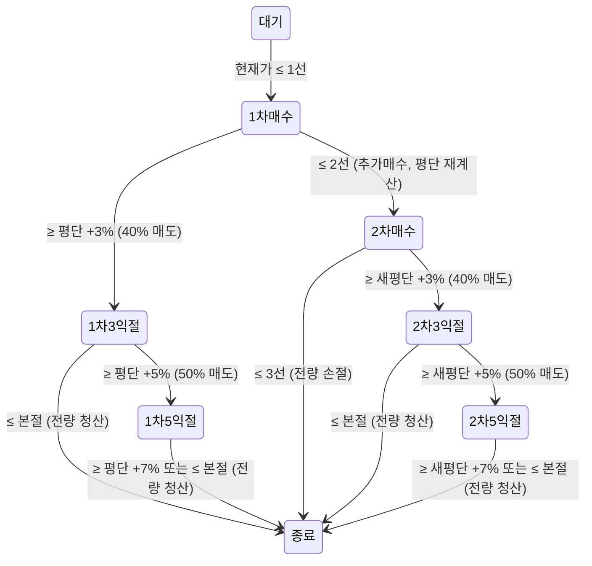

# 3선 자동매매 (three-line-trader)

관심종목의 실시간 시세를 감시하고, 종목별 상태 머신에 따라 자동으로 매수 · 부분 익절 · 청산을 수행하는 국내주식 자동매매 프로그램.

| 구성 | 사용 기술 |
|---|---|
| 증권사 연동 | 키움증권 **REST API + WebSocket** (모의/실전 전환 지원) |
| 저장소 | **SQLite** — 상태 영속화, 장애 복구, 매매 이력 |
| 화면 | **Tkinter** (표준 라이브러리, 무의존성) |
| 알림 | **Discord Webhook** — 매매 요약 실시간 발송 |
| 패키지 관리 | **uv** (Python 3.13) |

### 목차

[1. 빠른 시작](#1-빠른-시작) · [2. 전략 개요](#2-전략-개요) · [3. 상태 머신](#3-상태-머신) · [4. 운영 규칙](#4-운영-규칙) · [5. 하루 운용 흐름](#5-하루-운용-흐름) · [6. 아키텍처](#6-아키텍처) · [7. 데이터 저장](#7-데이터-저장-sqlite) · [8. 로깅과 알림](#8-로깅과-알림) · [9. 프로젝트 구조](#9-프로젝트-구조) · [10. 개발과 테스트](#10-개발과-테스트) · [11. 운영 메모](#11-운영-메모-실측-기반) · [12. 로드맵](#12-로드맵)

---

## 1. 빠른 시작

```bash
uv sync                               # 의존성 설치
cp config.toml.example config.toml    # 키움 앱키 · Discord webhook 입력
uv run simulate.py                    # 연습 모드 (가짜 틱, 실제 주문 없음)
uv run main.py                        # 실전 모드
```

**설정 파일** — `config.toml` 에 모의/실전 앱키와 Discord webhook 을 넣는다.

```toml
[kiwoom.mock]
appkey = "모의투자 앱키"
secretkey = "모의투자 시크릿키"
account = "0000-0000 위탁종합"   # 화면 표시용 (선택)

[kiwoom.real]
appkey = ""
secretkey = ""
account = ""

[discord]
webhook_url = "https://discord.com/api/webhooks/..."

[fees]                        # 세후 실현손익 계산용 (아래 "거래비용 설정" 참고)
commission_rate = 0.00015
tax_rate = 0.0015

[schedule]                    # 무인 운용 (아래 "자동 스케줄" 참고)
enabled = false
start = "08:55"
stop = "15:30"
summary = "15:35"
```

**거래비용 설정** — 세후 손익을 정확히 보려면 실제 요율을 넣어야 한다.
수수료율은 계좌마다 다르므로 영웅문의 수수료 안내에서, 거래세율은 제도 변경이 잦으므로
거래내역의 실제 차감액으로 확인해 맞춘다. 적용 중인 요율은 프로그램 시작 로그에 표시된다.

> **보안**: 앱키·시크릿이 유출되면 타인이 내 계좌로 주문을 낼 수 있다. `config.toml` 은 절대 커밋하지 않는다 (`.gitignore` 등록됨). 커밋 대상은 `config.toml.example` 뿐이다.

**첫 연결 점검** — 실제 주문 없이 토큰·조회·WebSocket 을 확인한다.

```bash
uv run check_kiwoom.py                 # 모의투자 점검 (토큰 → REST 조회 → WS 수신)
uv run check_kiwoom.py --real          # 실전 계좌로 점검
uv run check_kiwoom.py 005930 --buy1   # 모의투자 한정: 1주 매수 → 체결통보까지 실측 (장중)
```

---

## 2. 전략 개요

관심종목에 편입된 각 종목은 사용자가 직접 설정한 **3개의 기준선**을 가진다.

```
현재가 > 1선 > 2선 > 3선
```

- **1선 이탈** 시 1차 매수, **2선 이탈** 시 2차 매수(물타기, 평단 재계산), **3선 이탈** 시 전량 손절
- 상승 시 평단가 대비 **+3% → +5% → +7%** 에서 단계적으로 부분 익절
- 익절 시작 이후에는 추가 매수 없음. 익절 진행 중 **평단가(본절) 이탈 시 잔량 전량 청산**

### 자금 관리와 설정값

**총 운용금액 ÷ 최대 보유 종목 수 = 종목당 배분 금액**이며, 1·2차 매수 금액은 배분 금액의 절반씩 자동으로 채워진다(직접 수정 가능). 자동 채움과 배분 계산은 모두 **버림(floor)** 이라 1차 + 2차 합계가 종목당 배분을 넘는 일이 없다.

매수 수량은 **트리거 시점의 체결가로 `floor(금액 ÷ 가격)`** 을 즉석 계산한다. 매수는 항상 기준선 이하에서 발동하므로 "매수 금액 ≥ 기준선"이면 최소 1주가 보장된다(등록 시 검증).

| 항목 | 설명 | 기본값 |
|---|---|---|
| 1선 / 2선 / 3선 | 종목마다 개별 설정 (1선 > 2선 > 3선) | 필수 입력 |
| 총 운용금액 / 최대 종목 수 | 전역 설정. 종목당 배분 금액의 기준 | 10,000,000원 / 10종목 |
| 1차 / 2차 매수 금액 | 전역 설정. 적용 시 '대기' 종목에 즉시 반영, **보유 중 종목은 진입 시점 값 유지** | 종목당 배분의 50% / 50% |
| 익절 트리거 % | 전역 설정 — 평단가 대비 1 / 2 / 3차 익절 기준 | 3% / 5% / 7% |
| 익절 비중 | 전역 설정 — **최초 보유 물량** 기준 매도 비율 (합계 100%) | 40% / 50% / 10% |

**익절 수량 계산** — `i차 매도량 = floor(총량 × 누적비중) − 기매도량`, 마지막 차수는 잔량 전부. 버림 누적이라 총량이 정확히 일치하고 초과 매도가 구조적으로 불가능하다. 다만 보유량이 적으면 앞 차수가 0주가 되어 뒤로 밀린다(예: 40/50/10% 기준 2주 보유 → 0 / 1 / 1주). 이런 소량 종목은 우클릭 **수동 전량 청산**으로 직접 정리하는 것을 권장한다.

---

## 3. 상태 머신

총 **8개 상태**로 구성된다.

```
대기, 1차 매수, 1차 매수 + 3% 익절, 1차 매수 + 5% 익절,
2차 매수, 2차 매수 + 3% 익절, 2차 매수 + 5% 익절, 종료
```


```mermaid
stateDiagram-v2
    대기 --> 1차매수 : 현재가 ≤ 1선
    1차매수 --> 1차3익절 : ≥ 평단 +3% (40% 매도)
    1차매수 --> 2차매수 : ≤ 2선 (추가매수, 평단 재계산)
    1차3익절 --> 1차5익절 : ≥ 평단 +5% (50% 매도)
    1차3익절 --> 종료 : ≤ 본절 (전량 청산)
    1차5익절 --> 종료 : ≥ 평단 +7% 또는 ≤ 본절 (전량 청산)
    2차매수 --> 2차3익절 : ≥ 새평단 +3% (40% 매도)
    2차매수 --> 종료 : ≤ 3선 (전량 손절)
    2차3익절 --> 2차5익절 : ≥ 새평단 +5% (50% 매도)
    2차3익절 --> 종료 : ≤ 본절 (전량 청산)
    2차5익절 --> 종료 : ≥ 새평단 +7% 또는 ≤ 본절 (전량 청산)
```

### 상태 전이 규칙

| 현재 상태 | 조건 | 다음 상태 | 액션 |
|---|---|---|---|
| 대기 | 현재가 ≤ 1선 | 1차 매수 | 1차 매수 (평단 = 체결가) |
| 대기 | 현재가 ≤ 2선 (갭) | 2차 매수 | 1·2차 수량을 **한 주문으로 동시 매수** |
| 대기 | 현재가 ≤ 3선 (갭) | 종료 | **주문 없음.** 진입 금지, 당일 매매하지 않음 |
| 1차 매수 | ≥ 평단 × 1.03 | 1차 + 3% 익절 | 최초 물량의 40% 매도 |
| 1차 매수 | ≤ 2선 | 2차 매수 | 추가 매수, 평단가 재계산 |
| 1차 + 3% | ≥ 평단 × 1.05 | 1차 + 5% 익절 | 최초 물량의 50% 매도 |
| 1차 + 3% | ≤ 평단 (본절) | 종료 | 잔량 전량 청산 |
| 1차 + 5% | ≥ 평단 × 1.07 | 종료 | 잔량 전량 청산 |
| 1차 + 5% | ≤ 평단 (본절) | 종료 | 잔량 전량 청산 |
| 2차 매수 | ≥ 새 평단 × 1.03 | 2차 + 3% 익절 | 최초 물량의 40% 매도 |
| 2차 매수 | ≤ 3선 | 종료 | 전량 청산 (손절) |
| 2차 + 3% | ≥ 새 평단 × 1.05 | 2차 + 5% 익절 | 최초 물량의 50% 매도 |
| 2차 + 3% | ≤ 새 평단 (본절) | 종료 | 잔량 전량 청산 |
| 2차 + 5% | ≥ 새 평단 × 1.07 | 종료 | 잔량 전량 청산 |
| 2차 + 5% | ≤ 새 평단 (본절) | 종료 | 잔량 전량 청산 |

### 설계 원칙

- 익절 % 와 본절 기준은 **항상 그 시점의 평단가 기준**. 2차 매수 후에는 낮아진 새 평단가로 전부 재설정된다. 매도(익절)는 평단가를 바꾸지 않는다.
- 익절 비중은 **최초 보유 물량 기준**. 2차 매수 경로에서 최초 물량 = 1차 + 2차 매수 합산 총량.
- **익절 시작 후 추가 매수 없음.** 평단 > 2선이 구조적으로 보장되므로, 익절 상태에서 하락하면 2선 도달 전에 본절 청산이 먼저 발동한다.
- 일반적인 하락 흐름: `1차 매수 → 2차 매수 → 3선 손절`

---

## 4. 운영 규칙

| 규칙 | 내용 |
|---|---|
| 판정 가격 | **WebSocket 실시간 체결가(0B)** 기준. 모든 가격 조건은 **터치 시 발동** (하락 ≤, 상승 ≥) |
| 주문 방식 | 조건 충족 → 시장가 주문 → **체결통보(00) 수신 후** 평단·잔량 갱신 및 상태 전이 확정. 평단은 지시 가격이 아닌 **실제 체결가** |
| 갭 / 동시 조건 | 한 틱(특히 시가)이 여러 단계를 통과하면 중간 단계 생략. 상승 갭은 누적 비중을 한 주문으로 매도하고 +7% 이상이면 즉시 전량 청산. 하락 갭은 '1차 매수'에서 3선 이하 직행 시 2차 매수 생략하고 전량 손절 |
| 최대 종목 수 | **1차 진입 시점에 보유 중 종목 수가 최대치면 주문 없이 '종료'.** 청산으로 슬롯이 비면 다른 종목이 다시 진입할 수 있다 |
| 예수금 부족 | 코어가 매수 실행 전 예수금을 확인한다(상태 머신은 관여하지 않음). **1차 시점 부족**: 주문 없이 '종료'. **2차 시점 부족**: 1차 물량 유지(손절·익절 경로는 계속 동작), 해당 종목 추가 매수만 차단. 두 경우 모두 로그 + 알림 1회 |
| 재진입 | 한 종목은 **하루 1회만 진입**. '종료' 상태는 당일 유지. 우클릭 `종료 → 대기 초기화` 로 당일 재시작 가능 |
| 매매일별 리스트 | 관심종목·포지션은 **(매매일, 종목코드)** 단위로 저장되어 날짜별로 독립. 저녁에 다음날 날짜로 이동해 등록하고, 다음날 그 날짜에서 감시를 시작한다. 과거 날짜로 이동하면 그날의 최종 상태·실현손익을 조회할 수 있다 |
| 오버나이트 | 보유 중인 종목은 우클릭 **다음 매매일로 이월**로 상태·평단·잔량을 그대로 넘긴다(주말 자동 건너뜀). 등록 시 시작 상태를 직접 지정할 수도 있다 |
| 감시 중 변경 차단 | 감시 중에는 등록·편집·삭제·CSV 불러오기·설정 적용·모드/매매일 전환이 모두 차단되고 해당 위젯이 비활성화된다(UI 경고 + 코어 거부 이중 방어). **예수금 새로고침·알림 수준·Discord 연결·수동 청산·로그 조작은 허용** |
| 수동 개입 | 종목 우클릭 메뉴: 편집(상태·평단·수량까지 수정) · 종료 → 대기 초기화 · 다음 매매일로 이월 · **수동 전량 청산(시장가)** · 관심종목 제외 |
| 주문 실패 | 실패하면 해당 종목은 30초간 재주문을 보류하고, 연속 3회 실패 시 당일 주문을 중단한다. 틱마다 재주문해 주문·알림이 폭주하거나 "응답만 유실되고 주문은 접수된" 경우 중복 매수가 되는 것을 막는다 |
| 체결 대기 복구 | 체결통보가 60초 미도착이면 경고, 90초가 지나면 **계좌 잔고를 근거로** 잔량을 맞추고 대기를 해제한다. 부분 체결이나 통보 유실로 종목이 하루 종일 잠겨 손절이 멈추는 것을 막는다(평단·실현손익은 추정이므로 경고 후 수동 보정 요청) |
| 중복 실행 방지 | 두 인스턴스가 동시에 돌면 같은 조건에 주문이 두 번 나가므로, 이미 실행 중이면 안내 후 종료한다 |
| 모드별 DB 분리 | 모의와 실전은 **DB 파일 자체가 다르다**(`trader-mock.db` / `trader-real.db`). 현재 모드는 `data/mode.txt` 에 저장되며, 모드를 바꾸면 종목·설정·로그가 해당 DB 기준으로 다시 로드된다 |
| 장애 복구 | 모든 상태 변경을 SQLite 에 즉시 기록. 재시작 시 저장된 상태와 로그를 복원하고, 키움 계좌 잔고와 대조해 불일치 시 경고한다 |
| 실현손익 | 매도 체결마다 `(체결가 − 평단) × 수량` 을 로컬에서 누적(API 부하 0). 체결마다 수수료·거래세도 함께 누적해 **세전·세후를 모두** 기록한다 |
| 최고/최저가 (MFE/MAE) | 보유 구간 동안의 최고가·최저가를 기록한다. "손절된 종목이 그전에 얼마까지 올랐나", "수익 종목이 얼마나 밀렸다 왔나" 를 나중에 집계해 익절률·비중·3선 간격을 조정하는 근거로 쓴다 |

---

## 5. 하루 운용 흐름

### 전날 저녁 — 다음날 준비

1. 매매일 그룹의 **▶** 버튼으로 다음 영업일로 이동
2. 관심종목 등록 (둘 중 편한 방법)
   - **＋ 종목 추가하기**: 종목코드 입력 → `조회`로 종목명 자동 완성 → 1·2·3선 가격 입력
   - **＋ 종목 CSV 불러오기**: 영웅문에서 내보낸 관심종목 CSV 를 그대로 사용. 엑셀에서 **`1선` · `2선` · `3선` 열을 추가해 값을 채우면 불러오는 즉시 정식 등록**되고, 비워두면 주황색 "3선 미입력" 행으로 들어와 ✎ 로 입력한다. `메모` 열도 함께 표시된다
3. 전역 설정 확인 후 **[적용]** — 총 운용금액·최대 종목 수를 입력하면 종목당 배분과 1·2차 금액이 자동 계산된다
4. 보유 중이던 종목은 우클릭 **다음 매매일로 이월** 후 3선 가격만 갱신
5. 3선이 입력되지 않은 종목이 하나라도 남아 있으면 **감시 시작이 차단**된다

### 장 시작 전 — 08:40 ~ 08:55

1. 프로그램 실행 → **투자 모드(모의/실전) 확인** → 키움 **[연결]**
2. 예수금 표시와 잔고 대조 경고 여부 확인
3. Discord **[연결]** → 알림 수준은 **'매매만'** 권장 (Webhook 분당 제한 회피)
4. 08:55 전후 **[감시 시작]** — 이후 설정 위젯은 잠긴다

### 장중 — 09:00 ~ 15:30

- 자동 처리: 1·2선 이탈 매수, +3/5/7% 단계 익절, 본절·3선 손절
- 소량 보유로 익절 비중이 0주가 되는 종목은 우클릭 **수동 전량 청산**으로 직접 정리
- 설정을 바꾸려면 **[감시 중지]** 후 변경하고 다시 시작

> **자동 스케줄**: `config.toml` 의 `[schedule] enabled = true` 로 두면 위의 연결·시작·중지를
> 프로그램이 알아서 한다. 평일에만 동작하고, 화면의 매매일이 오늘이 아니면 자동 시작을 건너뛴다.

### 장 마감 후 — 15:30 이후

1. **[감시 중지]**
2. 보유 종목은 우클릭 **다음 매매일로 이월**
3. 15:35 에 **일일 요약**이 Discord 로 온다 (로그 우클릭 → "일일 요약 Discord 발송" 으로 즉시 받을 수도 있다)
4. 필요하면 로그 우클릭 → **CSV 내보내기**로 보관 (DB 에도 남아 재시작 시 자동 복원된다)

#### 무인 운용 (Windows 작업 스케줄러)

`[schedule] enabled = true` 로 두고, 작업 스케줄러에 **평일 08:35 실행**으로 `start.bat` 을 등록한다.

- 프로그램 → `start.bat`, **시작 위치는 프로젝트 폴더**로 지정한다 (`config.toml` · `data/` 경로 기준)
- "작업을 실행하기 위해 절전 모드 해제" 를 켜둔다
- 나중에 exe 로 배포할 때도 방식은 같다 — 자세한 체크리스트는 [11. 운영 메모](#11-운영-메모-실측-기반) 참고

---

## 6. 아키텍처

매매 코어와 UI 는 스레드로 분리되어 서로를 블로킹하지 않는다. 코어는 백그라운드 스레드의 asyncio 루프에서 돌고, Tkinter UI 는 메인 스레드에서 돌며, 둘은 **큐 2개로만** 통신한다.

```
[코어 스레드 (asyncio)]
키움 WebSocket ──체결가(0B)──▶ Watcher ──가격 이벤트──▶ StateMachine
키움 WebSocket ──체결통보(00)─▶ Core   ◀──주문 지시──── StateMachine
                                 │                        │
                                 └──체결 확정──▶ 상태 확정 ─┤
                                                          ▼
                                        Store(SQLite) + Notifier(Discord)
                                                          │
[메인 스레드 (Tkinter)]                                    │
UI ◀────────────── 이벤트 큐 (상태·체결·로그) ──────────────┘
UI ─────────────── 명령 큐 (등록·수정·청산·설정) ──────────▶ 코어
```

| 모듈 | 역할 |
|---|---|
| **StateMachine** | 순수 로직(I/O 없음). 가격 → 상태 전이 + 주문 지시 반환. 단위 테스트의 핵심 대상 |
| **Watcher** | WebSocket 시세(0B)·체결통보(00) 수신, PING 응답, 지수 백오프 재연결 |
| **Broker** | 키움 REST 시장가 주문, 계좌·종목 조회, 체결통보 해석, **호출 간격 제어와 조회 재시도** |
| **Kiwoom** | 모의/실전 접속 정보, 접근토큰 발급·캐시·만료 전 자동 재발급 |
| **Core** | 전체 조립. 틱 → 판단 → 예수금·종목 수 방어 → 주문 → 체결 확정 → 저장·알림·화면 반영. 재연결 후 가격 보정과 잔고 대조도 담당 |
| **Store** | SQLite 영속화·복원 (매매일 단위). 상태 스냅샷 + 이벤트 이력 |
| **Notifier** | Discord Webhook 발송 + 알림 수준 필터 |
| **UI** | Tkinter. 코어의 구독자 중 하나로 비즈니스 로직이 없다. `after()` 기반 200ms 큐 폴링이라 틱 유입량과 무관하게 부하가 일정하다. 코어는 UI 존재를 모르므로 헤드리스 실행도 가능 |

---

## 7. 데이터 저장 (SQLite)

| 테이블 | 용도 |
|---|---|
| `symbols` | 관심종목과 종목별 설정 — **PK (매매일, 종목코드)**. 3선 가격, 매수 금액, 익절 %/비중, 메모 |
| `positions` | 종목별 상태 스냅샷 — **PK (매매일, 종목코드)**. 상태, 평단가, 최초 물량, 잔량, 실현손익, **거래비용**, **보유 중 최고/최저가**, 체결 대기 여부 — 장애 복구의 기준 |
| `events` | 상태 전이·주문·체결·에러 이력 (append-only) — 화면 로그 복원과 월간 통계의 원천 |
| `orders` | 주문 요청/체결 기록 (주문번호, 구분, 수량, 가격, 체결 결과) |
| `settings` | 전역 설정 key-value — 총 운용금액, 최대 종목 수, 1·2차 매수 금액, 익절 %/비중, 투자 모드, 알림 수준 |

- `events` 가 append-only 라 이후 pandas 로 읽어 월간 수익률, 상태별 체류 시간, 익절/손절 비율을 자유롭게 집계할 수 있다.
- DB 파일은 모드별로 분리된다: `data/trader-mock.db` · `data/trader-real.db`. 현재 모드는 `data/mode.txt` 에 저장한다(어느 DB 를 열지 정하려면 모드를 먼저 알아야 하므로 DB 밖에 둔다).
- 스키마 변경 시 `_SCHEMA_VERSION` 을 올린다(현재 **v7**). 구버전 DB 파일로 실행하면 버전 가드가 한글 에러로 안내하며, 개발 단계에서는 `data/` 의 DB 파일을 삭제하고 재실행한다.
- 시뮬레이터는 `simulator.db` 를 따로 써서 실전 데이터와 섞이지 않는다.

---

## 8. 로깅과 알림

**로그** — 모든 이벤트(등록, 상태 전이, 주문, 체결, 에러, 재연결)는 SQLite `events` 에 기록되고 화면 로그 창에도 표시된다. 프로그램이 예기치 않게 종료돼도 **재시작하면 그날의 로그가 화면에 그대로 복원**된다. 로그 창 우클릭으로 화면 비우기(DB 이력은 보존)와 CSV 내보내기를 할 수 있다.

**Discord 알림** — 매매 이벤트는 사람이 읽기 쉬운 요약으로 발송된다.

```
🟢 스모트로닉(066590) 1차 매수 — 97주 @ 2,575
💰 스모트로닉(066590) 1차 익절 — 79주 @ 2,580
🛑 흥구석유(024060) 전량 손절 — 76주 @ 13,068
   실현손익 -4,750원
```

- 주문 접수가 아니라 **체결 확정 시점**에만 발송하며, 종료 시 실현손익이 함께 표시된다
- **알림 수준**: `전체` / `매매만 (시스템 제외)` / `에러만` / `끔` — 화면에서 즉시 변경되고 설정에 저장된다
- **일일 요약**(기본 15:35): 체결 건수, 세전·세후 실현손익, 종목별 결과(최고/최저 도달률·보유 시간), **이월이 필요한 보유 종목**, 예수금을 한 번에 정리해 보낸다
- Webhook 분당 제한(약 30건)에 대비해 최소 발송 간격을 두고, 제한(429)을 받으면 일정 시간 발송을 생략한다. 평소에는 **'매매만'** 을 권장한다

---

## 9. 프로젝트 구조

루트 진입점 + 평평한 단일 패키지 구조. 배포 목적이 없는 개인용 프로그램이므로 `src/` 레이아웃이나 기능별 폴더 분할 없이 계층을 최소화한다.

```
three-line-trader/
├── README.md
├── pyproject.toml            # uv 관리 (websockets, requests, tkcalendar / dev: pytest)
├── config.toml               # API 키 등 비밀 설정 — 커밋 금지 (.gitignore 등록됨)
├── config.toml.example       # 설정 작성 예시 (이 파일만 커밋)
├── main.py                   # 실전 진입점: 코어 스레드 기동 → Tkinter 앱 (조립만 담당)
├── simulate.py               # 연습용 시뮬레이터: 가짜 틱으로 전체 흐름 구동 (Discord 실발송 지원)
├── check_kiwoom.py           # 연결 점검: 토큰 → REST 조회 → WS 수신 (--real, --buy1 옵션)
├── start.bat                 # Windows 작업 스케줄러용 실행 파일 (무인 운용)
├── trader/
│   ├── state_machine.py      # 상태 정의 + 전이 로직 (순수 함수, I/O 없음)
│   ├── core.py               # 실전 코어: 틱→판단→방어→주문→체결 확정, 잔고 대조·재연결 보정
│   ├── kiwoom.py             # 접속 정보(모의/실전) + 접근토큰 발급·캐시·자동 재발급
│   ├── watcher.py            # WebSocket 체결가(0B)·체결통보(00) 수신, PING 응답, 백오프 재연결
│   ├── broker.py             # REST 시장가 주문 / 계좌·종목 조회 / 체결통보 해석 / 호출 간격 제어
│   ├── store.py              # SQLite 영속화·복원 (매매일 단위)
│   ├── notifier.py           # Discord Webhook 발송 + 알림 수준 필터
│   └── ui/                   # Tkinter UI (화면 단위 분리, 비즈니스 로직 없음)
│       ├── app.py            # 메인 윈도우: 툴바(감시·모드·손익) + 설정 5그룹 + 상태 바
│       ├── positions_view.py # 종목 모니터: 행 내 📈/✎/✕, ＋추가·CSV 행, 열 정렬, 손익 색상
│       ├── events_view.py    # 로그 뷰 (우클릭: 화면 지우기 / CSV 내보내기)
│       ├── register_dialog.py# 종목 추가·편집 창 (종목명 조회, 콤마 입력, 상태·수량 수정)
│       └── bus.py            # 코어 ↔ UI 큐 정의 + 메시지 타입 (프로토콜 문서 역할)
├── assets/                   # 앱 아이콘 (투명 배경, 라이트/다크 모드 공용)
├── tests/
│   ├── test_state_machine.py # 상태 머신 단위 테스트
│   ├── test_store.py         # 저장·복원, 장애 복구, 매매일 독립성
│   ├── test_watcher.py       # WS 메시지 파싱, 토큰 캐시·재발급
│   ├── test_broker.py        # 주문 규격, 응답 파싱, 체결통보 해석, 호출 간격·재시도
│   ├── test_core.py          # 주문→체결 흐름, 예수금·최대 종목 방어
│   ├── test_notifier.py      # 알림 필터·메시지 형식·발송 처리
│   ├── test_csv_import.py    # 영웅문 관심종목 CSV 파서
│   └── test_ui_smoke.py      # 실제 창을 띄워 다이얼로그·버튼 동작 확인 (화면 없으면 생략)
└── data/
    ├── mode.txt              # 현재 투자 모드 (모의/실전)
    ├── trader-mock.db        # 모의투자 기록
    ├── trader-real.db        # 실전투자 기록
    └── simulator.db          # 시뮬레이터 전용 DB
```

---

## 10. 개발과 테스트

```bash
uv run pytest              # 전체 테스트
uv run pytest -v           # 테스트별 결과 표시
uv run pytest -rs          # 생략(skip)된 테스트와 사유 표시
```

- UI 스모크 테스트는 **실제 Tk 창을 띄워** "버튼을 눌러도 아무 반응이 없는" 유형의 버그를 잡는다. 화면이 없는 환경(CI 등)에서는 자동으로 생략되므로, 개발 PC 에서 돌리는 편이 좋다.
- 상태 머신은 순수 함수라 I/O 없이 전 시나리오를 검증한다. 매매 규칙을 바꿀 때는 여기부터 고친다.
- 키움 응답 필드는 개정될 수 있어 상수로 격리하고 방어적으로 파싱한다. 실측으로 확인된 케이스는 테스트로 고정해 둔다.

---

## 11. 운영 메모 (실측 기반)

실제 운용에서 확인된 주의사항이다.

| 항목 | 내용 |
|---|---|
| **REST 호출 한도** | 키움 REST 는 초당 호출 수 제한이 있다. 재연결 직후 전 종목 시세를 간격 없이 조회하면 상당수가 거부된다(2026-07-24 실측: 22종목 중 10종목 실패). Broker 가 최소 간격(0.25초)과 조회 재시도를 처리하며, **주문은 재시도하지 않는다** — 응답만 유실되고 주문은 접수됐을 수 있어 중복 주문 위험이 있기 때문이다 |
| **WebSocket 재연결** | 장중에도 서버가 세션을 끊을 수 있다(실측 14:00, 1초 만에 자동 재연결). 재연결 후 **보유 종목부터** 순서대로 REST 현재가로 공백 구간을 보정한다. 장 운영시간 밖에는 보정을 생략한다 |
| **시장가 슬리피지** | 익절 트리거 가격과 실제 체결가는 다르다(실측: 트리거 2,594원 → 체결 2,580원, **-0.56%**). 거래량이 얇은 종목일수록 커지므로 +3% 익절의 실질 수익은 그보다 낮게 잡는 것이 현실적이다 |
| **권장 운용 시간** | 정규장 09:00~15:30. **08:40~08:50** 프로그램 시작(연결·복원·잔고 대조) → **08:55 전후** 감시 시작 → **15:30 이후** 감시 중지. 15:20~15:30 종가 동시호가에서도 시장가 주문은 정상 처리된다 |
| **예수금 기준** | 프로그램은 정산이 끝난 뒤 남는 **D+2 추정예수금**을 기준으로 삼는다. 증권사 앱의 '인출 가능금'보다 작을 수 있는데, 오늘 매수한 대금이 2영업일 뒤에 빠져나가기 때문이다(가장 보수적이고 안전한 기준) |
| **계좌 유형별 필드** | 예수금이 실리는 응답 필드는 계좌 유형마다 다르다. 해외주식 원화주문(통합증거금) 계좌는 일반 현금 필드가 0 으로 오고 대용 설정 필드에 금액이 잡힌다(실측). 후보 필드를 순서대로 탐색해 처리하며, 한 번 성공한 조합은 기억해 호출 수를 줄인다 |
| **모드별 기록 분리** | 모의와 실전은 DB 파일이 분리되어 있어 기록이 섞이지 않는다. 다만 **같은 날 두 모드를 번갈아 운용하면 계좌 잔고와 프로그램 상태가 어긋날 수 있으므로** 하루에 한 모드만 사용한다 |

### exe 로 배포할 때 확인할 것

지금은 VS Code(`uv run main.py`)로 운용하지만, 나중에 PyInstaller 등으로 실행파일을 만들 때
아래를 함께 챙겨야 자동 스케줄이 동일하게 동작한다.

1. **작업 디렉터리** — `config.toml` 과 `data/` 를 상대 경로로 읽는다. 작업 스케줄러의
   "시작 위치"를 exe 가 있는 폴더로 지정하거나, 실행 시 작업 디렉터리를 고정해야 한다.
2. **숨은 의존성** — `tkcalendar`, `babel` 등 동적 import 되는 패키지는 자동 수집되지 않을 수 있어
   `--hidden-import` 또는 `--collect-all` 지정이 필요하다.
3. **아이콘·데이터 파일** — `assets/` 는 코드가 아니므로 `--add-data` 로 함께 넣고, 경로를
   실행 환경에 맞게 해석해야 한다(PyInstaller 는 임시 폴더에 풀어 놓는다).
4. **콘솔 창** — `--noconsole` 로 만들면 예외 메시지가 화면에 안 보인다. 로그가 DB 에 남지만,
   초기에는 콘솔을 켜둔 채로 며칠 운용해 보는 편이 안전하다.
5. **중복 실행 방지** — 포트 점유 방식이라 exe 에서도 그대로 동작한다. 다만 방화벽이 로컬
   포트 바인딩을 막지 않는지 첫 실행 때 확인한다.
6. **작업 스케줄러 재등록** — 프로그램 항목을 `start.bat` 에서 exe 경로로 바꾸고, 시작 위치는
   그대로 유지한다.

---

## 12. 로드맵

- [x] 상태 머신 코어 + 단위 테스트
- [x] SQLite 저장·복원 (매매일 단위, 장애 복구)
- [x] 키움 WebSocket 시세 수신 + 접근토큰 관리
- [x] 키움 REST 주문·조회 (시장가 매수·매도, 예수금·잔고·종목정보, 체결통보 해석)
- [x] 코어 조립 (틱→판단→주문→체결 확정, 예수금·최대 종목 방어, 잔고 대조, 재연결 보정)
- [x] Tkinter UI (관심종목 편집 / 상태 모니터 / 이벤트 로그) + 연습용 시뮬레이터
- [x] 관심종목 CSV 불러오기 (영웅문 형식, 3선·메모 열 지원)
- [x] 수동 개입 (종료 → 대기 초기화, 다음 매매일 이월, 수동 전량 청산)
- [x] Discord 알림 (Webhook 발송, 알림 수준 필터, 매매 요약 형식, 전송 제한 방어)
- [x] 모의투자 장중 통합 검증 → 실전 운용 전환
- [x] 실전 안전장치 (주문 실패 차단, 체결 대기 복구, 중복 실행 방지, 모드별 DB 분리)
- [x] 거래비용 반영 세후 손익 · 일일 요약 알림 · 자동 스케줄
- [x] 보유 중 최고/최저가(MFE/MAE) 기록
- [ ] 종료 시 복기 차트 자동 생성 → Discord 전송 (분봉 REST + mplfinance, 3선·평단·체결 마커). 종목 행의 📈 버튼과 동일한 생성기를 공유한다
- [ ] 월간 통계 시각화 (`events` + MFE/MAE 기반 — 익절률·비중·3선 간격 튜닝 근거)
- [ ] 일일 손실 한도 (설정치 초과 시 신규 진입 중단)
- [ ] Discord 봇 명령어 양방향 연동 (상태 조회, 수동 전환)

---

> ⚠️ **실전 투입 전 반드시 키움 모의투자 환경에서 충분히 검증할 것.** 엔드포인트 · TR 코드 · 요청 제한 수치는 키움 공식 개발자 문서 기준으로 확인한다. 이 프로그램은 개인용이며, 발생하는 모든 매매 손익의 책임은 사용자 본인에게 있다.