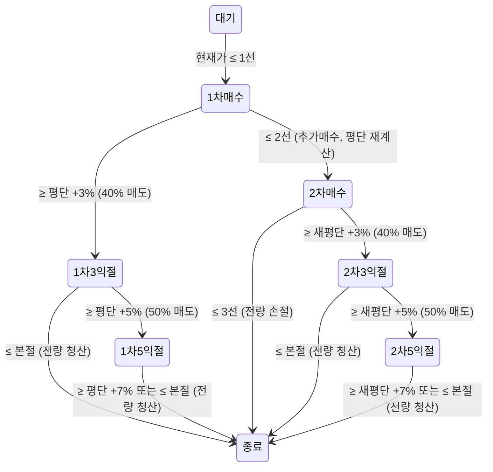

# 3선 자동매매 (three-line-trader)

관심종목의 실시간 시세를 감시하고, 종목별 상태 머신에 따라 자동으로 매수 · 부분 익절 · 청산을 수행하는 국내주식 자동매매 프로그램.

| 구성 | 사용 기술 |
|---|---|
| 증권사 연동 | 키움증권 **REST API + WebSocket** (모의/실전 전환 지원) |
| 저장소 | **SQLite** — 상태 영속화, 장애 복구, 매매 이력 |
| 화면 | **Tkinter** (표준 라이브러리, 무의존성) |
| 알림·원격 조회 | **Discord 봇** — 실시간 알림, 슬래시 명령, 장중 대시보드 |
| 패키지 관리 | **uv** (Python 3.13) |
| 복기 차트 | **matplotlib** — 일봉·3분봉 PNG 생성, Discord 전송 |

### 목차

[1. 빠른 시작](#1-빠른-시작) · [2. 전략 개요](#2-전략-개요) · [3. 상태 머신](#3-상태-머신) · [4. 운영 규칙](#4-운영-규칙) · [5. 하루 운용 흐름](#5-하루-운용-흐름) · [6. 아키텍처](#6-아키텍처) · [7. 데이터 저장](#7-데이터-저장-sqlite) · [8. 로깅 · 알림 · 복기 차트](#8-로깅--알림--복기-차트) · [9. 프로젝트 구조](#9-프로젝트-구조) · [10. 개발과 테스트](#10-개발과-테스트) · [11. 운영 메모](#11-운영-메모-실측-기반) · [12. 로드맵](#12-로드맵)

---

## 1. 빠른 시작

```bash
uv sync                               # 의존성 설치
cp config.toml.example config.toml    # 키움 앱키 · Discord 봇 토큰 입력
uv run simulate.py                    # 연습 모드 (가짜 틱, 실제 주문 없음)
uv run main.py                        # 실전 모드
```

**설정 파일** — `config.toml` 에 모의/실전 앱키와 Discord 봇 정보를 넣는다.

```toml
[kiwoom.mock]
appkey = "모의투자 앱키"
secretkey = "모의투자 시크릿키"
account = "0000-0000 위탁종합"   # 화면 표시용 (선택)

[kiwoom.real]
appkey = ""
secretkey = ""
account = ""

[discord]                     # 봇 하나로 알림·명령·대시보드를 모두 처리한다
bot_token = "봇 토큰"
channel_id = "채널 ID"
allowed_users = ["본인 사용자 ID"]

[fees]                        # 세후 실현손익 계산용 (아래 "거래비용 설정" 참고)
commission_rate = 0.00015
tax_rate = 0.0015

[schedule]                    # 무인 운용 (아래 "자동 스케줄" 참고)
enabled = false
start = "08:55"
stop = "15:30"
summary = "15:35"             # 일일 요약 — 자동화는 여기서 끝난다

[chart]                       # 복기 차트 (아래 8장 참고)
font = ""                     # 비우면 맑은 고딕 → 나눔고딕 순 자동 선택
```

**거래비용 설정** — 세후 손익을 정확히 보려면 실제 요율을 넣어야 한다.
수수료율은 계좌마다 다르므로 영웅문의 수수료 안내에서, 거래세율은 제도 변경이 잦으므로
거래내역의 실제 차감액으로 확인해 맞춘다. 적용 중인 요율은 프로그램 시작 로그에 표시된다.

> **보안**: 앱키·시크릿이 유출되면 타인이 내 계좌로 주문을 낼 수 있다. `config.toml` 은 절대 커밋하지 않는다 (`.gitignore` 등록됨). 커밋 대상은 `config.toml.example` 뿐이다.

**첫 연결 점검** — 실제 주문 없이 토큰·조회·WebSocket 을 확인한다.

```bash
uv run check_kiwoom.py                 # 모의투자 점검 (토큰 → REST 조회 → WS 수신)
uv run check_kiwoom.py --real          # 실전 계좌로 점검
uv run check_kiwoom.py 005930 --buy1   # 모의투자 한정: 1주 매수 → 체결통보까지 실측 (장중)
```

---

## 2. 전략 개요

관심종목에 편입된 각 종목은 사용자가 직접 설정한 **3개의 기준선**을 가진다.

```
현재가 > 1선 > 2선 > 3선
```

- **1선 이탈** 시 1차 매수, **2선 이탈** 시 2차 매수(물타기, 평단 재계산), **3선 이탈** 시 전량 손절
- 상승 시 평단가 대비 **+3% → +5% → +7%** 에서 단계적으로 부분 익절
- 익절 시작 이후에는 추가 매수 없음. 익절 진행 중 **평단가(본절) 이탈 시 잔량 전량 청산**

### 자금 관리와 설정값

**총 운용금액 ÷ 최대 보유 종목 수 = 종목당 배분 금액**이며, 1·2차 매수 금액은 배분 금액의 절반씩 자동으로 채워진다(직접 수정 가능). 자동 채움과 배분 계산은 모두 **버림(floor)** 이라 1차 + 2차 합계가 종목당 배분을 넘는 일이 없다.

매수 수량은 **트리거 시점의 체결가로 `floor(금액 ÷ 가격)`** 을 즉석 계산한다. 매수는 항상 기준선 이하에서 발동하므로 "매수 금액 ≥ 기준선"이면 최소 1주가 보장된다(등록 시 검증).

| 항목 | 설명 | 기본값 |
|---|---|---|
| 1선 / 2선 / 3선 | 종목마다 개별 설정 (1선 > 2선 > 3선) | 필수 입력 |
| 총 운용금액 / 최대 종목 수 | 전역 설정. 종목당 배분 금액의 기준 | 10,000,000원 / 10종목 |
| 1차 / 2차 매수 금액 | 전역 설정. 적용 시 '대기' 종목에 즉시 반영, **보유 중 종목은 진입 시점 값 유지** | 종목당 배분의 50% / 50% |
| 익절 트리거 % | 전역 설정 — 평단가 대비 1 / 2 / 3차 익절 기준 | 3% / 5% / 7% |
| 익절 비중 | 전역 설정 — **최초 보유 물량** 기준 매도 비율 (합계 100%) | 40% / 50% / 10% |

**익절 수량 계산** — `i차 매도량 = floor(총량 × 누적비중) − 기매도량`, 마지막 차수는 잔량 전부. 버림 누적이라 총량이 정확히 일치하고 초과 매도가 구조적으로 불가능하다. 다만 보유량이 적으면 앞 차수가 0주가 되어 뒤로 밀린다(예: 40/50/10% 기준 2주 보유 → 0 / 1 / 1주). 이런 소량 종목은 우클릭 **수동 전량 청산**으로 직접 정리하는 것을 권장한다.

---

## 3. 상태 머신

총 **8개 상태**로 구성된다.

```
대기, 1차 매수, 1차 매수 + 3% 익절, 1차 매수 + 5% 익절,
2차 매수, 2차 매수 + 3% 익절, 2차 매수 + 5% 익절, 종료
```


```mermaid
stateDiagram-v2
    대기 --> 1차매수 : 현재가 ≤ 1선
    1차매수 --> 1차3익절 : ≥ 평단 +3% (40% 매도)
    1차매수 --> 2차매수 : ≤ 2선 (추가매수, 평단 재계산)
    1차3익절 --> 1차5익절 : ≥ 평단 +5% (50% 매도)
    1차3익절 --> 종료 : ≤ 본절 (전량 청산)
    1차5익절 --> 종료 : ≥ 평단 +7% 또는 ≤ 본절 (전량 청산)
    2차매수 --> 2차3익절 : ≥ 새평단 +3% (40% 매도)
    2차매수 --> 종료 : ≤ 3선 (전량 손절)
    2차3익절 --> 2차5익절 : ≥ 새평단 +5% (50% 매도)
    2차3익절 --> 종료 : ≤ 본절 (전량 청산)
    2차5익절 --> 종료 : ≥ 새평단 +7% 또는 ≤ 본절 (전량 청산)
```

### 상태 전이 규칙

| 현재 상태 | 조건 | 다음 상태 | 액션 |
|---|---|---|---|
| 대기 | 현재가 ≤ 1선 | 1차 매수 | 1차 매수 (평단 = 체결가) |
| 대기 | 현재가 ≤ 2선 (갭) | 2차 매수 | 1·2차 수량을 **한 주문으로 동시 매수** |
| 대기 | 현재가 ≤ 3선 (갭) | 종료 | **주문 없음.** 진입 금지, 당일 매매하지 않음 |
| 1차 매수 | ≥ 평단 × 1.03 | 1차 + 3% 익절 | 최초 물량의 40% 매도 |
| 1차 매수 | ≤ 2선 | 2차 매수 | 추가 매수, 평단가 재계산 |
| 1차 + 3% | ≥ 평단 × 1.05 | 1차 + 5% 익절 | 최초 물량의 50% 매도 |
| 1차 + 3% | ≤ 평단 (본절) | 종료 | 잔량 전량 청산 |
| 1차 + 5% | ≥ 평단 × 1.07 | 종료 | 잔량 전량 청산 |
| 1차 + 5% | ≤ 평단 (본절) | 종료 | 잔량 전량 청산 |
| 2차 매수 | ≥ 새 평단 × 1.03 | 2차 + 3% 익절 | 최초 물량의 40% 매도 |
| 2차 매수 | ≤ 3선 | 종료 | 전량 청산 (손절) |
| 2차 + 3% | ≥ 새 평단 × 1.05 | 2차 + 5% 익절 | 최초 물량의 50% 매도 |
| 2차 + 3% | ≤ 새 평단 (본절) | 종료 | 잔량 전량 청산 |
| 2차 + 5% | ≥ 새 평단 × 1.07 | 종료 | 잔량 전량 청산 |
| 2차 + 5% | ≤ 새 평단 (본절) | 종료 | 잔량 전량 청산 |

### 설계 원칙

- 익절 % 와 본절 기준은 **항상 그 시점의 평단가 기준**. 2차 매수 후에는 낮아진 새 평단가로 전부 재설정된다. 매도(익절)는 평단가를 바꾸지 않는다.
- 익절 비중은 **최초 보유 물량 기준**. 2차 매수 경로에서 최초 물량 = 1차 + 2차 매수 합산 총량.
- **익절 시작 후 추가 매수 없음.** 평단 > 2선이 구조적으로 보장되므로, 익절 상태에서 하락하면 2선 도달 전에 본절 청산이 먼저 발동한다.
- 일반적인 하락 흐름: `1차 매수 → 2차 매수 → 3선 손절`

---

## 4. 운영 규칙

| 규칙 | 내용 |
|---|---|
| 판정 가격 | **WebSocket 실시간 체결가(0B)** 기준. 모든 가격 조건은 **터치 시 발동** (하락 ≤, 상승 ≥) |
| 주문 방식 | 조건 충족 → 시장가 주문 → **체결통보(00) 수신 후** 평단·잔량 갱신 및 상태 전이 확정. 평단은 지시 가격이 아닌 **실제 체결가** |
| 갭 / 동시 조건 | 한 틱(특히 시가)이 여러 단계를 통과하면 중간 단계 생략. 상승 갭은 누적 비중을 한 주문으로 매도하고 +7% 이상이면 즉시 전량 청산. 하락 갭은 '1차 매수'에서 3선 이하 직행 시 2차 매수 생략하고 전량 손절 |
| 최대 종목 수 | 1차 진입 시점에 보유 종목이 최대치면 **주문 없이 '대기'로 보류**한다. 청산으로 슬롯이 비면 같은 규칙(1선~2선이면 1차, 2선~3선이면 1·2차 동시)으로 다시 진입한다. 보류 중에는 **종목 행 상태에 "(보류)" 가 표시**되고, 로그는 사유나 가격 구간(1선~2선 / 2선~3선)이 바뀔 때만 남는다(틱마다 남기면 하루 수백 건이 된다 — 실측 107건). 알림은 종목당 1회 |
| 주문 수량 | `floor(금액 ÷ (트리거 가격 × (1 + 수수료율)))`. 매수 수수료를 빼먹으면 배분 금액을 꽉 채운 수량이 나와 증권사 여력을 1주 차이로 넘어선다. 예수금 검사도 **조회값의 98%까지만** 사용한다 — 직전 체결이 증권사 여력에 반영되기까지 시차가 있어, 꽉 채워 주문하면 "매수증거금이 부족합니다" 로 거부된다(2026-07-29 실측) |
| 예수금 부족 | 코어가 매수 실행 전 주문가능금액을 확인한다(상태 머신은 관여하지 않음). **1차·2차 모두 '보류'** — 종료시키지 않고 대기 상태로 두어 자금이 회수되면 다시 진입한다(2차 보류 중에도 1차 물량의 손절·익절은 계속 동작). 조회는 짧게 캐시하고 **체결이 나면 캐시를 즉시 버려** 회수 자금을 바로 인식한다 |
| 최소 진입 수량 | 1차 매수 예상 수량이 **3주 미만이면 경고**한다(등록·편집 시, 전역 설정 적용 시, 실제 진입 시). 진입을 막지는 않으며, 소량 종목은 수동 전량 청산으로 정리하면 된다 |
| 재진입 | 한 종목은 **하루 1회만 진입**. '종료' 상태는 당일 유지. 우클릭 `종료 → 대기 초기화` 로 당일 재시작 가능 |
| 매매일별 리스트 | 관심종목·포지션은 **(매매일, 종목코드)** 단위로 저장되어 날짜별로 독립. 저녁에 다음날 날짜로 이동해 등록하고, 다음날 그 날짜에서 감시를 시작한다. 과거 날짜로 이동하면 그날의 최종 상태·실현손익을 조회할 수 있다 |
| 오버나이트 | 보유 중인 종목은 우클릭 **다음 매매일로 이월**로 상태·평단·잔량을 그대로 넘긴다(주말 자동 건너뜀). 등록 시 시작 상태를 직접 지정할 수도 있다 |
| 감시 중 변경 차단 | 감시 중에는 등록·편집·삭제·CSV 불러오기·설정 적용·모드/매매일 전환이 모두 차단되고 해당 위젯이 비활성화된다(UI 경고 + 코어 거부 이중 방어). **주문가능금액 새로고침·알림 수준 변경·수동 청산·로그 조작은 허용** |
| 수동 개입 | 종목 우클릭 메뉴: **다음 매매일로 이월(상태·평단·수량)** · **다음 매매일로 이월(전체)** · 수동 전량 청산(시장가) · 종료 → 대기 초기화 · 차트 보기 · 편집 · 관심종목 제외. **Ctrl·Shift 로 여러 종목을 골라 한 번에** 처리할 수 있고, 한 종목씩 다뤄야 하는 항목(수동 청산·리셋·편집)은 다중 선택 시 비활성화된다 |
| 이월 두 가지 | **전체 이월**은 3선·메모·태그까지 통째로 다음 매매일에 만든다. **포지션 이월**은 상태·평단·잔량/총량만 덮어써, 다음 매매일에 이미 잡아둔 3선과 메모를 지키고 싶을 때 쓴다(대상 날짜에 종목이 없으면 거부한다 — 어느 설정을 쓸지 알 수 없기 때문) |
| 주문 실패 | 실패하면 해당 종목은 30초간 재주문을 보류하고, 연속 3회 실패 시 당일 주문을 중단한다. 틱마다 재주문해 주문·알림이 폭주하거나 "응답만 유실되고 주문은 접수된" 경우 중복 매수가 되는 것을 막는다 |
| 체결 대기 복구 | 체결통보가 90초 미도착이면 경고, **7분**이 지나면 계좌 잔고를 근거로 잔량을 맞추고 대기를 해제한다(개장 직후에는 시장가도 수 분 뒤 체결될 수 있어 짧게 잡으면 살아 있는 주문을 죽은 것으로 오판한다 — 2026-07-30 실측: 09:00:04 접수 → 09:02:16 체결). 정리한 뒤 체결통보가 뒤늦게 오면 자동 반영하지 않고 **손익 보정을 요청**한다. 매도 주문이었다면 **보유수량이 아니라 매도가능수량**을 기준으로 삼는다 — 보유수량은 매도 직후에도 남아 보여, 그 값을 믿으면 같은 물량을 또 팔려 해 주문이 계속 거부된다(2026-07-30 실측). "매도가능수량이 부족합니다" 오류는 재시도해도 성공하지 않으므로 **1회로 즉시 중단**하고 수동 확인을 요청한다. 부분 체결이나 통보 유실로 종목이 하루 종일 잠겨 손절이 멈추는 것을 막는다(평단·실현손익은 추정이므로 경고 후 수동 보정 요청) |
| 중복 실행 방지 | 두 인스턴스가 동시에 돌면 같은 조건에 주문이 두 번 나가므로, 이미 실행 중이면 안내 후 종료한다 |
| 모드별 DB 분리 | 모의와 실전은 **DB 파일 자체가 다르다**(`trader-mock.db` / `trader-real.db`). 현재 모드는 `data/mode.txt` 에 저장되며, 모드를 바꾸면 종목·설정·로그가 해당 DB 기준으로 다시 로드된다 |
| 장애 복구 | 모든 상태 변경을 SQLite 에 즉시 기록. 재시작 시 저장된 상태와 로그를 복원하고, 키움 계좌 잔고와 대조해 불일치 시 경고한다 |
| 실현손익 | 매도 체결마다 `(체결가 − 평단) × 수량` 을 로컬에서 누적(API 부하 0). 체결마다 수수료·거래세도 함께 누적해 **세전·세후를 모두** 기록한다 |
| 기준봉 경과일 | 화면과 알림의 **D±n 은 실제 거래일 기준**이다. 주말만 제외하면 광복절·대체휴일 같은 날이 그대로 세어져 어긋나므로, **키움 지수 일봉의 날짜 목록**을 거래일 달력으로 삼는다(장이 열린 날에만 존재하기 때문). 달력은 하루 한 번 갱신하고 DB 에 저장해 재시작·미연결 상태에서도 쓴다. 구하지 못하면 주말 기준 근사로 물러난다 |
| 선정 태그 | 종목을 고른 근거를 **기준봉(급등일) 시점의 판단**으로 기록한다: `#KOSPI상승장` `#KOSPI하락횡보장` `#테마주` `#섹터주` `#시장을이기는종목` `#상한가`. 사후 평가가 아니라 **사전 가설**이라, 나중에 "어떤 근거로 고른 종목이 실제로 통했는가" 를 집계할 수 있다. 등록·편집 창의 체크박스, CSV 의 `태그`·`기준봉` 열로 입력하며, 편집에서 비워 보내도 기존 값이 유지된다 |
| 당일 등락 기록 | 감시 중 **첫 체결가·마지막 체결가**를 종목마다 남긴다. "내 종목 등락률 vs 관심종목 평균 vs KOSPI" 를 대조해 **성과가 실력인지 시장 덕인지** 가늠하는 재료다 |
| 1선 근접도 기록 | 진입하지 않은 종목도 **감시 중 당일 최저가**를 기록해, 일일 요약에 "1선 대비 얼마나 가까웠는지"를 가까운 순으로 보여준다. 진입이 없는 날이 **설정이 보수적이어서인지 시장이 안 맞아서인지** 구분하는 근거가 된다(3%/5%/10% 이내 종목 수도 함께 표시) |
| 체결 오차 기록 | 주문을 유발한 **판정가**와 **실제 체결가**를 함께 남긴다. 시장가 주문은 트리거 가격에 그대로 체결되지 않으므로(실측 -1.9% ~ +0.2%), 쌓인 데이터로 "평균 오차·최악값·손익 영향"을 집계해 나중에 주문 방식(지정가 혼합·분할 주문)을 재검토할 근거로 쓴다. **판정·주문 로직에는 전혀 관여하지 않는 기록 전용 값이다** |
| 최고/최저가 (MFE/MAE) | 보유 구간 동안의 최고가·최저가를 기록한다. "손절된 종목이 그전에 얼마까지 올랐나", "수익 종목이 얼마나 밀렸다 왔나" 를 나중에 집계해 익절률·비중·3선 간격을 조정하는 근거로 쓴다. 틱으로 갱신한 값을 **1분마다 DB 에 옮긴다** — 전이 때만 옮기면 매수 후 청산 없이 보유만 한 날은 체결가에 멈춰 늘 "최고 +0.0% / 최저 +0.0%" 가 된다(2026-08-12 실측) |

---

## 5. 하루 운용 흐름

### 전날 저녁 — 다음날 준비

1. 매매일 그룹의 **▶** 버튼으로 다음 영업일로 이동
2. 관심종목 등록 (둘 중 편한 방법)
   - **＋ 종목 추가하기**: 종목코드 입력 → `조회`로 종목명 자동 완성 → 1·2·3선 가격 입력
   - **＋ 종목 CSV 불러오기**: 영웅문에서 내보낸 관심종목 CSV 에 열 몇 개를 더해 사용한다.
     열 순서는 자유이며 **헤더 이름으로 찾는다**. 표준 형식은 다음과 같다:

     ```csv
     분,신,종목명,현재가,등락률,L일봉H,거래대금,메모,종목코드,1선,2선,3선,기준봉,태그
     증,,GRT,"3,895",4.42,3840 3895 3625 3895,"1,040",2차전지,'900290,3355,3215,3105,2026-07-31,#테마주 #상한가
     ```

     종목코드는 숫자 6자리가 대부분이지만 **영문자가 섞인 코드도 있다**(신주인수권·스팩 등,
     예: `0015N0`) — 둘 다 인식한다.
     **`태그`·`기준봉` 열**이 선정 근거다. 태그는 쉼표·공백·`#`
     어느 조합으로 적어도 같게 인식된다 — CSV 규칙상 쉼표는 열 구분자라 원래는
     `"#KOSPI상승장, #테마주"` 처럼 따옴표로 감싸야 하지만, **따옴표 없이 써도 밀린 칸을
     자동으로 되돌린다**(메모 등 다른 열의 쉼표는 건드리지 않는다).
     칸이 비어 있거나 열 자체가 없어도 오류 없이 넘어간다.
     불러오기 결과와 **등록에 실패한 종목(1선 > 2선 > 3선 위반 등)은 로그·Discord 에도 남는다**
     — 팝업은 닫으면 사라져 입력 실수를 되짚을 수 없기 때문이다. 엑셀에서 **`1선` · `2선` · `3선` 열을 추가해 값을 채우면 불러오는 즉시 정식 등록**되고, 비워두면 주황색 "3선 미입력" 행으로 들어와 ✎ 로 입력한다. `메모` 열도 함께 표시된다
3. 전역 설정 확인 후 **[적용]** — 총 운용금액·최대 종목 수를 입력하면 종목당 배분과 1·2차 금액이 자동 계산된다
4. 보유 중이던 종목은 우클릭 **다음 매매일로 이월** 후 3선 가격만 갱신
5. 3선이 입력되지 않은 종목이 하나라도 남아 있으면 **감시 시작이 차단**된다

### 장 시작 전 — 08:40 ~ 08:55

1. 프로그램 실행 → **투자 모드(모의/실전) 확인** → 키움 **[연결]**
   (`config.toml` 의 `[startup] auto_connect = true` 로 두면 이 단계가 자동이다)
2. 예수금 표시와 잔고 대조 경고 여부 확인
3. Discord 상태가 "연결됨" 인지 확인 (봇은 자동 연결) → 알림 수준은 **'매매만'** 권장
4. 08:55 전후 **[감시 시작]** — 이후 설정 위젯은 잠긴다

### 장중 — 09:00 ~ 15:30

- 자동 처리: 1·2선 이탈 매수, +3/5/7% 단계 익절, 본절·3선 손절
- 소량 보유로 익절 비중이 0주가 되는 종목은 우클릭 **수동 전량 청산**으로 직접 정리
- 종목 행의 **📈** 를 누르면 일봉·3분봉 복기 차트가 창으로 뜬다. 종목이 '종료' 되면 같은 차트가 Discord 로 자동 발송된다
- 설정을 바꾸려면 **[감시 중지]** 후 변경하고 다시 시작

> **자동 스케줄**: `config.toml` 의 `[schedule] enabled = true` 로 두면 위의 연결·시작·중지를
> 프로그램이 알아서 한다. 평일에만 동작하고, 화면의 매매일이 오늘이 아니면 자동 시작을 건너뛴다.
> 실행 이력은 DB 에 남으므로 **프로그램을 다시 켜도 그날 이미 끝난 항목은 다시 실행되지 않는다**
> (요약이 재시작 때마다 다시 발송되던 문제 — 2026-07-31 수정).

### 장 마감 후 — 15:30 이후

1. **[감시 중지]**
2. 보유 종목은 우클릭 **다음 매매일로 이월**
3. 15:35 에 **일일 요약**이 Discord 로 온다 (로그 우클릭 → "일일 요약 Discord 발송" 으로 즉시 받을 수도 있다).
   **자동화는 여기서 끝난다** — 요약을 받으면 프로그램을 꺼도 된다
4. 필요하면 로그 우클릭 → **CSV 내보내기**로 보관 (DB 에도 남아 재시작 시 자동 복원된다)

#### 무인 운용 (Windows 작업 스케줄러)

`[schedule] enabled = true` 로 두고, 작업 스케줄러에 **평일 08:35 실행**으로 `start.bat` 을 등록한다.

- 프로그램 → `start.bat`, **시작 위치는 프로젝트 폴더**로 지정한다 (`config.toml` · `data/` 경로 기준)
- "작업을 실행하기 위해 절전 모드 해제" 를 켜둔다
- 나중에 exe 로 배포할 때도 방식은 같다 — 자세한 체크리스트는 [11. 운영 메모](#11-운영-메모-실측-기반) 참고

---

## 6. 아키텍처

매매 코어와 UI 는 스레드로 분리되어 서로를 블로킹하지 않는다. 코어는 백그라운드 스레드의 asyncio 루프에서 돌고, Tkinter UI 는 메인 스레드에서 돌며, 둘은 **큐 2개로만** 통신한다.

```
[코어 스레드 (asyncio)]
키움 WebSocket ──체결가(0B)──▶ Watcher ──가격 이벤트──▶ StateMachine
키움 WebSocket ──체결통보(00)─▶ Core   ◀──주문 지시──── StateMachine
                                 │                        │
                                 └──체결 확정──▶ 상태 확정 ─┤
                                                          ▼
                                        Store(SQLite) + Notifier(Discord)
                                                          │
[메인 스레드 (Tkinter)]                                    │
UI ◀────────────── 이벤트 큐 (상태·체결·로그) ──────────────┘
UI ─────────────── 명령 큐 (등록·수정·청산·설정) ──────────▶ 코어
```

| 모듈 | 역할 |
|---|---|
| **StateMachine** | 순수 로직(I/O 없음). 가격 → 상태 전이 + 주문 지시 반환. 단위 테스트의 핵심 대상 |
| **Watcher** | WebSocket 시세(0B)·체결통보(00) 수신, PING 응답, 지수 백오프 재연결 |
| **Broker** | 키움 REST 시장가 주문, 계좌·종목 조회, 체결통보 해석, **호출 간격 제어와 조회 재시도** |
| **Kiwoom** | 모의/실전 접속 정보, 접근토큰 발급·캐시·만료 전 자동 재발급 |
| **Core** | 전체 조립. 틱 → 판단 → 예수금·종목 수 방어 → 주문 → 체결 확정 → 저장·알림·화면 반영. 재연결 후 가격 보정과 잔고 대조도 담당 |
| **Store** | SQLite 영속화·복원 (매매일 단위). 상태 스냅샷 + 이벤트 이력 |
| **Notifier** | 알림 문구·embed 구성 + 알림 수준 필터 (순수 함수) |
| **DiscordBot** | 알림 발송·슬래시 명령·장중 대시보드 (코어와 같은 루프의 태스크) |
| **UI** | Tkinter. 코어의 구독자 중 하나로 비즈니스 로직이 없다. `after()` 기반 200ms 큐 폴링이라 틱 유입량과 무관하게 부하가 일정하다. 코어는 UI 존재를 모르므로 헤드리스 실행도 가능 |

---

## 7. 데이터 저장 (SQLite)

| 테이블 | 용도 |
|---|---|
| `symbols` | 관심종목과 종목별 설정 — **PK (매매일, 종목코드)**. 3선 가격, 매수 금액, 익절 %/비중, 메모, **선정 태그·기준봉 날짜** |
| `positions` | 종목별 상태 스냅샷 — **PK (매매일, 종목코드)**. 상태, 평단가, 최초 물량, 잔량, 실현손익, **거래비용**, **보유 중 최고/최저가**, 체결 대기 여부 — 장애 복구의 기준 |
| `events` | 상태 전이·주문·체결·에러 이력 (append-only) — 화면 로그 복원과 월간 통계의 원천. 체결 행에는 **판정가(trigger_price)와 실제 체결가**가 함께 남아 시장가 주문의 체결 오차를 나중에 집계할 수 있다 |
| `orders` | 주문 요청/체결 기록 (주문번호, 구분, 수량, 가격, 체결 결과) |
| `journal` | **매매일지** — 잘한 점·아쉬운 점과 보관된 차트 경로. 손익·MFE/MAE·태그는 이미 다른 테이블에 있으므로 여기에는 사람이 쓴 것과 파일 경로만 둔다 |
| `settings` | 전역 설정 key-value — 총 운용금액, 최대 종목 수, 1·2차 매수 금액, 익절 %/비중, 투자 모드, 알림 수준 |

- `events` 가 append-only 라 이후 pandas 로 읽어 월간 수익률, 상태별 체류 시간, 익절/손절 비율을 자유롭게 집계할 수 있다.
- DB 파일은 모드별로 분리된다: `data/trader-mock.db` · `data/trader-real.db`. 현재 모드는 `data/mode.txt` 에 저장한다(어느 DB 를 열지 정하려면 모드를 먼저 알아야 하므로 DB 밖에 둔다).
- 스키마 변경 시 `_SCHEMA_VERSION` 을 올린다(현재 **v11**). **컬럼 추가처럼 기존 데이터를 보존할 수 있는 변경은 `_MIGRATIONS` 에 등록해 자동 이관**되므로 DB 를 지우지 않아도 된다. 구조가 바뀌어 이관할 수 없는 경우에만 종전처럼 삭제 안내가 나온다. 구버전 DB 파일로 실행하면 버전 가드가 한글 에러로 안내하며, 개발 단계에서는 `data/` 의 DB 파일을 삭제하고 재실행한다.
- 시뮬레이터는 `simulator.db` 를 따로 써서 실전 데이터와 섞이지 않는다.

---

## 8. 로깅 · 알림 · 복기 차트

**로그** — 모든 이벤트(등록, 상태 전이, 주문, 체결, 에러, 재연결)는 SQLite `events` 에 기록되고 화면 로그 창에도 표시된다. 프로그램이 예기치 않게 종료돼도 **재시작하면 그날의 로그가 화면에 그대로 복원**된다. 로그 창 우클릭으로 화면 비우기(DB 이력은 보존)와 CSV 내보내기를 할 수 있다.

**Discord 알림** — 매매 이벤트는 사람이 읽기 쉬운 요약으로 발송된다.

```
🟢 성호전자(043260) 1차 매수 — 12주 @ 15,870          ← 한 줄 텍스트
💰 성호전자(043260) 1차 익절 — 4주 @ 16,330

┃ 💰 성호전자(043260) 종료                            ← 색 띠가 붙는 embed
┃ +7% 도달 → 전량 청산 — 2주 @ 16,960
┃ 실현손익 +8,406원 (세전 +8,760 · 비용 354)
```

- 주문 접수가 아니라 **체결 확정 시점**에만 발송하며, 종료 시 실현손익이 함께 표시된다
- **알림 수준**: `전체` / `매매만 (시스템 제외)` / `에러만` / `끔` — 화면에서 즉시 변경되고 설정에 저장된다
- **매매일지**: 종목이 '종료' 되면 복기 차트가 `data/journal/2026-08/2026-08-10/` 아래
  `종목코드-종목명-익절-daily.png` 형태로 보관된다(탐색기에서 정렬만 해도 손절 매매가 모인다).
  일지 목록은 **매매 사이클 단위**다 — 이월된 포지션이 여러 매매일에 걸쳐 있어도 종료된 날
  한 건으로 묶인다(같은 매매를 여러 번 쓰지 않도록). 각 항목에는 **상태 경로**
  (`2차 매수 → 3% 익절 → 본절 이탈`)와 **진입·청산 시점**(기준봉 D±n 포함)이 함께 표시된다.
  경로에는 '대기' 와 '종료' 를 적지 않는다 — 대기는 모든 매매의 출발점이라 정보가 없고,
  '종료' 대신 **끝난 이유**(7% 익절 / 본절 이탈 / 손절 / 수동 청산 / 진입 금지)를 적어야
  무엇 때문에 끝났는지 알 수 있다. '1차 매수 → 2차 매수' 는 '2차 매수' 로 줄인다.
  목록 위 **검색창**(종목명·코드 일부), **기간 선택**(월별 또는 전체 — 둘 중 하나),
  **전체/익절/손절** 버튼으로 걸러 볼 수 있다. 목록 아래에는 그 기간의 성적이
  `20건 · 익절 15 · 손절 5 · 승률 75.0% · 세후 +115,000원` 처럼 한 줄로 나온다
  (승률의 분모에서 본전·보유 중인 건은 뺀다). 기간은 **DB 단계에서** 자르고 기본은
  이번 달이다 — 전부 읽어와 화면에서 거르면 기록이 쌓일수록 창이 뜨는 데 오래 걸리고,
  그 조회가 코어 스레드에서 돌아 매매 판정까지 밀린다.
  익절·손절은
  수수료·세금까지 뺀 **세후 손익 부호**로 나눈다.
  차트는 **휠로 확대·축소, 드래그로 이동**한다 (더블클릭하면 원본 뷰어로 열린다).
  코멘트는 툴바 **[매매일지]** 또는 로그 우클릭 → **매매일지 열기**에서 차트를 보며 작성한다 — 종료 직후·장중·
  마감 후·주말 어느 때나. 미작성 건은 일일 요약에 안내된다
- **시장 대비**: 일일 요약에 **내 종목 등락률 · 관심종목 평균 · KOSPI** 를 나란히 보여준다.
  감시 중 받은 첫 체결가와 마지막 체결가로 계산하므로 추가 조회가 없다
- **일일 요약**(기본 15:35): 체결 건수, 세전·세후 실현손익, 종목별 결과(최고/최저 도달률·보유 시간), **이월이 필요한 보유 종목**, 계좌 평가손익·추정자산, 주문가능금액을 한 번에 정리해 보낸다. Discord embed 로 발송해 **세후 손익 부호에 따라 초록/빨강 색 띠**가 붙고 종목마다 항목이 나뉜다(💰 이익 / 🛑 손실 / ⚠️ 이월 필요)
- **메시지 층위**: 자주 오는 것은 가볍게, 중요한 것은 눈에 띄게 나눈다.
  **매수·단계 익절**만 한 줄 텍스트로 보내고, 나머지는 모두 색 띠가 붙는 embed 다 —
  **종목 종료(손절·청산)** 는 세후 손익 부호에 따라 초록/빨강, **에러**는 빨강,
  **경고·보류**는 주황, **연결·감시·시작**은 청록, **등록·편집·삭제·설정·이월**은 청회색.
  종류마다 아이콘도 다르다(⛔ ⚠️ ⏸️ ➕ ✏️ 🗑️ ⚙️ 📦 🔗 👁️ 🚀 📊).
  Discord 는 같은 웹훅의 연속 메시지를 한 덩어리로 묶어 보여주기 때문에, 색 띠가 없으면
  경고가 체결 알림 사이에 묻힌다
- **오류 문구 정리**: API 오류의 기술적 부분(`kt10000 실패 (HTTP 200, code 20): [2000]`)을
  걷어내고 사람이 읽을 내용만 남긴다 — "주문 실패(3회): 매수증거금이 부족합니다. 127주 매수가능"
- **관심종목 편성은 조용히**: 등록·편집·삭제·리셋·이월과 CSV 불러오기 결과는 저녁에 PC 앞에서
  몰아서 하는 작업이라 건건이 알리면 소음이 된다. 화면 로그와 DB 에는 남기되 **Discord 로는
  보내지 않고**, 08:55 개장 브리핑으로 갈음한다. 다만 **등록 실패**(1선 > 2선 > 3선 위반 등)는
  사용자가 고쳐야 하는 문제라 즉시 알린다
- **개장 브리핑**(감시 시작 시): 오늘 무엇을 들고 시작하는지 한 장으로 — 종목 수, **태그 분포**,
  **기준봉 경과일 분포**, 자금 설정, 주문가능금액, 소량 진입이 예상되는 종목. 개별 종목을
  나열하면 수십 줄이 되므로 집계로 보여준다 (전체 목록은 `/관심종목`) 상태·잔량 같은 기계적 정보 대신 "무엇을 왜 골랐는지" 를
  남기는 자리이기 때문이다. 등록에 실패한 종목은 주황색 필드로 분리된다
- **묶음 알림**: 등록·편집·삭제·보류·경고처럼 한 번에 여러 건이 쏟아지는 정보성 알림은 2초간 모았다가 **embed 한 장**으로 보낸다(경고는 별도 필드로 분리·주황색). CSV 로 24종목을 넣어도 발송이 1회로 끝나고, 그 뒤에 오는 체결 알림이 밀리지 않는다. **체결 알림(매수·익절·손절)은 즉시성이 중요하므로 묶지 않고 한 줄로** 바로 보낸다
- 발송 제한은 discord.py 가 자체 큐로 처리한다. 그래도 알림이 많으면 읽기 어려우므로 평소에는 **'매매만'** 을 권장한다

**복기 차트** — 매매를 되돌아보기 위한 PNG 차트 2종을 자동 생성한다.

| 차트 | 구성 |
|---|---|
| 일봉 (세로 3:4) | 4패널 — 일봉 60봉(속 빈 캔들 + 이평 5·10·20·60·120) / 거래량(속 빔) / 거래대금(채움, 단위 자동 보정) / KOSPI(캔들 + 이평 10·20). 1·2·3선 마젠타 수평선(가격은 오른쪽 끝 태그), 현재가 태그, **월 단위 세로 격자**, 진입▲·청산▼ 마커(**캔들 밖** — 매수는 저가 아래, 매도는 고가 위. 겹치면 위아래로 쌓는다) |
| 3분봉 (세로 3:4) | 진입 마커는 **매매 사이클 전체의 체결**에서 찍는다 — 이월 종목은 매수가 며칠 전이라 당일 기록만 보면 진입 화살표가 빠진다. **최소 2거래일**(짧게 보유한 종목도 캔들이 충분하도록), 며칠 보유한 이월 종목만 진입일부터 전부. **그날 누적 최저가** 대비 3/5/7% 검정 계단 지표(날마다 리셋). 익절 트리거는 **평단 대비**라 기준점이 다르다 — 숫자가 같아도 의미가 다른 선이다, 날짜 경계선, 3선·마커 동일 |

- **📈 버튼**: 클릭 → 백그라운드 생성(1~3초) → 일봉/3분봉 탭 창으로 표시. **휠로 확대·축소, 드래그로 이동**하고(보이는 영역만 리샘플링해 배율과 무관하게 비용이 일정하다), 더블클릭으로 원본 뷰어, "Discord로 보내기" 버튼으로 전송
- **종료 시 자동 전송**: 매매가 있었던 종목이 '종료' 되면 차트 2장이 Discord 로 자동 발송된다
- 생성·조회는 전부 백그라운드 스레드 + 무화면(Agg) 렌더링이라 **매매 판정을 지연시키지 않는다**. PNG 는 `data/charts/매매일/` 에 남는다
- 한글 폰트는 맑은 고딕이 기본이며, `[chart] font` 로 교체할 수 있다(나눔고딕, Pretendard 등 설치 후 이름 기입)
- TR 규격 실측 확인: `uv run check_kiwoom.py 005930 --chart`

**Discord 봇** — 알림 발송·슬래시 명령·대시보드가 모두 봇 하나로 나간다(웹훅은 쓰지 않는다 —
발송 경로가 둘이면 "지금 무엇이 연결된 상태인지" 가 헷갈려 운영 사고로 이어진다).
`config.toml` 에 `bot_token`·`channel_id`·`allowed_users` 를 채우면 **프로그램 시작과 함께
자동 연결**된다. 비워두면 Discord 없이 동작하며 화면 로그와 DB 기록은 그대로 남는다.

| 명령 | 동작 |
|---|---|
| `/상태` | 보유 종목·평단·현재가·수익률, 실현손익, 계좌 평가·추정자산, 주문가능금액 |
| `/주문가능` | 지금 더 매수할 수 있는 금액 조회 |
| `/요약 [날짜]` | 매매 요약 조회 (날짜를 비우면 오늘, 기록이 있는 날짜가 자동완성된다) |
| `/근접도` | 미진입 종목이 1선에 얼마나 가까운지 (가까운 순) |
| `/관심종목 [태그] [쪽]` | 오늘 관심종목의 태그·메모·기준봉 (태그 필터·페이지, 실제 쓰인 태그가 자동완성된다) |
| `/차트 [종목]` | 복기 차트를 만들어 **이 채널로** 전송 (입력하면 종목 후보가 자동완성된다) |
| `/감시 [시작·중지]` | 감시 제어 |
| `/알림 [수준]` | 전체 / 매매만 / 에러만 / 끔 |

- **결과는 명령을 낸 자리로 돌아간다.** 📈 버튼은 UI 창, Discord 명령은 Discord 채널로
  전송된다. 상태를 바꾸는 명령(`/감시`·`/알림`)은 코어에 실제로 반영된 것을 확인한 뒤
  답하므로, 거부된 경우(키움 미연결 등)를 놓치지 않는다
- **주문을 내는 조작(수동 청산·종목 삭제·설정 변경)은 일부러 넣지 않았다** — 계정이 탈취돼도
  최악이 '감시가 꺼지는 것' 에 그치게 하기 위해서다. 그런 판단은 미니PC 에서 직접 한다
- **화이트리스트**: `allowed_users` 에 등록된 사용자가 지정 채널에서 보낸 명령만 실행된다.
  비워두면 봇이 켜지지 않는다(안전한 기본값)
- **장중 대시보드**: 감시 시작 시 메시지를 만들어 채널에 고정하고 10초마다 **편집**으로
  갱신한다(새 메시지가 아니라 편집이라 채널이 더러워지지 않고 푸시도 울리지 않는다).
  일일 요약이 나가면 고정을 풀고 삭제해, 장 마감 후에는 요약만 남는다.
  고정에는 채널 **'메시지 관리'** 권한이 필요하며, 없으면 고정만 실패하고(로그로 알림)
  대시보드 자체는 정상 동작한다. Discord 의 고정 메시지는 채널 상단에 상주하지 않고
  **핀 아이콘 목록**에서 확인한다
- **Discord 연결과 키움 연결은 별개다.** 봇이 붙어도 키움이 끊겨 있으면 매매가 되지 않으므로,
  대시보드는 그 경우 주황색으로 "⛔ 키움 연결 안 됨" 을 맨 위에 띄운다
- 봇은 코어와 같은 asyncio 루프에서 태스크로 돌며, 상태는 직접 읽되 **변경은 UI 와 똑같이
  명령 큐를 통해서만** 한다. 봇 연결이 끊겨도 웹훅 알림은 계속 나간다 (캔들이 HTS 와 다르면 `--raw` 로 응답 원본 필드까지 확인)

---

## 9. 프로젝트 구조

루트 진입점 + 평평한 단일 패키지 구조. 배포 목적이 없는 개인용 프로그램이므로 `src/` 레이아웃이나 기능별 폴더 분할 없이 계층을 최소화한다.

```
three-line-trader/
├── README.md
├── pyproject.toml            # uv 관리 (websockets, requests, tkcalendar, matplotlib, pillow, discord.py / dev: pytest)
├── config.toml               # API 키 등 비밀 설정 — 커밋 금지 (.gitignore 등록됨)
├── config.toml.example       # 설정 작성 예시 (이 파일만 커밋)
├── main.py                   # 실전 진입점: 코어 스레드 기동 → Tkinter 앱 (조립만 담당)
├── simulate.py               # 연습용 시뮬레이터: 가짜 틱으로 전체 흐름 구동 (Discord 발송 없음)
├── check_kiwoom.py           # 연결 점검: 토큰 → REST 조회 → WS 수신 (--real, --buy1 옵션)
├── start.bat                 # Windows 작업 스케줄러용 실행 파일 (무인 운용)
├── trader/
│   ├── state_machine.py      # 상태 정의 + 전이 로직 (순수 함수, I/O 없음)
│   ├── core.py               # 실전 코어: 틱→판단→방어→주문→체결 확정, 잔고 대조·재연결 보정
│   ├── kiwoom.py             # 접속 정보(모의/실전) + 접근토큰 발급·캐시·자동 재발급
│   ├── watcher.py            # WebSocket 체결가(0B)·체결통보(00) 수신, PING 응답, 백오프 재연결
│   ├── broker.py             # REST 시장가 주문 / 계좌·종목 조회 / 체결통보 해석 / 호출 간격 제어
│   ├── store.py              # SQLite 영속화·복원 (매매일 단위)
│   ├── notifier.py           # 알림 문구·embed 구성 + 알림 수준 필터 (순수 함수)
│   ├── discord_bot.py        # Discord 봇: 알림 발송 + 슬래시 명령 + 장중 대시보드
│   ├── chart.py              # 복기 차트 렌더링 (일봉 4패널·3분봉, PNG 생성 전용)
│   ├── trading_calendar.py   # 거래일 달력 (기준봉 D±n 을 공휴일까지 반영해 계산)
│   ├── journal.py            # 매매일지 표시 문자열 (상태 경로·진입/청산 시점, 순수 함수)
│   └── ui/                   # Tkinter UI (화면 단위 분리, 비즈니스 로직 없음)
│       ├── app.py            # 메인 윈도우: 툴바(감시·모드·손익) + 설정 5그룹 + 상태 바
│       ├── positions_view.py # 종목 모니터: 행 내 📈/✎/✕, 등락률·기준봉 D±n 열, 다중 선택 메뉴
│       ├── events_view.py    # 로그 뷰 (우클릭: 화면 지우기 / CSV 내보내기)
│       ├── mini_scroll.py    # 자리를 차지하지 않는 오버레이 스크롤바 (자동 숨김)
│       ├── chart_view.py     # 차트 PNG 미리보기 (휠 확대·드래그 이동, 보이는 영역만 리샘플링)
│       ├── journal_dialog.py # 매매일지 창 (차트 보며 코멘트 작성)
│       ├── register_dialog.py# 종목 추가·편집 창 (종목명 조회, 콤마 입력, 상태·수량 수정)
│       └── bus.py            # 코어 ↔ UI 큐 정의 + 메시지 타입 (프로토콜 문서 역할)
├── assets/                   # 앱 아이콘 (투명 배경, 라이트/다크 모드 공용)
├── tests/
│   ├── test_state_machine.py # 상태 머신 단위 테스트
│   ├── test_store.py         # 저장·복원, 장애 복구, 매매일 독립성
│   ├── test_watcher.py       # WS 메시지 파싱, 토큰 캐시·재발급
│   ├── test_broker.py        # 주문 규격, 응답 파싱, 체결통보 해석, 호출 간격·재시도
│   ├── test_core.py          # 주문→체결 흐름, 예수금·최대 종목 방어
│   ├── test_notifier.py      # 알림 필터·메시지/embed 형식
│   ├── test_csv_import.py    # 영웅문 관심종목 CSV 파서
│   ├── test_chart.py         # 차트 계산·렌더링·조회 파싱·자동 전송 파이프라인
│   ├── test_journal.py       # 매매일지 저장·조회, 차트 보관, 벤치마크
│   ├── test_journal_path.py  # 상태 경로·사이클 묶기·화살표 배치·조회 API 파싱
│   ├── test_trading_calendar.py # 거래일 계산 (공휴일·주말·범위 밖 근사)
│   ├── test_discord_bot.py   # 봇 설정·권한·대시보드·명령 경로
│   ├── test_mode_and_schedule.py # 모드별 DB 분리, 스케줄·비용 설정, 일일 요약
│   ├── test_ui_smoke.py      # 실제 창을 띄워 다이얼로그·버튼 동작 확인 (화면 없으면 생략)
│   └── test_ui_dispatch.py   # 코어가 보내는 **모든** 이벤트를 화면이 처리하는지 + 폴링 고장 격리
└── data/
    ├── mode.txt              # 현재 투자 모드 (모의/실전)
    ├── trader-mock.db        # 모의투자 기록
    ├── trader-real.db        # 실전투자 기록
    ├── simulator.db          # 시뮬레이터 전용 DB
    └── charts/매매일/         # 복기 차트 PNG (종목-daily.png · 종목-minute.png)
```

---

## 10. 개발과 테스트

```bash
uv run pytest              # 전체 테스트
uv run pytest -v           # 테스트별 결과 표시
uv run pytest -rs          # 생략(skip)된 테스트와 사유 표시
```

- UI 스모크 테스트는 **실제 Tk 창을 띄워** "버튼을 눌러도 아무 반응이 없는" 유형의 버그를 잡는다. 화면이 없는 환경(CI 등)에서는 자동으로 생략되므로, 개발 PC 에서 돌리는 편이 좋다.
- 상태 머신은 순수 함수라 I/O 없이 전 시나리오를 검증한다. 매매 규칙을 바꿀 때는 여기부터 고친다.
- 키움 응답 필드는 개정될 수 있어 상수로 격리하고 방어적으로 파싱한다. 실측으로 확인된 케이스는 테스트로 고정해 둔다.
- **실전에서 겪은 사고는 반드시 회귀 테스트로 남긴다.** 예수금 필드 오독, 체결통보 유실, CSV 종목코드 누락, 화면 갱신 중단 등은 모두 그렇게 고정돼 있어 같은 문제가 다시 나지 않는다.
- **목록은 손으로 적지 말고 코드에서 뽑는다.** `test_ui_dispatch.py` 는 코어가 보내는 이벤트를 `core.py` 에서 찾아 전부 처리해 본다 — 손으로 적으면 이벤트가 늘었을 때 시험이 따라가지 못하고, 실제로 그 틈에서 사고가 났다(2026-08-13).
- **플랫폼에 따라 갈리는 부분은 Windows 에서 한 번 더 확인한다.** 개발·검증은 Linux 에서도 되지만, 키 이름(`<ISO_Left_Tab>`)·IME 조합 창·`os.startfile` 처럼 한쪽에만 있는 것들은 테스트를 통과해도 실제로는 깨진다.

---

## 11. 운영 메모 (실측 기반)

실제 운용에서 확인된 주의사항이다.

| 항목 | 내용 |
|---|---|
| **REST 호출 한도** | 키움 REST 는 초당 호출 수 제한이 있다. 재연결 직후 전 종목 시세를 간격 없이 조회하면 상당수가 거부된다(2026-07-24 실측: 22종목 중 10종목 실패). Broker 가 최소 간격(0.25초)과 조회 재시도를 처리하며, **주문은 재시도하지 않는다** — 응답만 유실되고 주문은 접수됐을 수 있어 중복 주문 위험이 있기 때문이다 |
| **WebSocket 재연결** | 장중에도 서버가 세션을 끊을 수 있다(실측 14:00, 1초 만에 자동 재연결). 재연결 후 **보유 종목부터** 순서대로 REST 현재가로 공백 구간을 보정한다. 장 운영시간 밖에는 보정을 생략한다 |
| **시장가 슬리피지** | 익절 트리거 가격과 실제 체결가는 다르다(실측: 트리거 2,594원 → 체결 2,580원, **-0.56%**). 거래량이 얇은 종목일수록 커지므로 +3% 익절의 실질 수익은 그보다 낮게 잡는 것이 현실적이다 |
| **권장 운용 시간** | 정규장 09:00~15:30. **08:40~08:50** 프로그램 시작(연결·복원·잔고 대조) → **08:55 전후** 감시 시작 → **15:30 이후** 감시 중지. 15:20~15:30 종가 동시호가에서도 시장가 주문은 정상 처리된다 |
| **예수금 기준** | 프로그램은 정산이 끝난 뒤 남는 **D+2 추정예수금**을 기준으로 삼는다. 증권사 앱의 '인출 가능금'보다 작을 수 있는데, 오늘 매수한 대금이 2영업일 뒤에 빠져나가기 때문이다(가장 보수적이고 안전한 기준) |
| **금액 용어 구분** | 영웅문에 비슷한 이름이 많아 혼동하기 쉽다. **예수금 잔액**은 계좌 현금 총액, **인출 가능금**은 은행으로 뺄 수 있는 돈, **주문가능금액**은 지금 더 매수할 수 있는 돈이다. 프로그램이 표시·판정에 쓰는 값은 **주문가능금액**이며 화면에도 그 이름으로 적는다. **대용금**은 보유 주식을 담보로 환산한 값이라 매수 여력과 무관하고, 추정자산에 더하면 이중 계상이 된다 |
| **주문가능금액 필드** | 예수금 응답에는 성격이 다른 금액이 여럿 있다(실측 2026-07-28): `ord_alow_amt` 는 **주문가능현금**(119,391)이라 당일 매도대금 재사용분이 빠져 있고, `100stk_ord_alow_amt` 가 **증거금 100% 종목 주문가능금액**(1,399,983 = 현금 + 재사용분)이다. 미수를 쓰지 않는 전략이므로 후자가 맞는 상한이며, 전자를 쓰면 자금이 있는데도 진입이 막힌다 |
| **계좌 유형별 필드** | 예수금이 실리는 응답 필드는 계좌 유형마다 다르다. 해외주식 원화주문(통합증거금) 계좌는 일반 현금 필드가 0 으로 오고 대용 설정 필드에 금액이 잡힌다(실측). 후보 필드를 순서대로 탐색해 처리하며, 한 번 성공한 조합은 기억해 호출 수를 줄인다 |
| **개장 직후 슬리피지** | 09:00~09:05 는 호가가 얇아 시장가가 크게 밀린다(실측 2026-08-13: 판정 9,300 → 체결 9,750, **+4.84%**. 같은 날 나머지 7건 평균은 +0.42%). 체결통보도 2분 넘게 늦을 수 있다(2026-08-11 125초, 08-13 134초). 판정과 체결 사이의 공백을 줄이려고 20초 뒤부터 REST(ka10076)로 체결을 직접 확인한다 |
| **UI 고장 격리** | 화면 갱신 중 예외가 나면 폴링 루프가 다시 예약되지 않아 **매매는 계속되는데 화면만 멈춘다**(실측 2026-08-13: PositionsView.set_blocked 누락). 낡은 값을 보며 판단하게 되는 가장 위험한 고장 방식이라, 이벤트 하나의 실패가 루프를 끊지 못하게 막고 실패는 로그와 터미널에 남긴다. `test_ui_dispatch.py` 가 코어의 이벤트 목록을 코드에서 뽑아 전부 처리해 본다 |
| **모드별 기록 분리** | 모의와 실전은 DB 파일이 분리되어 있어 기록이 섞이지 않는다. 다만 **같은 날 두 모드를 번갈아 운용하면 계좌 잔고와 프로그램 상태가 어긋날 수 있으므로** 하루에 한 모드만 사용한다 |

**차트 데이터 실측 메모** (2026-07-27)

- 지수(KOSPI)는 소수 2자리를 정수로 준다 → ÷100 보정 (669062 = 6,690.62)
- 거래대금은 TR 단위가 다를 수 있어 `종가×거래량` 대조로 10ⁿ 배율을 자동 보정한다
  (실측 대조: 영웅문 375,741백만 = 차트 3,757억 — 일치)
- 시가 필드는 이름이 비슷한 다른 값과 섞일 수 있어 **저가~고가 범위 검사**로 걸러낸다
- **차트는 통합(KRX+NXT) 코드로 조회한다** — 종목코드에 `_AL` 을 붙이면 영웅문
  '통합키움차트' 와 값이 정확히 일치한다(실측: 5일 × 시/고/저/종/거래량 전부 일치).
  접미사 없이 조회하면 KRX 단독이라 시가가 0/7 일치, 거래량이 2.4배 차이 났다.
  NXT 미상장 종목을 대비해 통합 코드 결과가 비면 원래 코드로 자동 폴백한다
- **분봉(ka10080)은 정규장 범위만 돌려준다.** 통합 코드(`_AL`)를 써도 마지막 봉이 항상
  15:30 이고, 요청 파라미터에 시간외를 포함하는 옵션이 없다(공식 문서 확인, 2026-08-11).
  일봉은 통합이라 NXT 거래가 반영되지만 분봉은 아니다. 이 때문에 20:05 시간외 리뷰는
  대상이 늘 0종목이었고, 기능 자체를 제거했다
- **매매 판정(WebSocket 시세)과 주문은 KRX 기준 그대로**다 — 주문을 내는 거래소와
  판정 근거를 일치시키기 위한 의도된 분리다

### exe 로 배포할 때 확인할 것

지금은 VS Code(`uv run main.py`)로 운용하지만, 나중에 PyInstaller 등으로 실행파일을 만들 때
아래를 함께 챙겨야 자동 스케줄이 동일하게 동작한다.

1. **작업 디렉터리** — `config.toml` 과 `data/` 를 상대 경로로 읽는다. 작업 스케줄러의
   "시작 위치"를 exe 가 있는 폴더로 지정하거나, 실행 시 작업 디렉터리를 고정해야 한다.
2. **숨은 의존성** — `tkcalendar`, `babel` 등 동적 import 되는 패키지는 자동 수집되지 않을 수 있어
   `--hidden-import` 또는 `--collect-all` 지정이 필요하다.
3. **아이콘·데이터 파일** — `assets/` 는 코드가 아니므로 `--add-data` 로 함께 넣고, 경로를
   실행 환경에 맞게 해석해야 한다(PyInstaller 는 임시 폴더에 풀어 놓는다).
4. **콘솔 창** — `--noconsole` 로 만들면 예외 메시지가 화면에 안 보인다. 로그가 DB 에 남지만,
   초기에는 콘솔을 켜둔 채로 며칠 운용해 보는 편이 안전하다.
5. **중복 실행 방지** — 포트 점유 방식이라 exe 에서도 그대로 동작한다. 다만 방화벽이 로컬
   포트 바인딩을 막지 않는지 첫 실행 때 확인한다.
6. **작업 스케줄러 재등록** — 프로그램 항목을 `start.bat` 에서 exe 경로로 바꾸고, 시작 위치는
   그대로 유지한다.
7. **matplotlib 포함** — 복기 차트용 matplotlib 이 exe 용량을 크게 늘린다(수십 MB). Agg 백엔드만
   쓰므로 `--exclude-module` 로 불필요한 백엔드(tk/qt 연동 등)를 제외하면 줄일 수 있다.
   차트 한글 폰트는 OS 폰트를 쓰므로 별도 포함이 필요 없다.

---

## 12. 로드맵

- [x] 상태 머신 코어 + 단위 테스트
- [x] SQLite 저장·복원 (매매일 단위, 장애 복구)
- [x] 키움 WebSocket 시세 수신 + 접근토큰 관리
- [x] 키움 REST 주문·조회 (시장가 매수·매도, 예수금·잔고·종목정보, 체결통보 해석)
- [x] 코어 조립 (틱→판단→주문→체결 확정, 예수금·최대 종목 방어, 잔고 대조, 재연결 보정)
- [x] Tkinter UI (관심종목 편집 / 상태 모니터 / 이벤트 로그) + 연습용 시뮬레이터
- [x] 관심종목 CSV 불러오기 (영웅문 형식, 3선·메모 열 지원)
- [x] 수동 개입 (종료 → 대기 초기화, 다음 매매일 이월, 수동 전량 청산)
- [x] Discord 알림 (알림 수준 필터, 매매 요약 형식, embed 층위, 묶음 발송)
- [x] 모의투자 장중 통합 검증 → 실전 운용 전환
- [x] 실전 안전장치 (주문 실패 차단, 체결 대기 복구, 중복 실행 방지, 모드별 DB 분리)
- [x] 거래비용 반영 세후 손익 · 일일 요약 알림 · 자동 스케줄
- [x] 보유 중 최고/최저가(MFE/MAE) 기록
- [x] 복기 차트 — 📈 버튼(UI 창) / 종료 시 자동 Discord 전송. 일봉 4패널(캔들+이평 5·10·20·60·120 / 거래량 / 거래대금 / KOSPI)·3분봉(바닥 대비 % 계단, 진입·청산 마커)
- [x] Discord 봇 (알림·슬래시 명령·장중 대시보드로 일원화)
- [x] 매매일지 1단계 — 종목 선정 태그·기준봉 날짜, 당일 시가/종가(벤치마크 재료)
- [x] 매매일지 2단계 — 코멘트 저장, 차트 보관(월·일자 폴더 + 결과별 파일명), 시장 대비 벤치마크
- [x] 체결통보 지연 대비 — 20초 넘게 통보가 없으면 REST(ka10076)로 체결을 직접 확인한다.
      웹소켓·REST 중 먼저 오는 쪽을 쓰므로 판정 공백이 최대 20초로 줄고, 통보가 유실돼도
      7분 강제 복구를 기다리지 않는다 (개장 직후 125초 지연 실측, 2026-08-11)
- [x] 증권사 대조 — 미체결(ka10075)로 중복 주문 방지, 체결(ka10076)·실현손익(ka10072)을
      일일 요약에서 실측 대조 (읽기 전용 — 차이가 나면 알리기만 하고 자동으로 고치지 않는다)
- [x] 매매일지 검색·기간·성적 — 종목명/코드 검색, 월별·전체 조회(DB 단계에서 자른다),
      익절/손절 필터, 목록 아래 승률·세후 합계 요약
- [x] UI 고장 격리 — 화면 갱신 실패가 폴링 루프를 끊지 못하게 하고, 코어가 보내는 모든
      이벤트를 자동으로 훑는 회귀 테스트 추가
- [ ] 매매일지 3단계 — 매매 1건당 A4 1장 PDF (차트 + 지표 + 코멘트)
- [ ] 월간 통계 시각화 (태그별 성적, MFE/MAE 기반 익절률·비중·3선 간격 튜닝 근거)

---

> ⚠️ **실전 투입 전 반드시 키움 모의투자 환경에서 충분히 검증할 것.** 엔드포인트 · TR 코드 · 요청 제한 수치는 키움 공식 개발자 문서 기준으로 확인한다. 이 프로그램은 개인용이며, 발생하는 모든 매매 손익의 책임은 사용자 본인에게 있다.