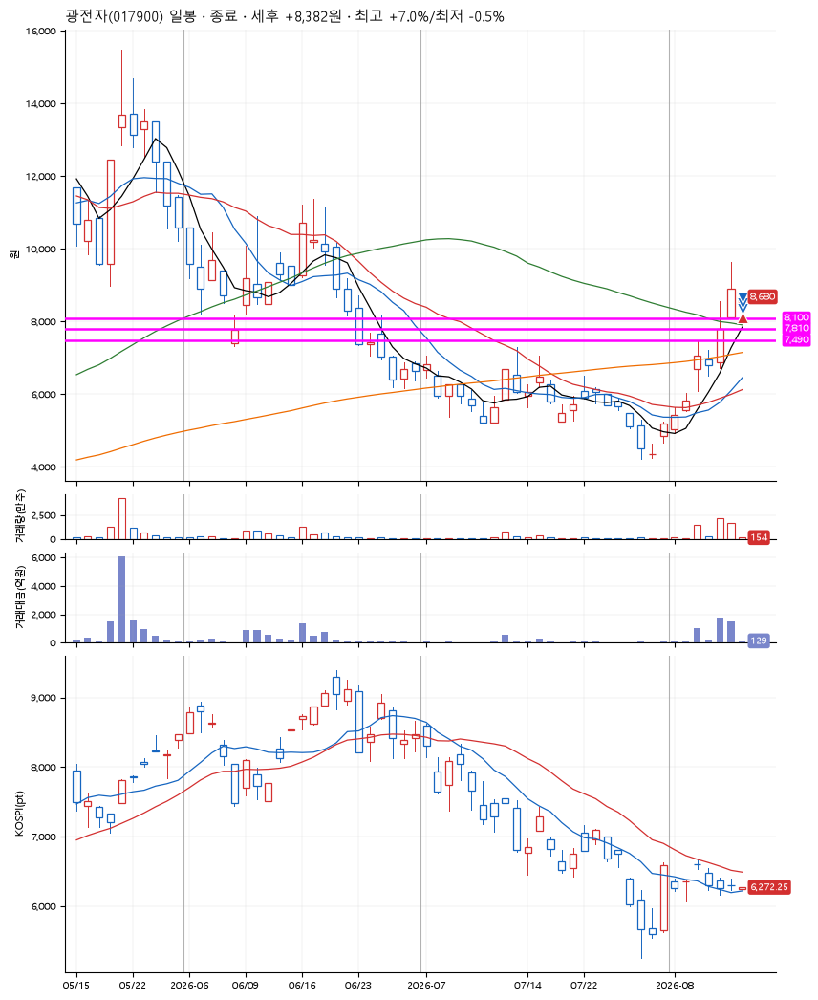
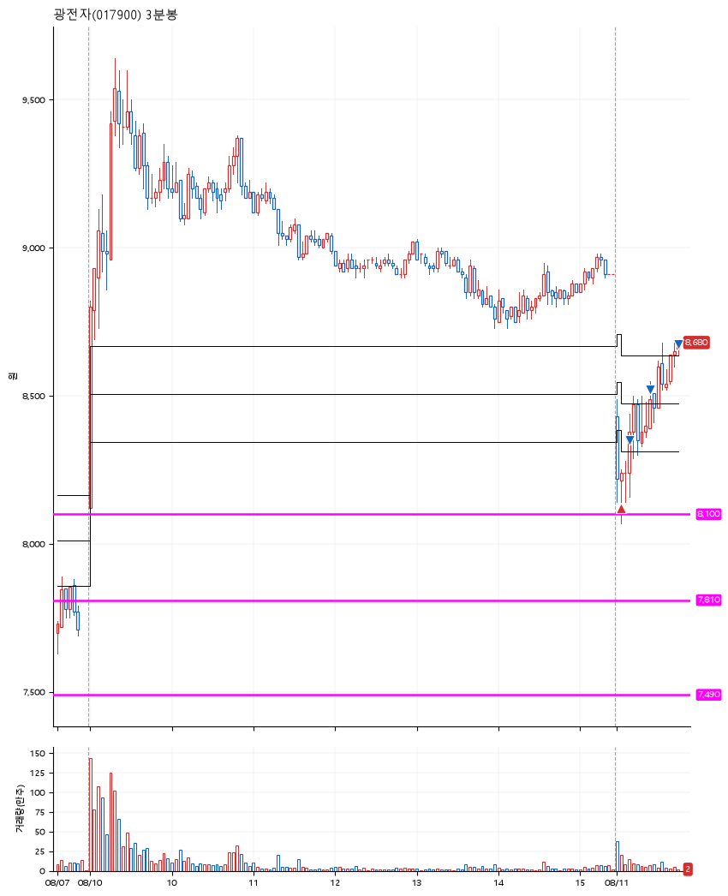

# 광전자(017900) · 2026-08-11

**1차 매수 → 3% 익절 → 5% 익절 → 7% 익절**

진입 2026-08-11 09:03 (D+4) · 청산 2026-08-11 09:46 (D+4) · 보유 42분

| | |
|---|---|
| 결과 | 익절 |
| 평단 / 수량 | 8,120원 · 25주 |
| 투입 | 203,000원 |
| 세후 손익 | +8,382원 (+4.13%) |
| 최고 / 최저 | +7.0% / -0.5% |
| 당일 등락 | +3.08% |
| 보유기간 | 42분 |

## 3선

| | |
|---|---|
| 1선 | 8,100원 |
| 2선 | 7,810원 |
| 3선 | 7,490원 |

기준봉 2026-08-05 (D+4)

## 차트

**일봉**

**3분봉**

## 체결

| 시각 | 구분 | 수량 | 판정가 | 체결가 | 오차 |
|---|---|---|---|---|---|
| 09:03 | 매수 | 25주 | 8,100 | 8,120 | +0.25% |
| 09:10 | 매도 | 10주 | 8,370 | 8,350 | -0.24% |
| 09:25 | 매도 | 12주 | 8,530 | 8,520 | -0.12% |
| 09:46 | 매도 | 3주 | 8,690 | 8,673 | -0.20% |

## 잘한 점

.

## 아쉬운 점

.
