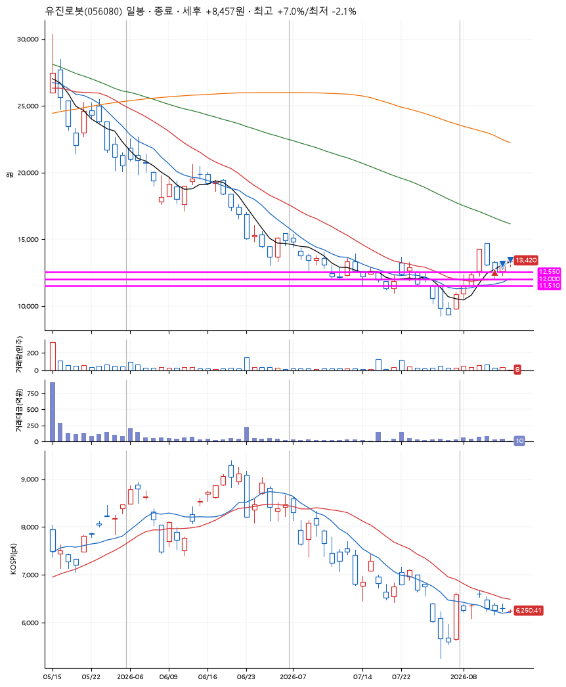
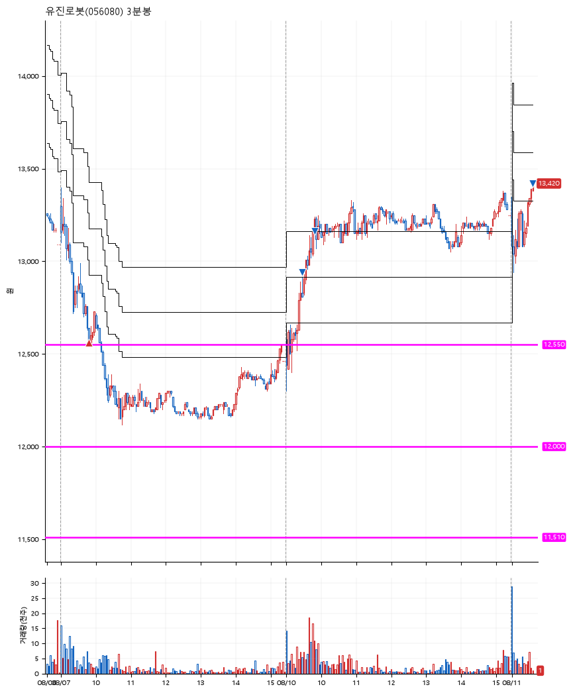

# 유진로봇(056080) · 2026-08-11

**1차 매수 → 3% 익절 → 5% 익절 → 7% 익절**

진입 2026-08-07 09:49 (D+2) · 청산 2026-08-11 09:36 (D+4) · 보유 3일차

| | |
|---|---|
| 결과 | 익절 |
| 평단 / 수량 | 12,560원 · 16주 |
| 투입 | 200,960원 |
| 세후 손익 | +8,457원 (+4.21%) |
| 최고 / 최저 | +7.0% / -2.1% |
| 당일 등락 | +4.93% |
| 보유기간 | 5일차 |

## 3선

| | |
|---|---|
| 1선 | 12,550원 |
| 2선 | 12,000원 |
| 3선 | 11,510원 |

기준봉 2026-08-05 (D+4)

## 차트

**일봉**

**3분봉**

## 체결

| 시각 | 구분 | 수량 | 판정가 | 체결가 | 오차 |
|---|---|---|---|---|---|
| 09:49 | 매수 | 16주 | 12,550 | 12,560 | +0.08% |
| 09:27 | 매도 | 6주 | 12,940 | 12,940 | +0.00% |
| 09:48 | 매도 | 8주 | 13,190 | 13,164 | -0.20% |
| 09:36 | 매도 | 2주 | 13,440 | 13,420 | -0.15% |

## 잘한 점

.

## 아쉬운 점

.
