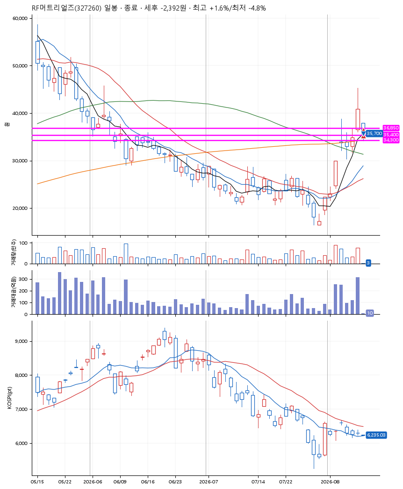
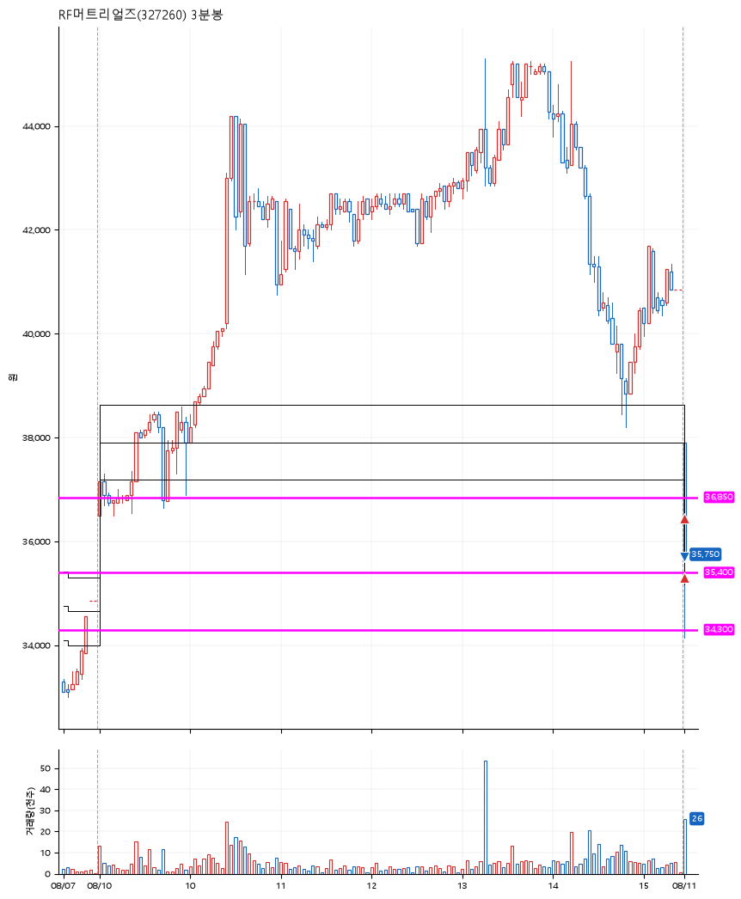

# RF머트리얼즈(327260) · 2026-08-11

**2차 매수 → 손절**

진입 2026-08-11 09:00 (D+5) · 청산 2026-08-11 09:02 (D+5) · 보유 2분

| | |
|---|---|
| 결과 | 손절 |
| 평단 / 수량 | 35,875원 · 10주 |
| 투입 | 358,750원 |
| 세후 손익 | -2,392원 (-0.67%) |
| 최고 / 최저 | +1.6% / -4.8% |
| 당일 등락 | +1.32% |
| 보유기간 | 2분 |

## 3선

| | |
|---|---|
| 1선 | 36,850원 |
| 2선 | 35,400원 |
| 3선 | 34,300원 |

기준봉 2026-08-04 (D+5)

## 차트

**일봉**

**3분봉**

## 체결

| 시각 | 구분 | 수량 | 판정가 | 체결가 | 오차 |
|---|---|---|---|---|---|
| 09:00 | 매수 | 5주 | 36,850 | 36,450 | -1.09% |
| 09:00 | 매수 | 5주 | 35,400 | 35,300 | -0.28% |
| 09:02 | 매도 | 10주 | 34,250 | 35,700 | +4.23% |

## 잘한 점

-

## 아쉬운 점

다시 보니 3선의 근거가 부족해보인다.
