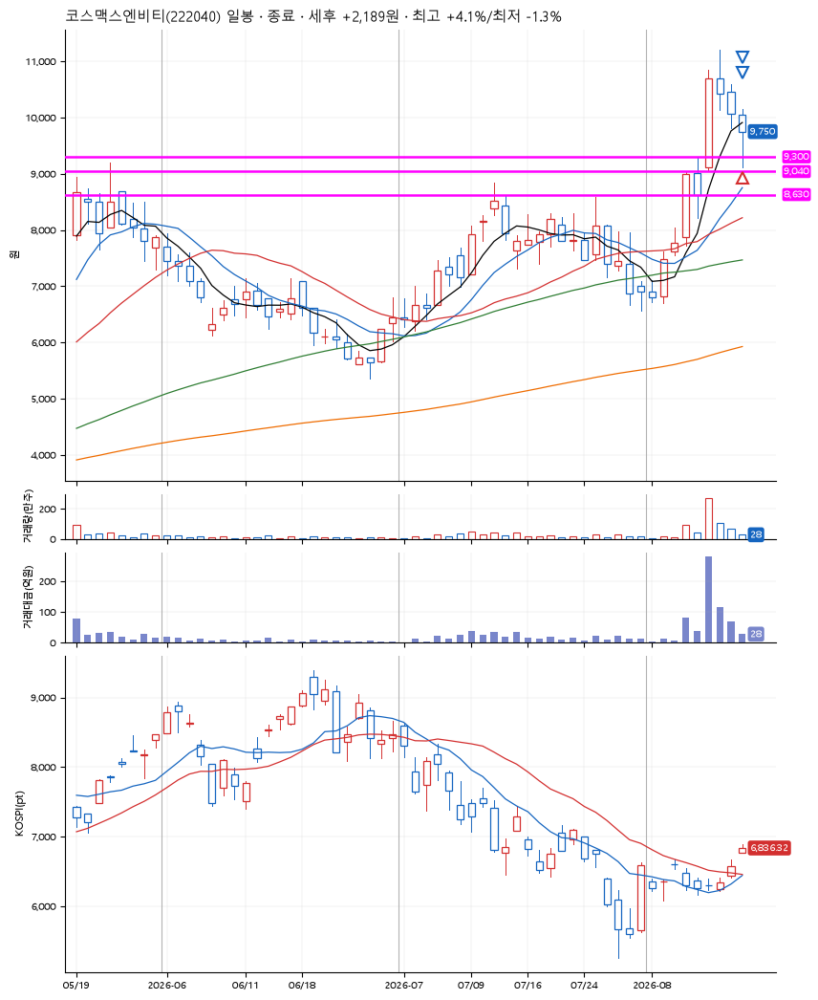
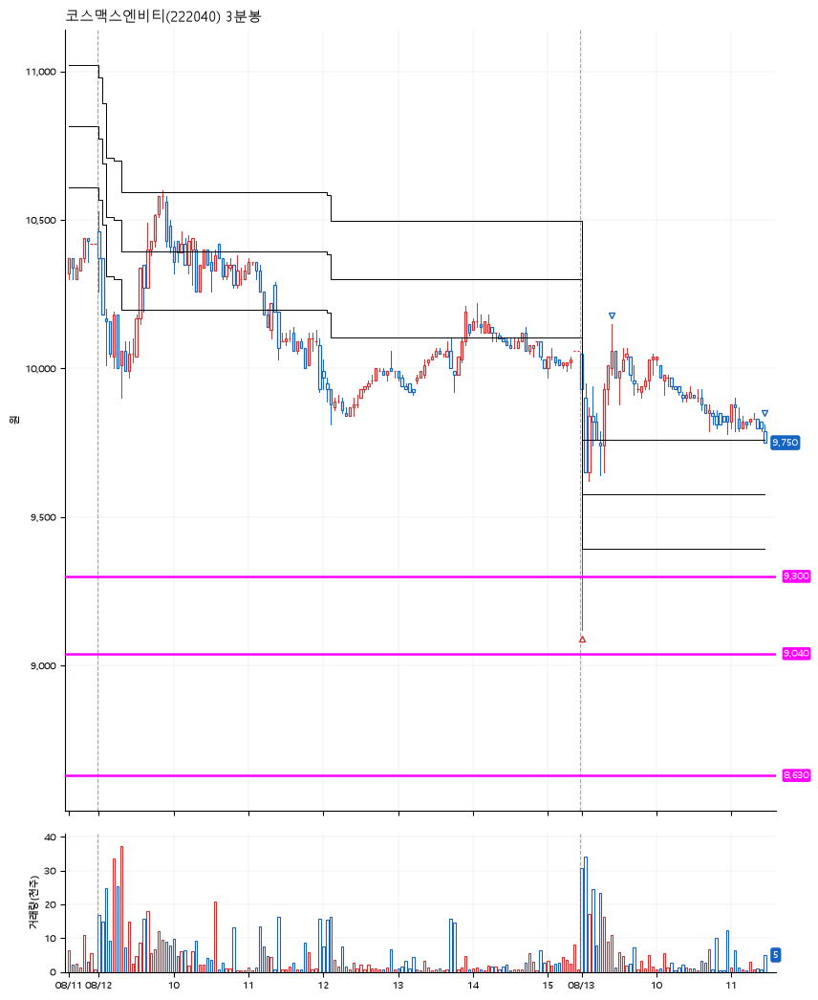

# 코스맥스엔비티(222040) · 2026-08-13

**1차 매수 → 3% 익절 → 본절 이탈**

진입 2026-08-13 09:02 (D+3) · 청산 2026-08-13 11:29 (D+3) · 보유 2시간 26분

| | |
|---|---|
| 결과 | 익절 |
| 평단 / 수량 | 9,750원 · 21주 |
| 투입 | 204,750원 |
| 세후 손익 | +2,189원 (+1.07%) |
| 최고 / 최저 | +4.1% / -1.3% |
| 당일 등락 | -2.59% |
| 보유기간 | 2시간 26분 |

## 3선

| | |
|---|---|
| 1선 | 9,300원 |
| 2선 | 9,040원 |
| 3선 | 8,630원 |

기준봉 2026-08-10 (D+3)

`#KOSPI하락횡보장` `#시장을이기는종목`

## 차트

**일봉**

**3분봉**

## 체결

| 시각 | 구분 | 수량 | 판정가 | 체결가 | 오차 |
|---|---|---|---|---|---|
| 09:02 | 매수 | 21주 | 9,300 | 9,750 | +4.84% |
| 09:24 | 매도 | 8주 | 10,050 | 10,070 | +0.20% |
| 11:29 | 매도 | 13주 | 9,750 | 9,750 | +0.00% |

## 잘한 점

_(미작성)_

## 아쉬운 점

_(미작성)_
