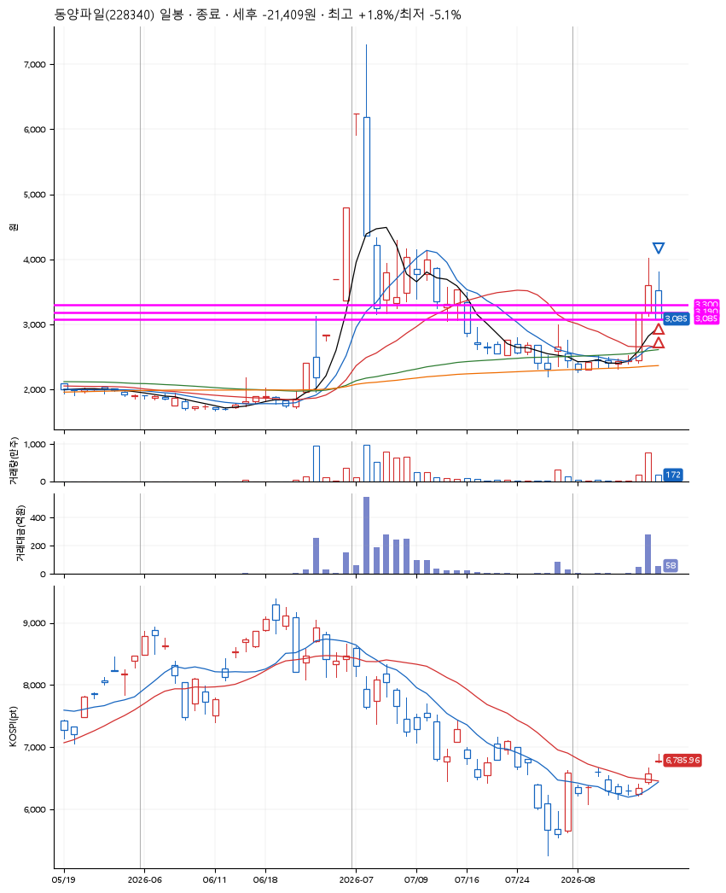

# 동양파일(228340) · 2026-08-13

**2차 매수 → 손절**

진입 2026-08-13 09:56 (D+1) · 청산 2026-08-13 15:12 (D+1) · 보유 5시간 16분

| | |
|---|---|
| 결과 | 손절 |
| 평단 / 수량 | 3,252원 · 124주 |
| 투입 | 403,258원 |
| 세후 손익 | -21,409원 (-5.31%) |
| 최고 / 최저 | +1.8% / -5.1% |
| 당일 등락 | -9.92% |
| 보유기간 | 5시간 16분 |

## 3선

| | |
|---|---|
| 1선 | 3,300원 |
| 2선 | 3,190원 |
| 3선 | 3,085원 |

기준봉 2026-08-12 (D+1)

`#KOSPI하락횡보장` `#시장을이기는종목`

## 차트

## 체결

| 시각 | 구분 | 수량 | 판정가 | 체결가 | 오차 |
|---|---|---|---|---|---|
| 09:56 | 매수 | 61주 | 3,300 | 3,310 | +0.30% |
| 10:14 | 매수 | 63주 | 3,190 | 3,196 | +0.19% |
| 15:12 | 매도 | 124주 | 3,085 | 3,085 | +0.00% |

## 잘한 점

_(미작성)_

## 아쉬운 점

_(미작성)_
