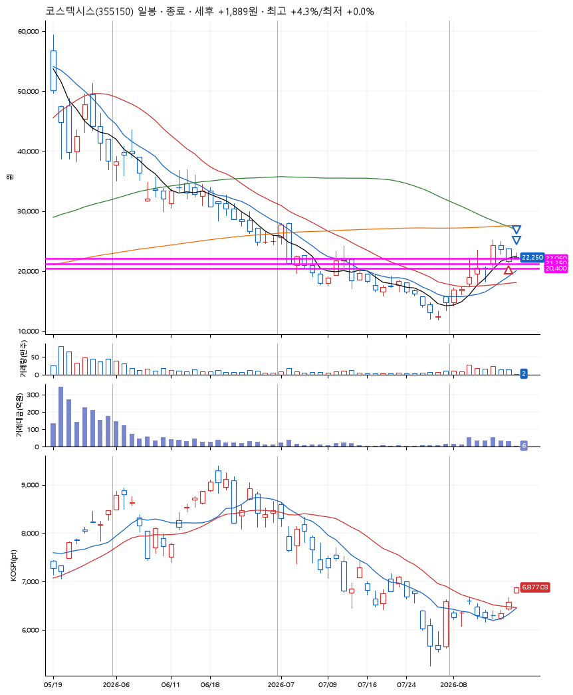
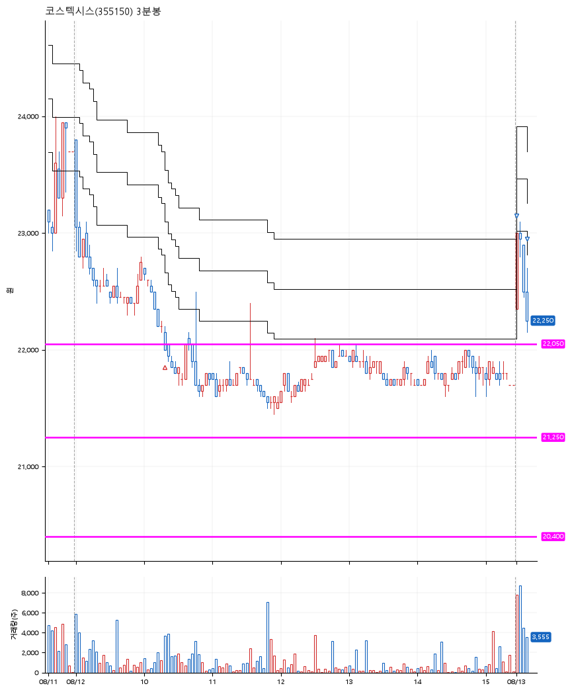

# 코스텍시스(355150) · 2026-08-13

**1차 매수 → 3% 익절 → 본절 이탈**

진입 2026-08-12 10:20 (D+2) · 청산 2026-08-13 09:11 (D+3) · 보유 2일차

| | |
|---|---|
| 결과 | 익절 |
| 평단 / 수량 | 22,150원 · 9주 |
| 투입 | 199,350원 |
| 세후 손익 | +1,889원 (+0.95%) |
| 최고 / 최저 | +4.3% / +0.0% |
| 당일 등락 | -13.24% |
| 보유기간 | 2일차 |

## 3선

| | |
|---|---|
| 1선 | 22,050원 |
| 2선 | 21,250원 |
| 3선 | 20,400원 |

기준봉 2026-08-10 (D+3)

`#KOSPI하락횡보장` `#시장을이기는종목`

## 차트

**일봉**

**3분봉**

## 체결

| 시각 | 구분 | 수량 | 판정가 | 체결가 | 오차 |
|---|---|---|---|---|---|
| 10:20 | 매수 | 9주 | 22,050 | 22,150 | +0.45% |
| 09:00 | 매도 | 3주 | 22,850 | 22,700 | -0.66% |
| 09:11 | 매도 | 6주 | 22,150 | 22,250 | +0.45% |

## 잘한 점

_(미작성)_

## 아쉬운 점

_(미작성)_
