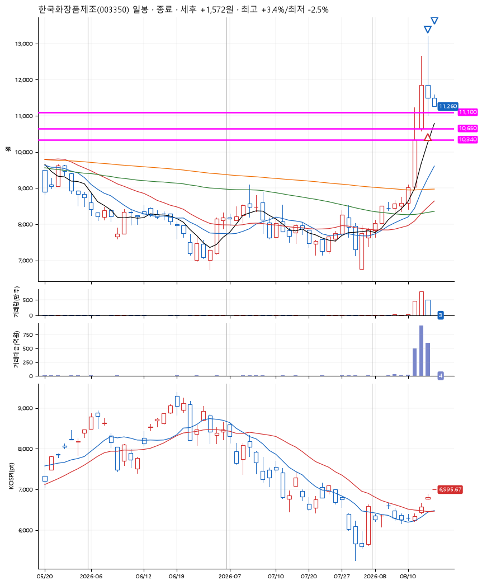

# 한국화장품제조(003350) · 2026-08-14

**1차 매수 → 3% 익절 → 본절 이탈**

진입 2026-08-13 12:18 (D+1) · 청산 2026-08-14 09:00 (D+2) · 보유 2일차

| | |
|---|---|
| 결과 | 손절 |
| 평단 / 수량 | 11,300원 · 18주 |
| 투입 | 203,400원 |
| 세후 손익 | -644원 (-0.32%) |
| 최고 / 최저 | +3.4% / -2.5% |
| 당일 등락 | -2.78% |
| 보유기간 | 2일차 |

## 3선

| | |
|---|---|
| 1선 | 11,100원 |
| 2선 | 10,650원 |
| 3선 | 10,340원 |

기준봉 2026-08-12 (D+2)

`#KOSPI하락횡보장` `#시장을이기는종목`

## 차트

## 체결

| 시각 | 구분 | 수량 | 판정가 | 체결가 | 오차 |
|---|---|---|---|---|---|
| 12:18 | 매수 | 18주 | 11,100 | 11,300 | +1.80% |
| 13:31 | 매도 | 7주 | 11,640 | 11,640 | +0.00% |
| 09:00 | 매도 | 11주 | 11,300 | 11,260 | -0.35% |

## 잘한 점

_(미작성)_

## 아쉬운 점

_(미작성)_
