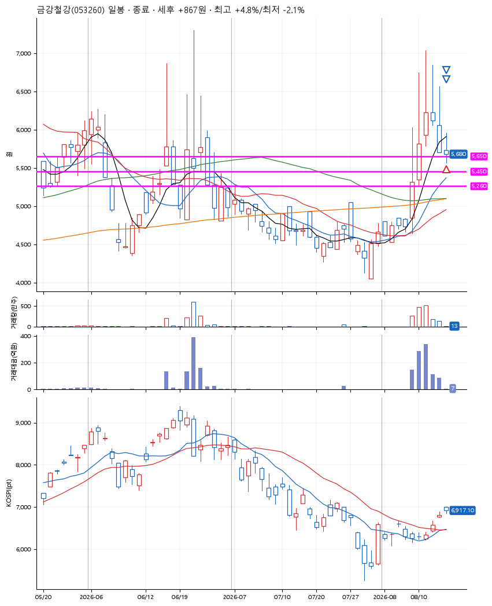
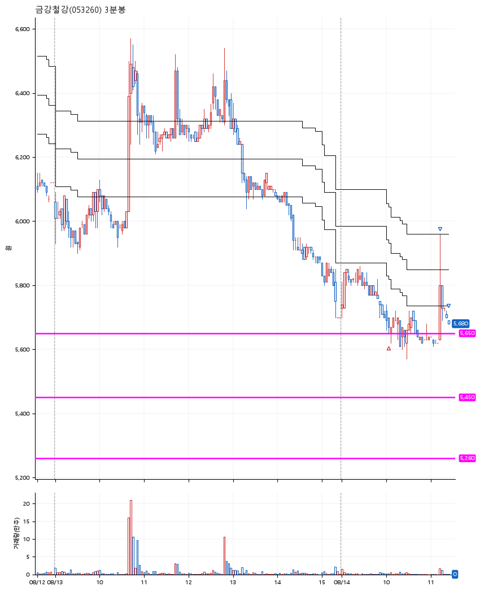

# 금강철강(053260) · 2026-08-14

**1차 매수 → 3% 익절 → 본절 이탈**

진입 2026-08-14 10:05 (D+4) · 청산 2026-08-14 11:24 (D+4) · 보유 1시간 19분

| | |
|---|---|
| 결과 | 익절 |
| 평단 / 수량 | 5,689원 · 35주 |
| 투입 | 199,115원 |
| 세후 손익 | +867원 (+0.44%) |
| 최고 / 최저 | +4.8% / -2.1% |
| 당일 등락 | -0.35% |
| 보유기간 | 1시간 19분 |

## 3선

| | |
|---|---|
| 1선 | 5,650원 |
| 2선 | 5,450원 |
| 3선 | 5,260원 |

기준봉 2026-08-10 (D+4)

`#KOSPI하락횡보장` `#시장을이기는종목`

## 차트

**일봉**

**3분봉**

## 체결

| 시각 | 구분 | 수량 | 판정가 | 체결가 | 오차 |
|---|---|---|---|---|---|
| 10:05 | 매수 | 35주 | 5,650 | 5,689 | +0.69% |
| 11:14 | 매도 | 14주 | 5,860 | 5,790 | -1.19% |
| 11:24 | 매도 | 21주 | 5,680 | 5,680 | +0.00% |

## 잘한 점

.

## 아쉬운 점

.
