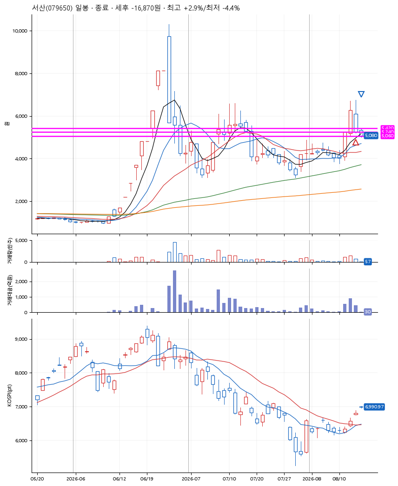
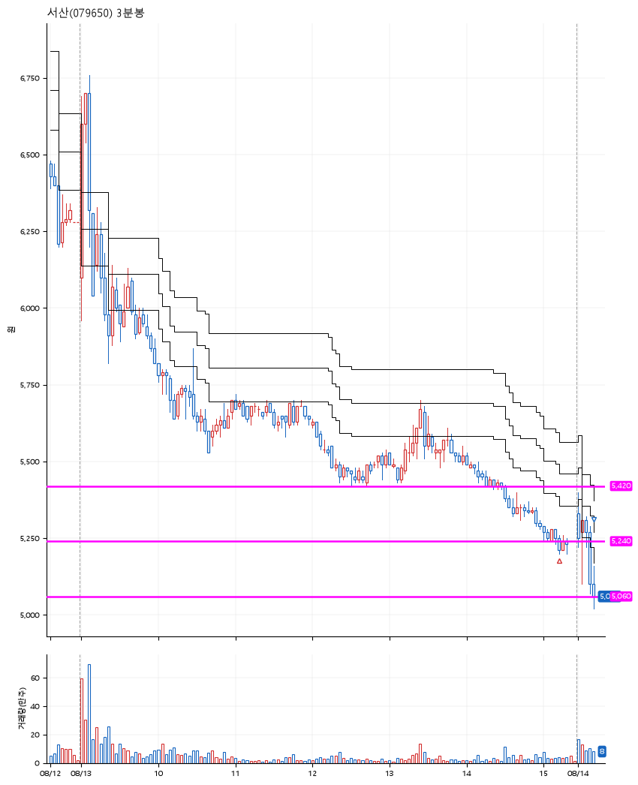

# 서산(079650) · 2026-08-14

**2차 매수 → 손절**

진입 2026-08-13 15:13 (D+1) · 청산 2026-08-14 09:14 (D+2) · 보유 2일차

| | |
|---|---|
| 결과 | 손절 |
| 평단 / 수량 | 5,250원 · 77주 |
| 투입 | 404,250원 |
| 세후 손익 | -16,870원 (-4.17%) |
| 최고 / 최저 | +2.9% / -4.4% |
| 당일 등락 | -18.93% |
| 보유기간 | 2일차 |

## 3선

| | |
|---|---|
| 1선 | 5,420원 |
| 2선 | 5,240원 |
| 3선 | 5,060원 |

기준봉 2026-08-12 (D+2)

`#KOSPI하락횡보장` `#시장을이기는종목`

## 차트

**일봉**

**3분봉**

## 체결

| 시각 | 구분 | 수량 | 판정가 | 체결가 | 오차 |
|---|---|---|---|---|---|
| 15:13 | 매수 | 77주 | 5,240 | 5,250 | +0.19% |
| 09:14 | 매도 | 77주 | 5,060 | 5,040 | -0.40% |

## 잘한 점

-

## 아쉬운 점

기준봉이 다음날로 변경되어, 공격적으로 3선을 그은게 패착이 된 듯. 타이트하게 3선을 잡아서 자주 진입하는 대신, 진입을 덜 하더라도 확률을 높이는 방식을 택하자.
