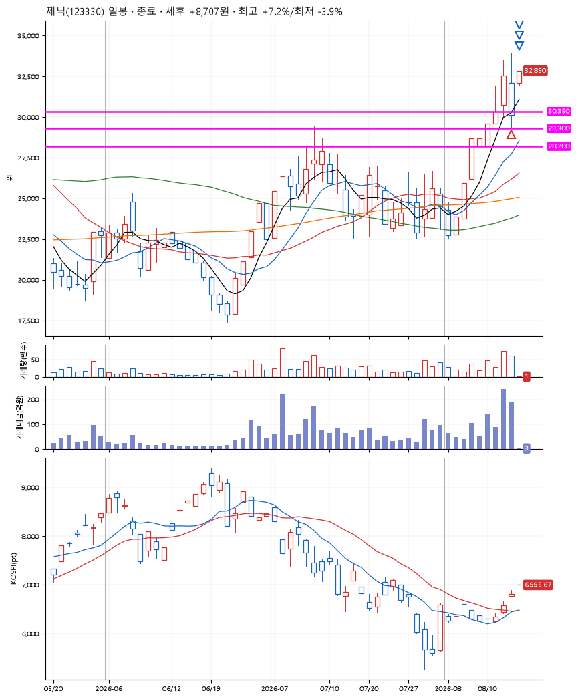
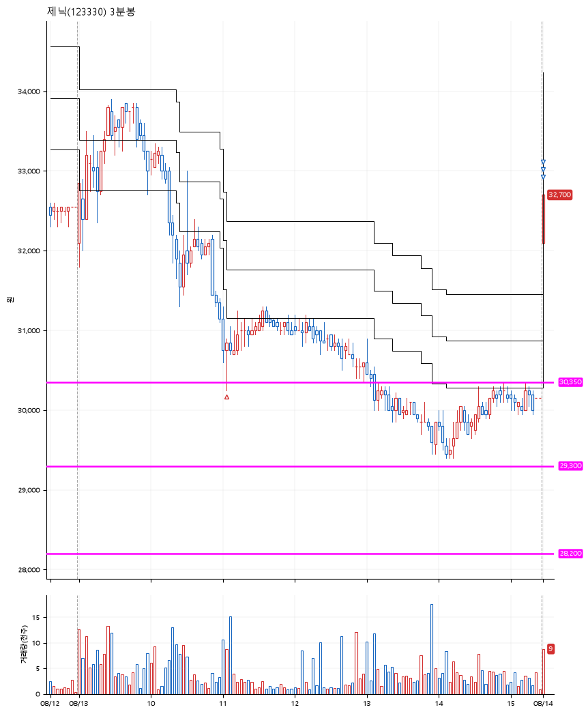

# 제닉(123330) · 2026-08-14

**1차 매수 → 3% 익절 → 5% 익절 → 7% 익절**

진입 2026-08-13 11:04 (D+1) · 청산 2026-08-14 09:00 (D+2) · 보유 2일차

| | |
|---|---|
| 결과 | 익절 |
| 평단 / 수량 | 30,600원 · 6주 |
| 투입 | 183,600원 |
| 세후 손익 | +8,734원 (+4.76%) |
| 최고 / 최저 | +7.2% / -3.9% |
| 당일 등락 | -14.95% |
| 보유기간 | 2일차 |

## 3선

| | |
|---|---|
| 1선 | 30,350원 |
| 2선 | 29,300원 |
| 3선 | 28,200원 |

기준봉 2026-08-12 (D+2)

`#KOSPI하락횡보장` `#시장을이기는종목`

## 차트

**일봉**

**3분봉**

## 체결

| 시각 | 구분 | 수량 | 판정가 | 체결가 | 오차 |
|---|---|---|---|---|---|
| 11:04 | 매수 | 6주 | 30,350 | 30,600 | +0.82% |
| 09:00 | 매도 | 2주 | 32,100 | 32,000 | -0.31% |
| 09:00 | 매도 | 3주 | 32,150 | 32,000 | -0.47% |
| 09:00 | 매도 | 1주 | 32,750 | 32,650 | -0.31% |

## 잘한 점

_(미작성)_

## 아쉬운 점

_(미작성)_
