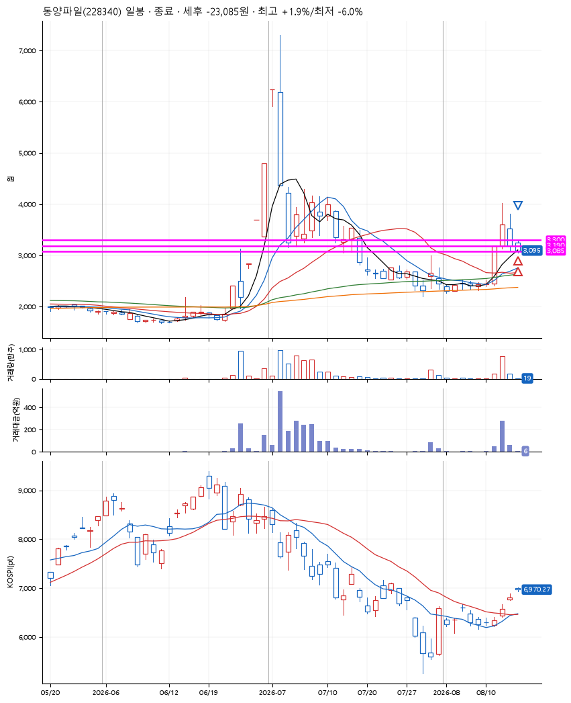

# 동양파일(228340) · 2026-08-14

**2차 매수 → 손절**

진입 2026-08-14 09:00 (D+2) · 청산 2026-08-14 09:29 (D+2) · 보유 28분

| | |
|---|---|
| 결과 | 손절 |
| 평단 / 수량 | 3,244원 · 125주 |
| 투입 | 405,518원 |
| 세후 손익 | -23,085원 (-5.69%) |
| 최고 / 최저 | +1.9% / -6.0% |
| 당일 등락 | -4.47% |
| 보유기간 | 28분 |

## 3선

| | |
|---|---|
| 1선 | 3,300원 |
| 2선 | 3,190원 |
| 3선 | 3,085원 |

기준봉 2026-08-12 (D+2)

`#KOSPI하락횡보장` `#시장을이기는종목`

## 차트

## 체결

| 시각 | 구분 | 수량 | 판정가 | 체결가 | 오차 |
|---|---|---|---|---|---|
| 09:00 | 매수 | 62주 | 3,270 | 3,289 | +0.58% |
| 09:02 | 매수 | 63주 | 3,190 | 3,200 | +0.31% |
| 09:29 | 매도 | 125주 | 3,085 | 3,065 | -0.65% |

## 잘한 점

_(미작성)_

## 아쉬운 점

_(미작성)_
