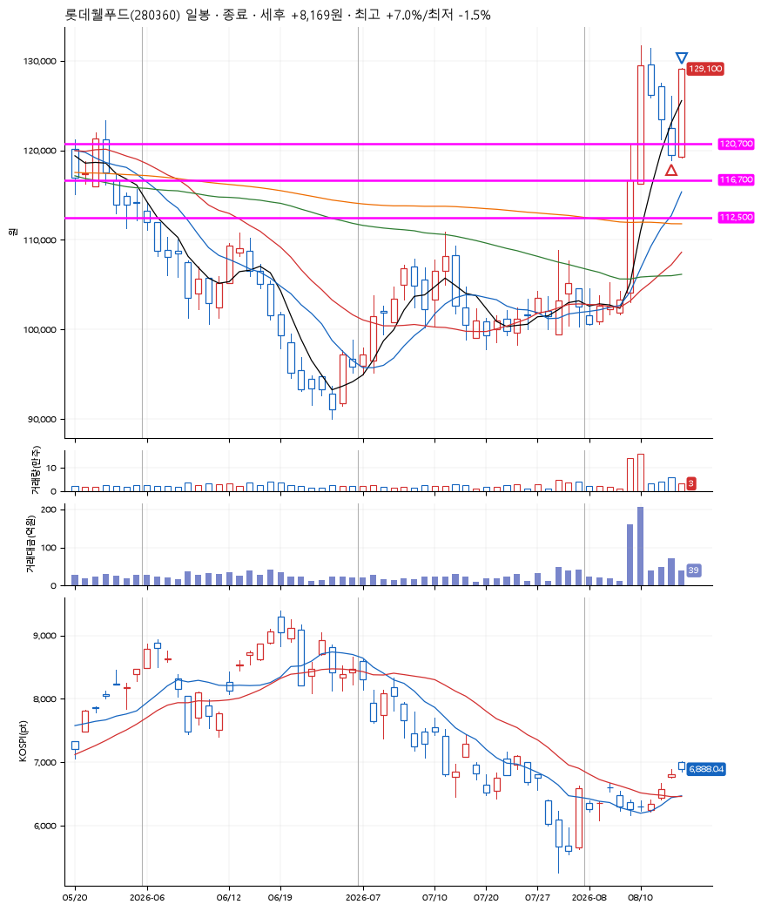
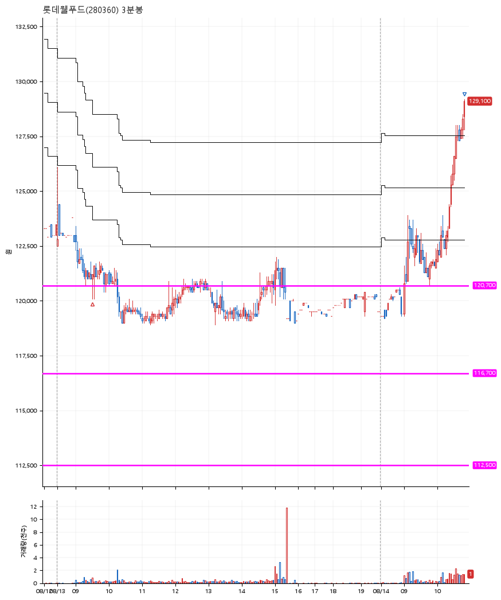

# 롯데웰푸드(280360) · 2026-08-14

**1차 매수 → 3% 익절 → 5% 익절 → 7% 익절**

진입 2026-08-13 09:30 (D+3) · 청산 2026-08-14 10:50 (D+4) · 보유 2일차

| | |
|---|---|
| 결과 | 익절 |
| 평단 / 수량 | 120,700원 · 1주 |
| 투입 | 120,700원 |
| 세후 손익 | +8,169원 (+6.77%) |
| 최고 / 최저 | +7.0% / -1.5% |
| 당일 등락 | +5.12% |
| 보유기간 | 2일차 |

## 3선

| | |
|---|---|
| 1선 | 120,700원 |
| 2선 | 116,700원 |
| 3선 | 112,500원 |

기준봉 2026-08-10 (D+4)

`#KOSPI하락횡보장` `#시장을이기는종목`

## 차트

**일봉**

**3분봉**

## 체결

| 시각 | 구분 | 수량 | 판정가 | 체결가 | 오차 |
|---|---|---|---|---|---|
| 09:30 | 매수 | 1주 | 120,700 | 120,700 | +0.00% |
| 10:50 | 매도 | 1주 | 129,200 | 129,100 | -0.08% |

## 잘한 점

_(미작성)_

## 아쉬운 점

_(미작성)_
