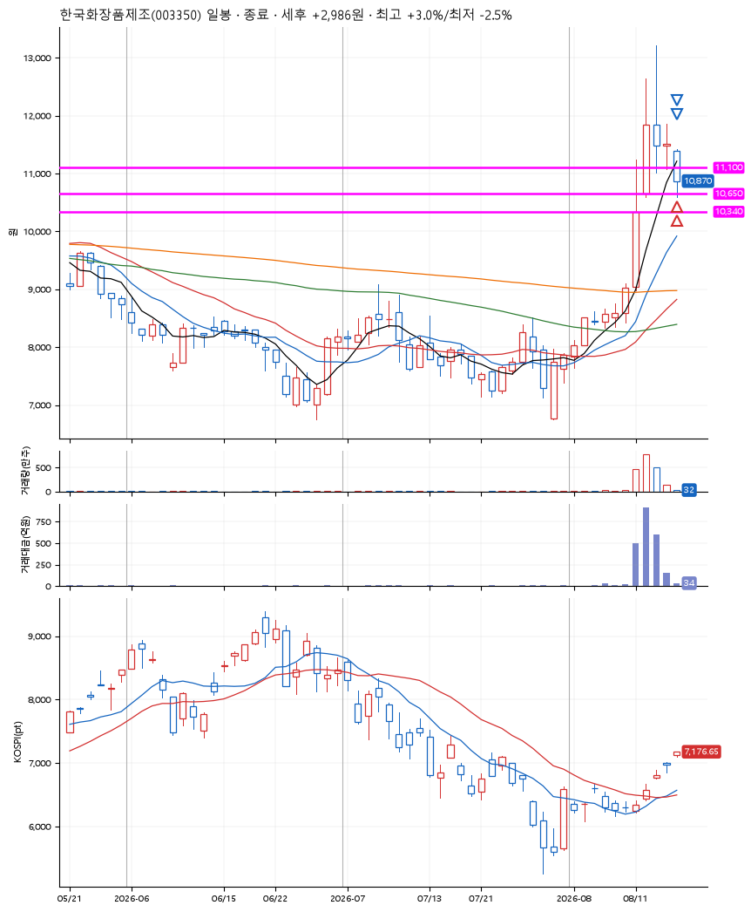

# 한국화장품제조(003350) · 2026-08-18

**2차 매수 → 3% 익절 → 본절 이탈**

진입 2026-08-18 09:01 (D+3) · 청산 2026-08-18 09:27 (D+3) · 보유 26분

| | |
|---|---|
| 결과 | 익절 |
| 평단 / 수량 | 10,870원 · 37주 |
| 투입 | 402,200원 |
| 세후 손익 | +2,986원 (+0.74%) |
| 최고 / 최저 | +3.0% / -2.5% |
| 당일 등락 | -5.18% |
| 보유기간 | 26분 |

## 3선

| | |
|---|---|
| 1선 | 11,100원 |
| 2선 | 10,650원 |
| 3선 | 10,340원 |

기준봉 2026-08-12 (D+3)

`#KOSPI하락횡보장` `#시장을이기는종목`

## 차트

## 체결

| 시각 | 구분 | 수량 | 판정가 | 체결가 | 오차 |
|---|---|---|---|---|---|
| 09:01 | 매수 | 18주 | 11,010 | 11,050 | +0.36% |
| 09:04 | 매수 | 19주 | 10,650 | 10,700 | +0.47% |
| 09:18 | 매도 | 14주 | 11,200 | 11,136 | -0.57% |
| 09:27 | 매도 | 23주 | 10,870 | 10,870 | +0.00% |

## 잘한 점

_(미작성)_

## 아쉬운 점

_(미작성)_
