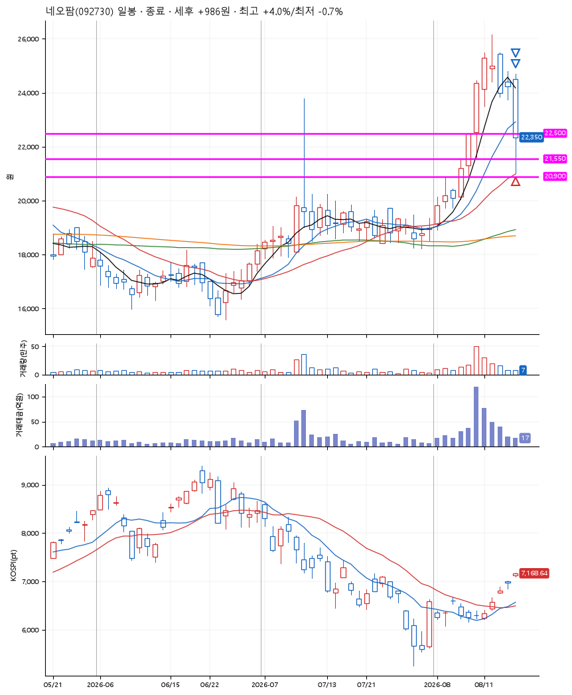
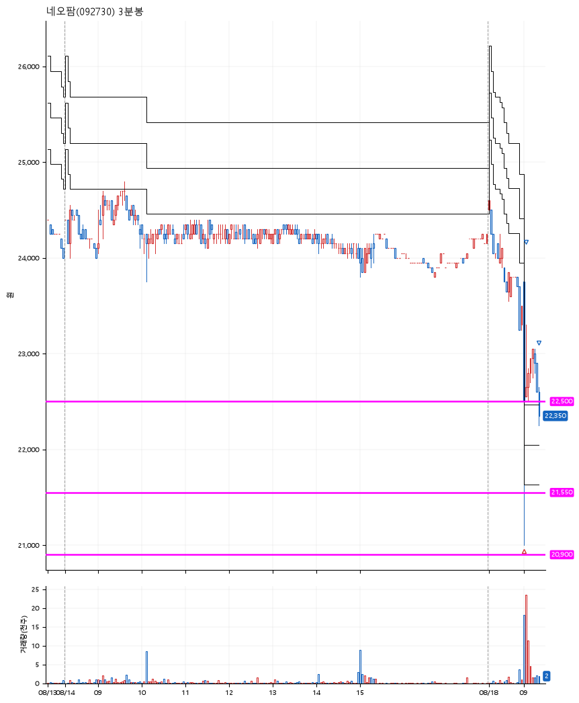

# 네오팜(092730) · 2026-08-18

**1차 매수 → 3% 익절 → 본절 이탈**

진입 2026-08-18 09:02 (D+5) · 청산 2026-08-18 09:21 (D+5) · 보유 18분

| | |
|---|---|
| 결과 | 익절 |
| 평단 / 수량 | 22,400원 · 9주 |
| 투입 | 201,600원 |
| 세후 손익 | +986원 (+0.49%) |
| 최고 / 최저 | +4.0% / -0.7% |
| 당일 등락 | -2.32% |
| 보유기간 | 18분 |

## 3선

| | |
|---|---|
| 1선 | 22,500원 |
| 2선 | 21,550원 |
| 3선 | 20,900원 |

기준봉 2026-08-10 (D+5)

`#KOSPI하락횡보장` `#시장을이기는종목`

## 차트

**일봉**

**3분봉**

## 체결

| 시각 | 구분 | 수량 | 판정가 | 체결가 | 오차 |
|---|---|---|---|---|---|
| 09:02 | 매수 | 9주 | 22,200 | 22,400 | +0.90% |
| 09:03 | 매도 | 3주 | 23,100 | 23,050 | -0.22% |
| 09:21 | 매도 | 6주 | 22,400 | 22,300 | -0.45% |

## 잘한 점

_(미작성)_

## 아쉬운 점

_(미작성)_
