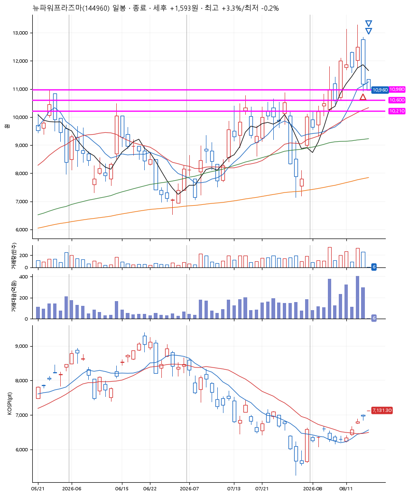

# 뉴파워프라즈마(144960) · 2026-08-18

**1차 매수 → 3% 익절 → 본절 이탈**

진입 2026-08-14 15:19 (D+4) · 청산 2026-08-18 09:00 (D+5) · 보유 2일차

| | |
|---|---|
| 결과 | 익절 |
| 평단 / 수량 | 10,980원 · 18주 |
| 투입 | 197,640원 |
| 세후 손익 | +1,622원 (+0.82%) |
| 최고 / 최저 | +3.3% / -0.2% |
| 당일 등락 | -10.57% |
| 보유기간 | 5일차 |

## 3선

| | |
|---|---|
| 1선 | 10,980원 |
| 2선 | 10,600원 |
| 3선 | 10,210원 |

기준봉 2026-08-10 (D+5)

`#KOSPI하락횡보장` `#시장을이기는종목`

## 차트

## 체결

| 시각 | 구분 | 수량 | 판정가 | 체결가 | 오차 |
|---|---|---|---|---|---|
| 15:19 | 매수 | 18주 | 10,980 | 10,980 | +0.00% |
| 09:00 | 매도 | 7주 | 11,340 | 11,290 | -0.44% |
| 09:00 | 매도 | 11주 | 10,970 | 10,960 | -0.09% |

## 잘한 점

_(미작성)_

## 아쉬운 점

_(미작성)_
