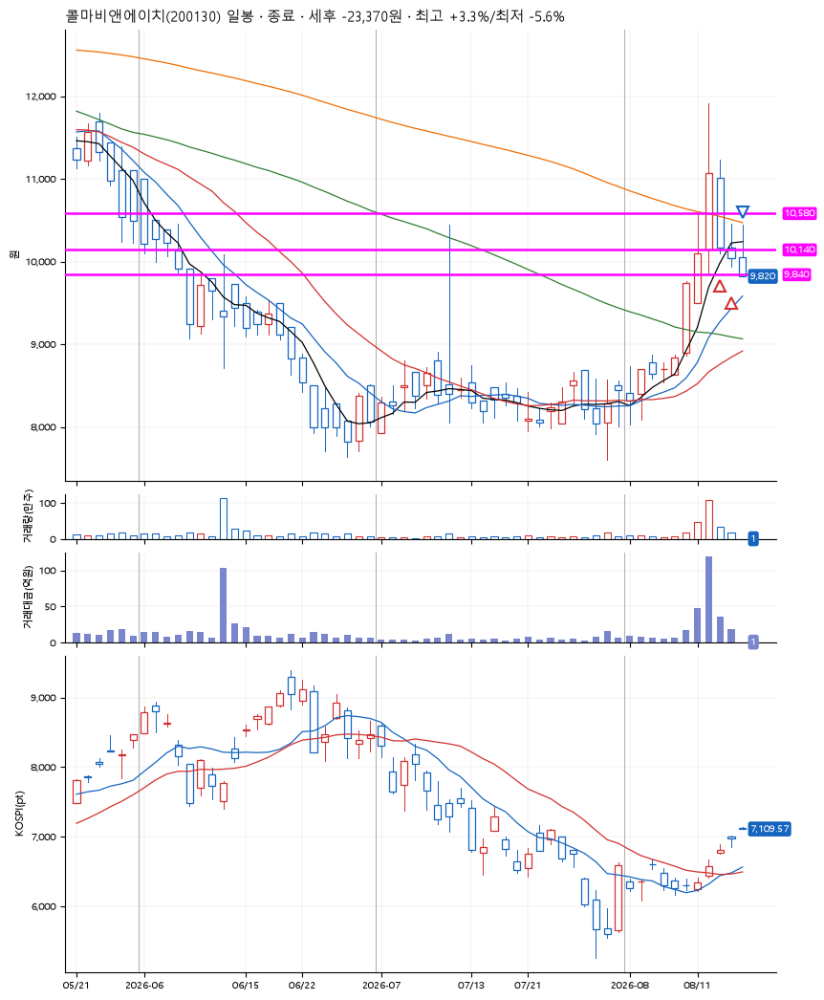
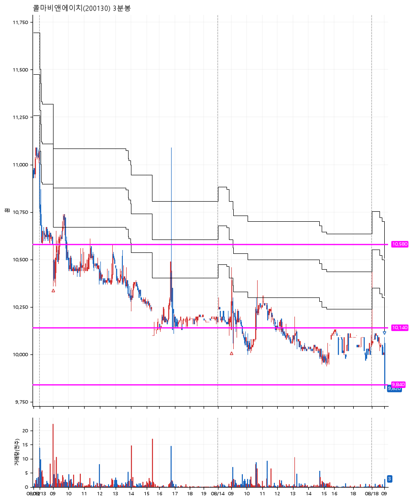

# 콜마비앤에이치(200130) · 2026-08-18

**2차 매수 → 손절**

진입 2026-08-13 09:00 (D+1) · 청산 2026-08-18 09:02 (D+3) · 보유 3일차

| | |
|---|---|
| 결과 | 손절 |
| 평단 / 수량 | 10,402원 · 39주 |
| 투입 | 405,660원 |
| 세후 손익 | -23,311원 (-5.75%) |
| 최고 / 최저 | +3.3% / -5.6% |
| 당일 등락 | -8.67% |
| 보유기간 | 6일차 |

## 3선

| | |
|---|---|
| 1선 | 10,580원 |
| 2선 | 10,140원 |
| 3선 | 9,840원 |

기준봉 2026-08-12 (D+3)

`#KOSPI하락횡보장` `#시장을이기는종목`

## 차트

**일봉**

**3분봉**

## 체결

| 시각 | 구분 | 수량 | 판정가 | 체결가 | 오차 |
|---|---|---|---|---|---|
| 09:00 | 매수 | 19주 | 10,490 | 10,500 | +0.10% |
| 09:00 | 매수 | 20주 | 10,130 | 10,308 | +1.76% |
| 09:02 | 매도 | 39주 | 9,840 | 9,820 | -0.20% |

## 잘한 점

_(미작성)_

## 아쉬운 점

_(미작성)_
