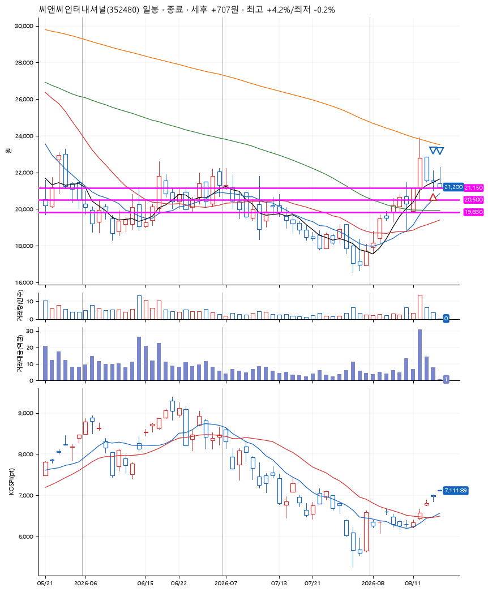
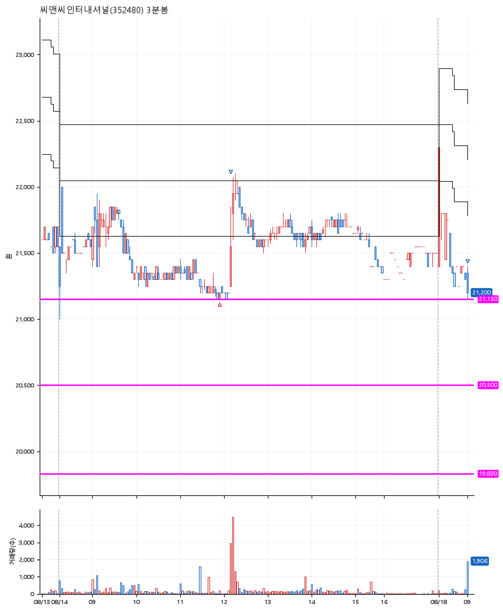

# 씨앤씨인터내셔널(352480) · 2026-08-18

**1차 매수 → 3% 익절 → 본절 이탈**

진입 2026-08-14 11:54 (D+2) · 청산 2026-08-18 09:01 (D+3) · 보유 2일차

| | |
|---|---|
| 결과 | 익절 |
| 평단 / 수량 | 21,200원 · 9주 |
| 투입 | 190,800원 |
| 세후 손익 | +707원 (+0.37%) |
| 최고 / 최저 | +4.2% / -0.2% |
| 당일 등락 | -2.10% |
| 보유기간 | 5일차 |

## 3선

| | |
|---|---|
| 1선 | 21,150원 |
| 2선 | 20,500원 |
| 3선 | 19,830원 |

기준봉 2026-08-12 (D+3)

`#KOSPI하락횡보장` `#시장을이기는종목`

## 차트

**일봉**

**3분봉**

## 체결

| 시각 | 구분 | 수량 | 판정가 | 체결가 | 오차 |
|---|---|---|---|---|---|
| 11:54 | 매수 | 9주 | 21,150 | 21,200 | +0.24% |
| 12:11 | 매도 | 3주 | 21,850 | 21,550 | -1.37% |
| 09:01 | 매도 | 6주 | 21,200 | 21,200 | +0.00% |

## 잘한 점

_(미작성)_

## 아쉬운 점

_(미작성)_
