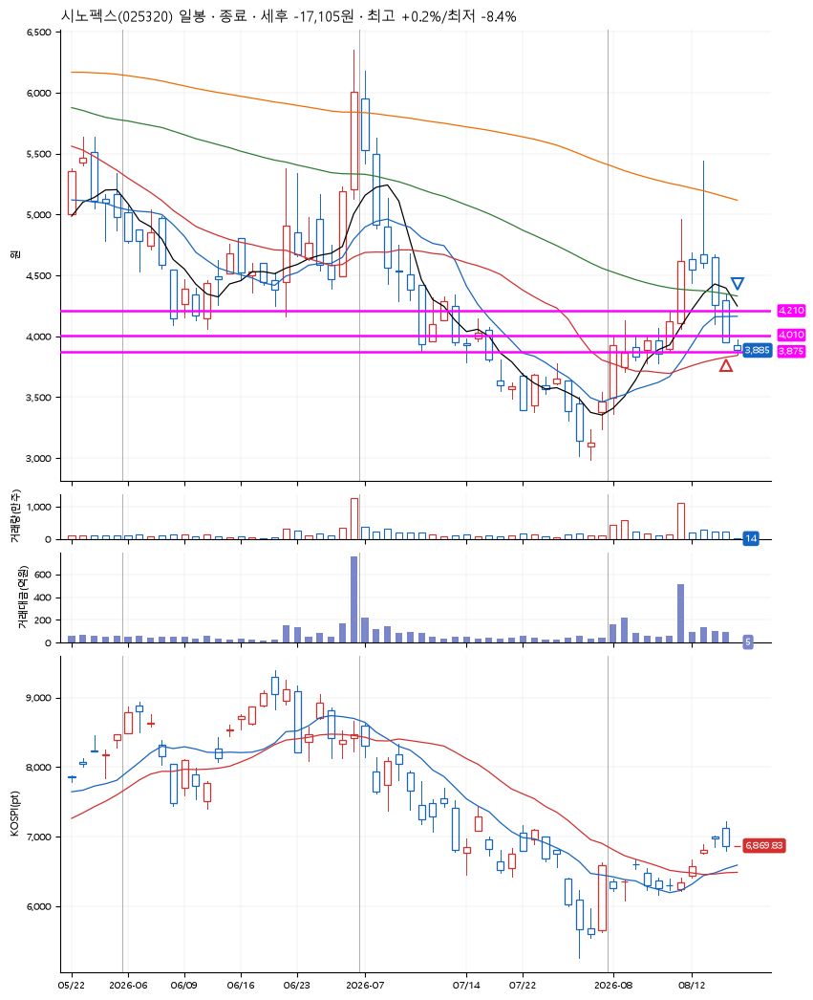
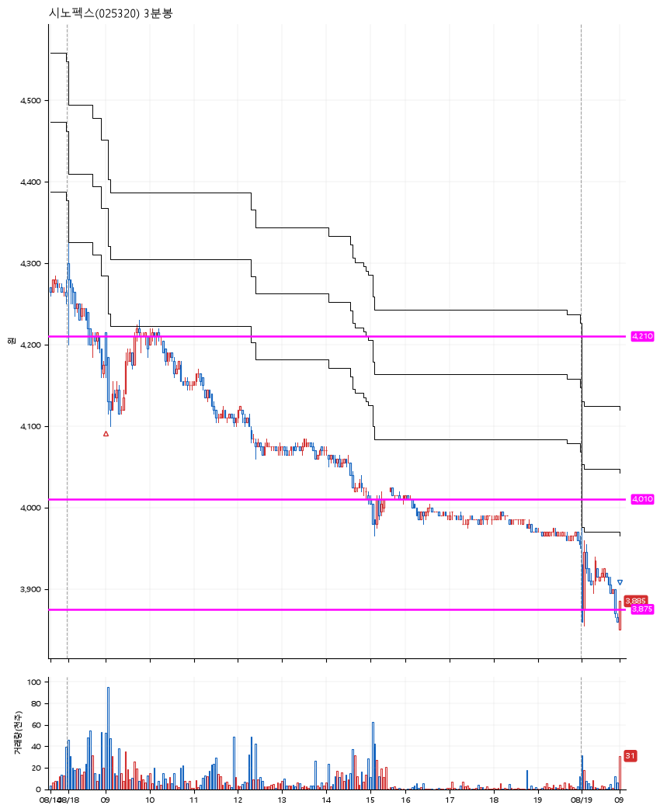

# 시노펙스(025320) · 2026-08-19

**1차 매수 → 손절**

진입 2026-08-18 09:00 (D+4) · 청산 2026-08-19 09:00 (D+5) · 보유 2일차

| | |
|---|---|
| 결과 | 손절 |
| 평단 / 수량 | 4,205원 · 48주 |
| 투입 | 201,840원 |
| 세후 손익 | -17,135원 (-8.49%) |
| 최고 / 최저 | +0.2% / -8.4% |
| 당일 등락 | -5.58% |
| 보유기간 | 2일차 |

## 3선

| | |
|---|---|
| 1선 | 4,210원 |
| 2선 | 4,010원 |
| 3선 | 3,875원 |

기준봉 2026-08-11 (D+5)

`#KOSPI하락횡보장` `#시장을이기는종목`

## 차트

**일봉**

**3분봉**

## 체결

| 시각 | 구분 | 수량 | 판정가 | 체결가 | 오차 |
|---|---|---|---|---|---|
| 09:00 | 매수 | 48주 | 4,210 | 4,205 | -0.12% |
| 09:00 | 매도 | 48주 | 3,850 | 3,855 | +0.13% |

## 잘한 점

.

## 아쉬운 점

.
