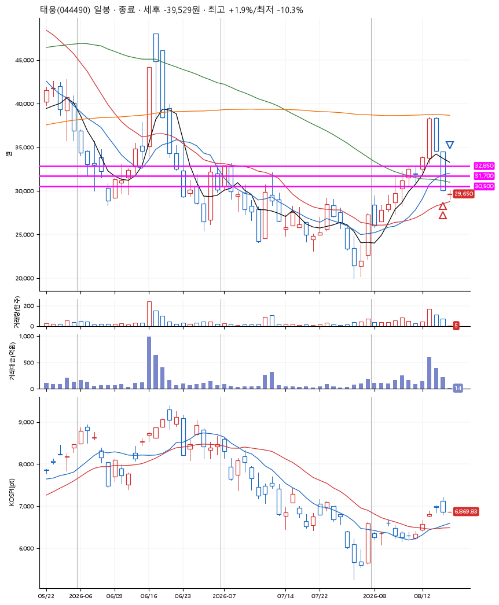
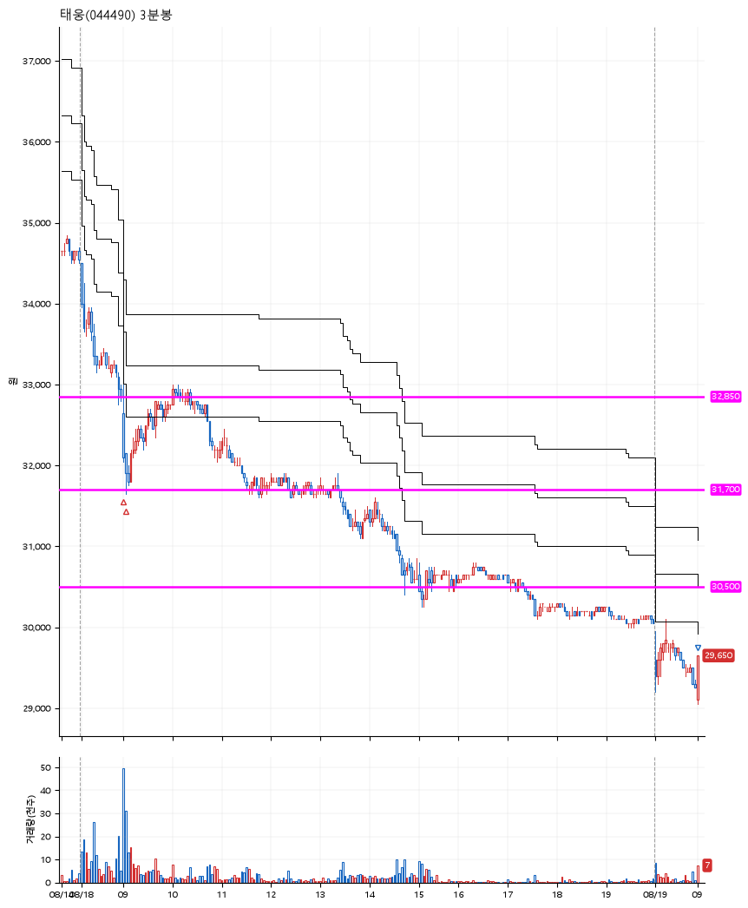

# 태웅(044490) · 2026-08-19

**2차 매수 → 손절**

진입 2026-08-18 09:00 (D+2) · 청산 2026-08-19 09:00 (D+3) · 보유 2일차

| | |
|---|---|
| 결과 | 손절 |
| 평단 / 수량 | 32,400원 · 12주 |
| 투입 | 388,800원 |
| 세후 손익 | -39,586원 (-10.18%) |
| 최고 / 최저 | +1.9% / -10.3% |
| 당일 등락 | -6.13% |
| 보유기간 | 2일차 |

## 3선

| | |
|---|---|
| 1선 | 32,850원 |
| 2선 | 31,700원 |
| 3선 | 30,500원 |

기준봉 2026-08-13 (D+3)

`#KOSPI하락횡보장` `#시장을이기는종목`

## 차트

**일봉**

**3분봉**

## 체결

| 시각 | 구분 | 수량 | 판정가 | 체결가 | 오차 |
|---|---|---|---|---|---|
| 09:00 | 매수 | 6주 | 32,650 | 33,000 | +1.07% |
| 09:03 | 매수 | 6주 | 31,700 | 31,800 | +0.32% |
| 09:00 | 매도 | 12주 | 29,100 | 29,154 | +0.19% |

## 잘한 점

_(미작성)_

## 아쉬운 점

_(미작성)_
