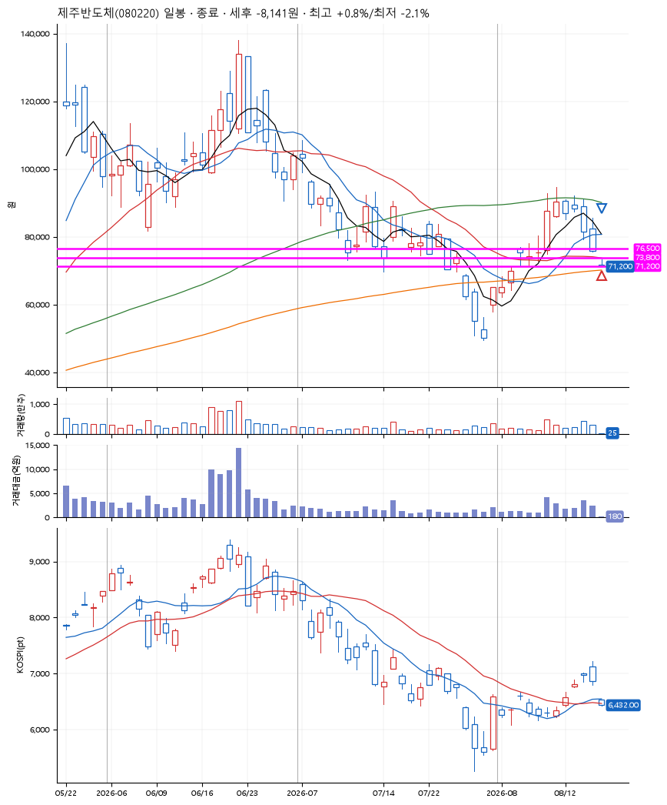
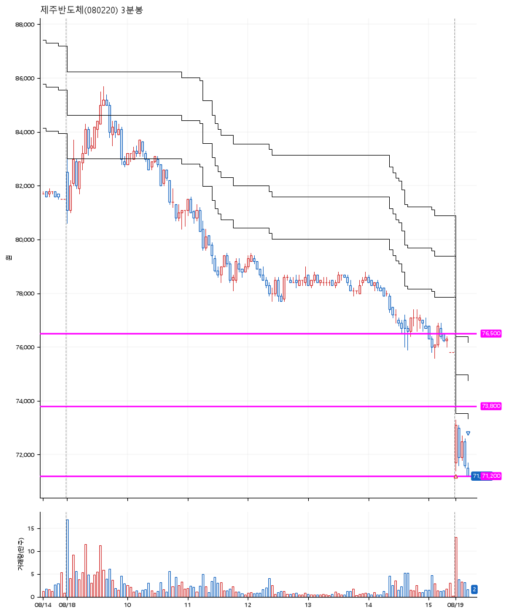

# 제주반도체(080220) · 2026-08-19

**2차 매수 → 손절**

진입 2026-08-19 09:00 (D+6) · 청산 2026-08-19 09:12 (D+6) · 보유 12분

| | |
|---|---|
| 결과 | 손절 |
| 평단 / 수량 | 72,700원 · 5주 |
| 투입 | 363,500원 |
| 세후 손익 | -8,141원 (-2.24%) |
| 최고 / 최저 | +0.8% / -2.1% |
| 당일 등락 | +2.65% |
| 보유기간 | 12분 |

## 3선

| | |
|---|---|
| 1선 | 76,500원 |
| 2선 | 73,800원 |
| 3선 | 71,200원 |

기준봉 2026-08-10 (D+6)

`#KOSPI하락횡보장` `#시장을이기는종목`

## 차트

**일봉**

**3분봉**

## 체결

| 시각 | 구분 | 수량 | 판정가 | 체결가 | 오차 |
|---|---|---|---|---|---|
| 09:00 | 매수 | 5주 | 71,700 | 72,700 | +1.39% |
| 09:12 | 매도 | 5주 | 71,200 | 71,200 | +0.00% |

## 잘한 점

_(미작성)_

## 아쉬운 점

_(미작성)_
