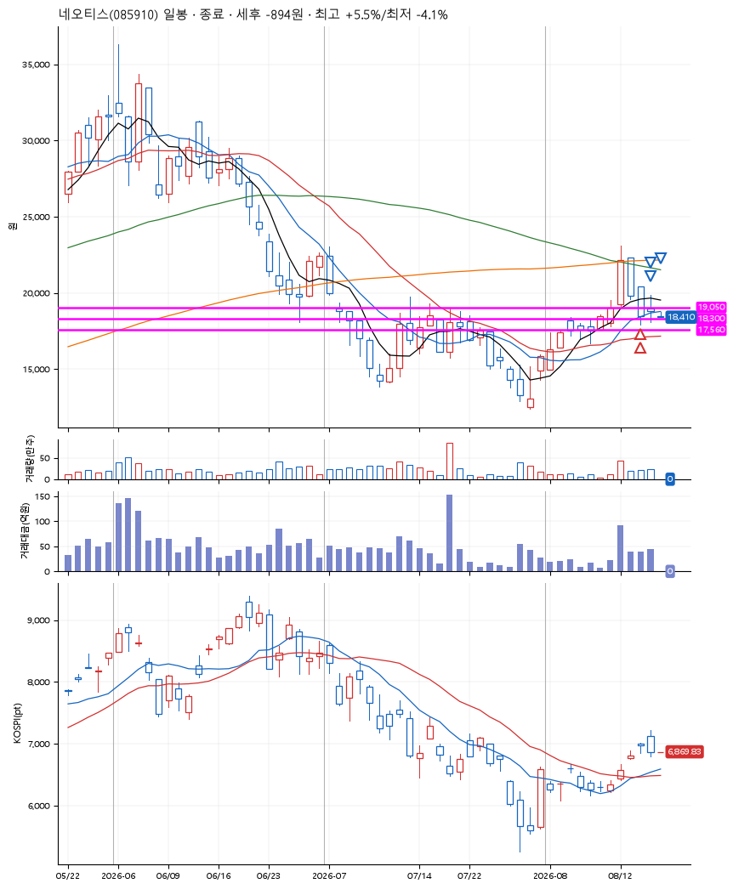
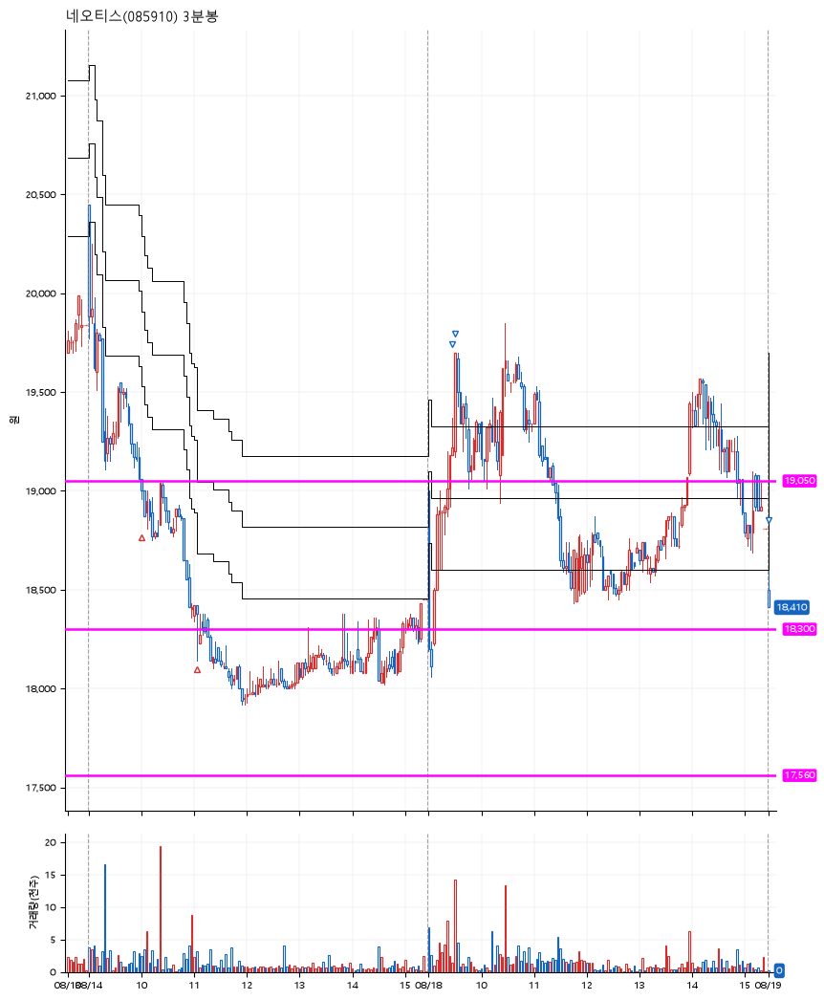

# 네오티스(085910) · 2026-08-19

**2차 매수 → 3% 익절 → 5% 익절 → 본절 이탈**

진입 2026-08-14 10:00 (D+2) · 청산 2026-08-19 09:00 (D+4) · 보유 3일차

| | |
|---|---|
| 결과 | 손절 |
| 평단 / 수량 | 18,678원 · 21주 |
| 투입 | 392,230원 |
| 세후 손익 | -894원 (-0.23%) |
| 최고 / 최저 | +5.5% / -4.1% |
| 당일 등락 | -11.88% |
| 보유기간 | 6일차 |

## 3선

| | |
|---|---|
| 1선 | 19,050원 |
| 2선 | 18,300원 |
| 3선 | 17,560원 |

기준봉 2026-08-12 (D+4)

`#KOSPI하락횡보장` `#시장을이기는종목`

## 차트

**일봉**

**3분봉**

## 체결

| 시각 | 구분 | 수량 | 판정가 | 체결가 | 오차 |
|---|---|---|---|---|---|
| 10:00 | 매수 | 10주 | 19,050 | 19,060 | +0.05% |
| 11:03 | 매수 | 11주 | 18,300 | 18,330 | +0.16% |
| 09:27 | 매도 | 8주 | 19,280 | 19,250 | -0.16% |
| 09:31 | 매도 | 10주 | 19,620 | 19,600 | -0.10% |
| 09:00 | 매도 | 3주 | 18,500 | 18,410 | -0.49% |

## 잘한 점

_(미작성)_

## 아쉬운 점

_(미작성)_
