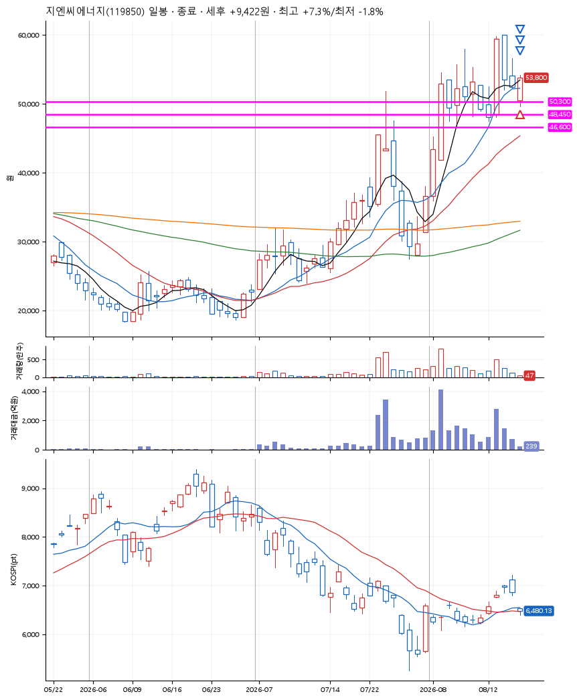

# 지엔씨에너지(119850) · 2026-08-19

**1차 매수 → 3% 익절 → 5% 익절 → 7% 익절**

진입 2026-08-19 09:00 (D+3) · 청산 2026-08-19 09:42 (D+3) · 보유 42분

| | |
|---|---|
| 결과 | 익절 |
| 평단 / 수량 | 50,500원 · 4주 |
| 투입 | 202,000원 |
| 세후 손익 | +9,422원 (+4.66%) |
| 최고 / 최저 | +7.3% / -1.8% |
| 당일 등락 | +7.65% |
| 보유기간 | 42분 |

## 3선

| | |
|---|---|
| 1선 | 50,300원 |
| 2선 | 48,450원 |
| 3선 | 46,600원 |

기준봉 2026-08-13 (D+3)

`#KOSPI하락횡보장` `#시장을이기는종목` `#테마주`

> 전력설비 데이터센터

## 차트

## 체결

| 시각 | 구분 | 수량 | 판정가 | 체결가 | 오차 |
|---|---|---|---|---|---|
| 09:00 | 매수 | 4주 | 50,300 | 50,500 | +0.40% |
| 09:36 | 매도 | 1주 | 52,100 | 51,700 | -0.77% |
| 09:40 | 매도 | 2주 | 53,100 | 53,000 | -0.19% |
| 09:42 | 매도 | 1주 | 54,100 | 54,100 | +0.00% |

## 잘한 점

_(미작성)_

## 아쉬운 점

_(미작성)_
