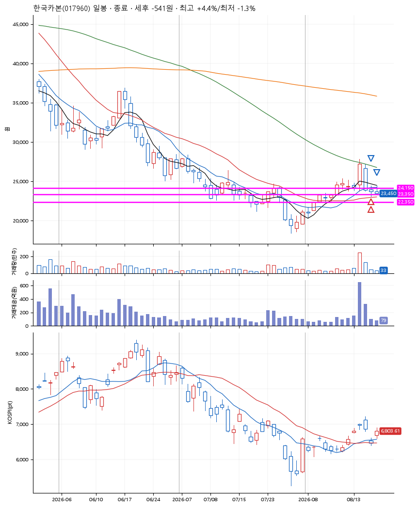
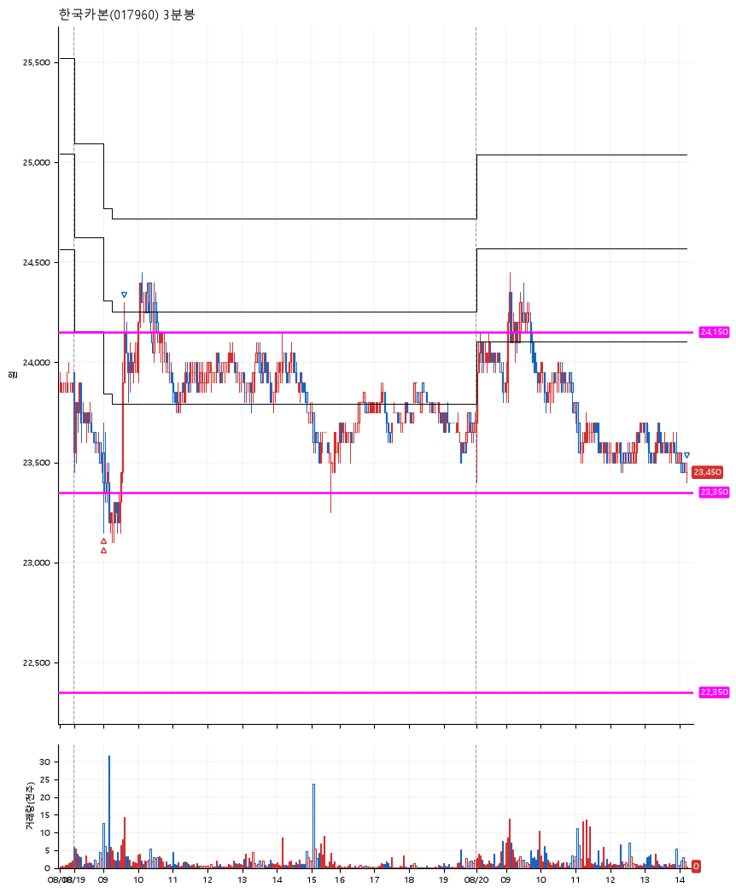

# 한국카본(017960) · 2026-08-20

**2차 매수 → 3% 익절 → 본절 이탈**

진입 2026-08-19 09:00 (D+2) · 청산 2026-08-20 14:12 (D+3) · 보유 2일차

| | |
|---|---|
| 결과 | 손절 |
| 평단 / 수량 | 23,416원 · 16주 |
| 투입 | 374,648원 |
| 세후 손익 | -541원 (-0.14%) |
| 최고 / 최저 | +4.4% / -1.3% |
| 당일 등락 | -1.68% |
| 보유기간 | 2일차 |

## 3선

| | |
|---|---|
| 1선 | 24,150원 |
| 2선 | 23,350원 |
| 3선 | 22,350원 |

기준봉 2026-08-14 (D+3)

`#KOSPI하락횡보장` `#시장을이기는종목`

## 차트

**일봉**

**3분봉**

## 체결

| 시각 | 구분 | 수량 | 판정가 | 체결가 | 오차 |
|---|---|---|---|---|---|
| 09:00 | 매수 | 8주 | 23,550 | 23,531 | -0.08% |
| 09:01 | 매수 | 8주 | 23,350 | 23,300 | -0.21% |
| 09:36 | 매도 | 6주 | 24,150 | 24,100 | -0.21% |
| 14:12 | 매도 | 10주 | 23,400 | 23,400 | +0.00% |

## 잘한 점

_(미작성)_

## 아쉬운 점

_(미작성)_
