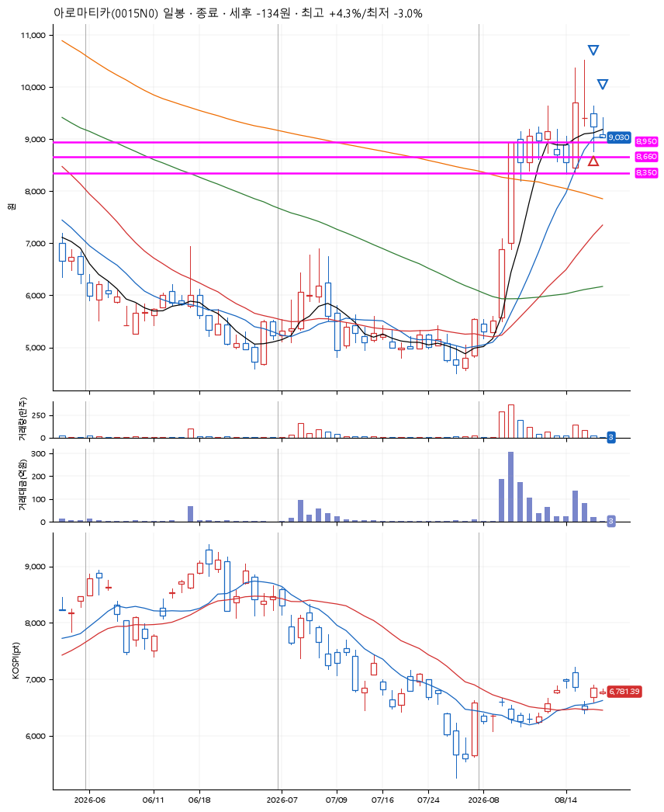

# 아로마티카(0015N0) · 2026-08-21

**1차 매수 → 3% 익절 → 본절 이탈**

진입 2026-08-20 09:51 (D+2) · 청산 2026-08-21 09:24 (D+3) · 보유 2일차

| | |
|---|---|
| 결과 | 손절 |
| 평단 / 수량 | 9,030원 · 15주 |
| 투입 | 135,450원 |
| 세후 손익 | -134원 (-0.10%) |
| 최고 / 최저 | +4.3% / -3.0% |
| 당일 등락 | -1.98% |
| 보유기간 | 2일차 |

## 3선

| | |
|---|---|
| 1선 | 8,950원 |
| 2선 | 8,660원 |
| 3선 | 8,350원 |

기준봉 2026-08-18 (D+3)

`#KOSPI하락횡보장` `#시장을이기는종목`

> 실적 호조

## 차트

## 체결

| 시각 | 구분 | 수량 | 판정가 | 체결가 | 오차 |
|---|---|---|---|---|---|
| 09:51 | 매수 | 15주 | 8,950 | 9,030 | +0.89% |
| 13:23 | 매도 | 6주 | 9,310 | 9,260 | -0.54% |
| 09:24 | 매도 | 9주 | 9,030 | 9,030 | +0.00% |

## 잘한 점

_(미작성)_

## 아쉬운 점

_(미작성)_
