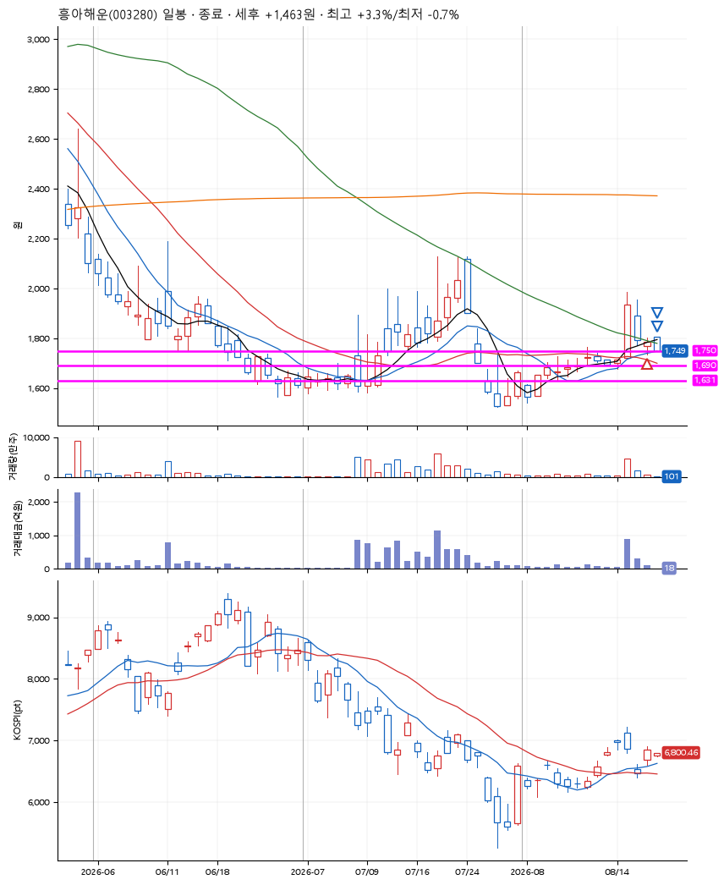
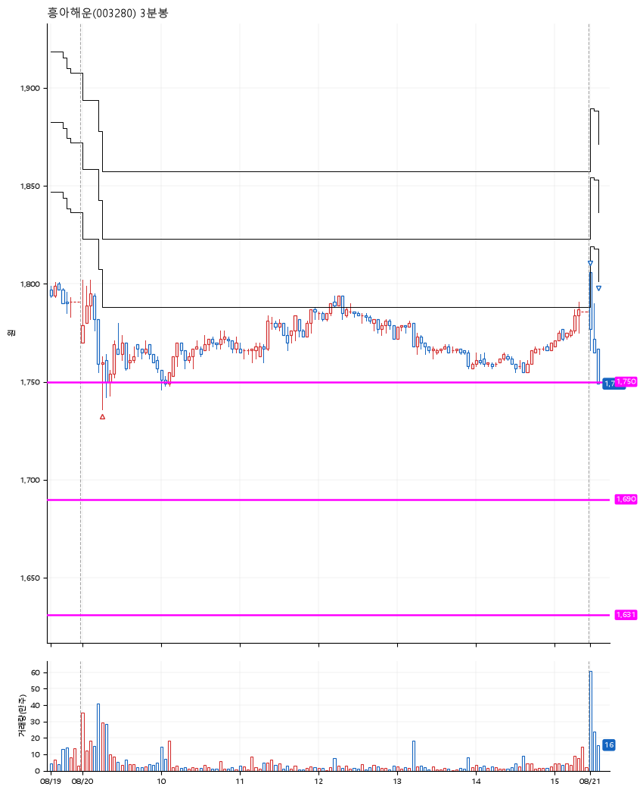

# 흥아해운(003280) · 2026-08-21

**1차 매수 → 3% 익절 → 본절 이탈**

진입 2026-08-20 09:15 (D+2) · 청산 2026-08-21 09:07 (D+3) · 보유 2일차

| | |
|---|---|
| 결과 | 익절 |
| 평단 / 수량 | 1,749원 · 80주 |
| 투입 | 139,920원 |
| 세후 손익 | +1,443원 (+1.03%) |
| 최고 / 최저 | +3.3% / -0.7% |
| 당일 등락 | -1.99% |
| 보유기간 | 2일차 |

## 3선

| | |
|---|---|
| 1선 | 1,750원 |
| 2선 | 1,690원 |
| 3선 | 1,631원 |

기준봉 2026-08-18 (D+3)

`#KOSPI하락횡보장` `#시장을이기는종목`

## 차트

**일봉**

**3분봉**

## 체결

| 시각 | 구분 | 수량 | 판정가 | 체결가 | 오차 |
|---|---|---|---|---|---|
| 09:15 | 매수 | 80주 | 1,750 | 1,749 | -0.06% |
| 09:00 | 매도 | 32주 | 1,806 | 1,802 | -0.22% |
| 09:07 | 매도 | 48주 | 1,749 | 1,749 | +0.00% |

## 잘한 점

.

## 아쉬운 점

.
