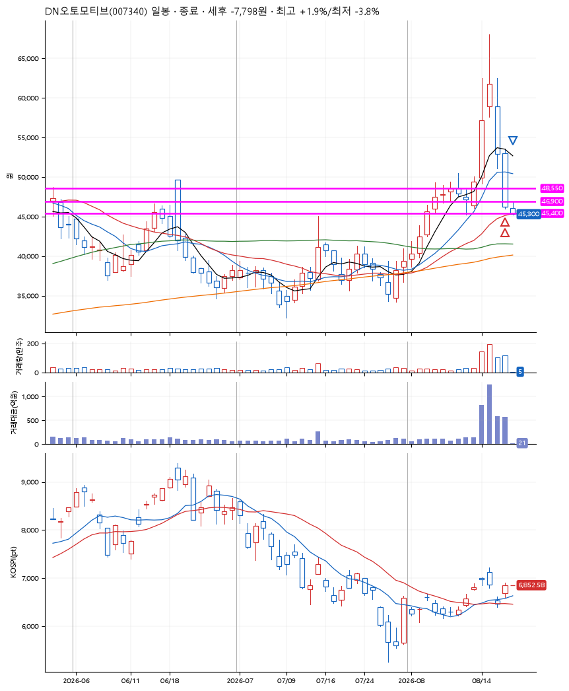
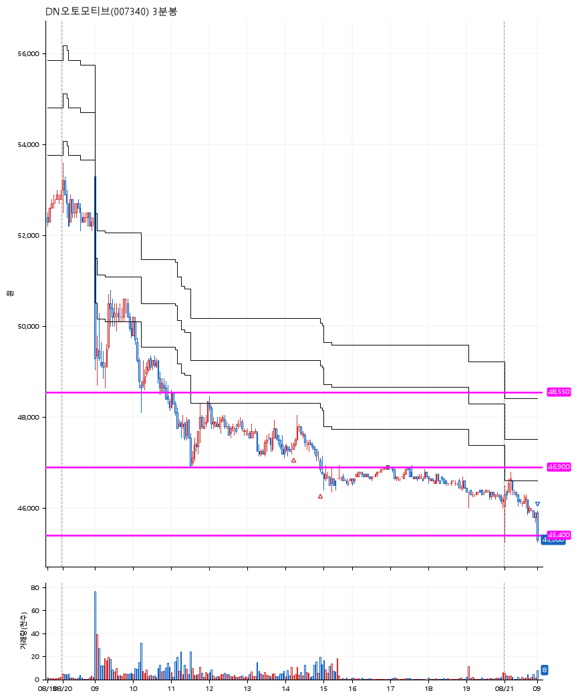

# DN오토모티브(007340) · 2026-08-21

**2차 매수 → 손절**

진입 2026-08-20 14:12 (D+3) · 청산 2026-08-21 09:00 (D+4) · 보유 2일차

| | |
|---|---|
| 결과 | 손절 |
| 평단 / 수량 | 47,175원 · 4주 |
| 투입 | 188,700원 |
| 세후 손익 | -7,798원 (-4.13%) |
| 최고 / 최저 | +1.9% / -3.8% |
| 당일 등락 | -3.70% |
| 보유기간 | 2일차 |

## 3선

| | |
|---|---|
| 1선 | 48,550원 |
| 2선 | 46,900원 |
| 3선 | 45,400원 |

기준봉 2026-08-14 (D+4)

`#KOSPI하락횡보장` `#시장을이기는종목`

## 차트

**일봉**

**3분봉**

## 체결

| 시각 | 구분 | 수량 | 판정가 | 체결가 | 오차 |
|---|---|---|---|---|---|
| 14:12 | 매수 | 2주 | 47,350 | 47,350 | +0.00% |
| 14:55 | 매수 | 2주 | 46,900 | 47,000 | +0.21% |
| 09:00 | 매도 | 4주 | 45,400 | 45,300 | -0.22% |

## 잘한 점

_(미작성)_

## 아쉬운 점

_(미작성)_
