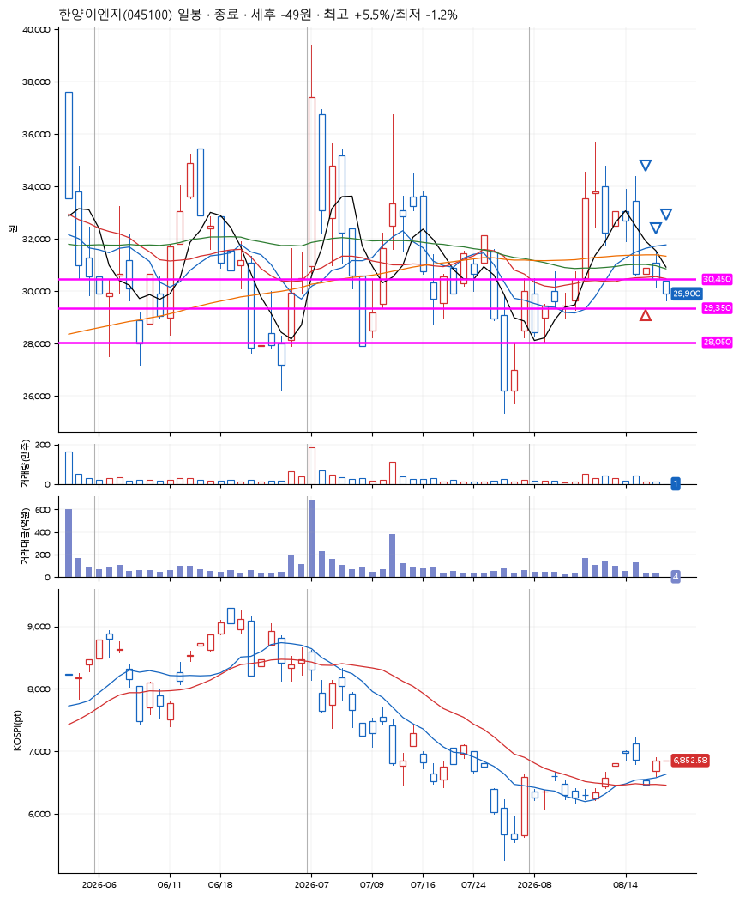
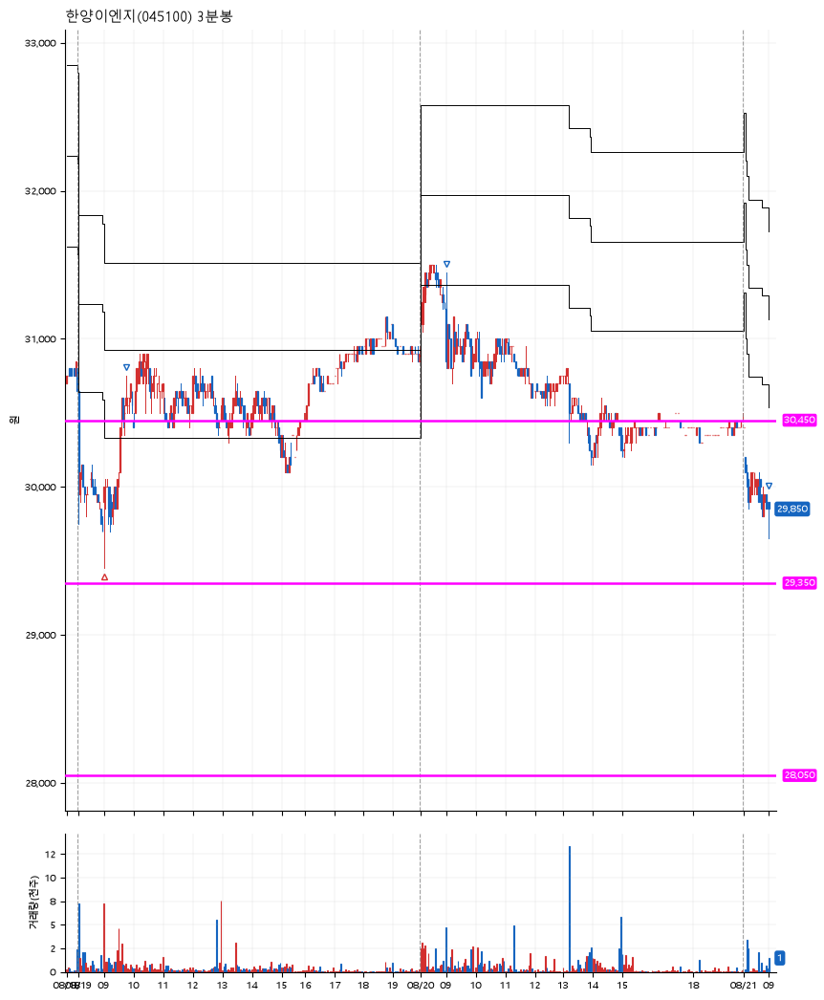

# 한양이엔지(045100) · 2026-08-21

**1차 매수 → 3% 익절 → 5% 익절 → 본절 이탈**

진입 2026-08-19 09:00 (D+6) · 청산 2026-08-21 09:00 (D+8) · 보유 3일차

| | |
|---|---|
| 결과 | 익절 |
| 평단 / 수량 | 29,800원 · 6주 |
| 투입 | 178,800원 |
| 세후 손익 | +5,621원 (+3.14%) |
| 최고 / 최저 | +5.5% / -1.2% |
| 당일 등락 | -2.84% |
| 보유기간 | 3일차 |

## 3선

| | |
|---|---|
| 1선 | 30,450원 |
| 2선 | 29,350원 |
| 3선 | 28,050원 |

기준봉 2026-08-10 (D+8)

`#KOSPI하락횡보장` `#시장을이기는종목`

## 차트

**일봉**

**3분봉**

## 체결

| 시각 | 구분 | 수량 | 판정가 | 체결가 | 오차 |
|---|---|---|---|---|---|
| 09:00 | 매수 | 6주 | 29,800 | 29,800 | +0.00% |
| 09:46 | 매도 | 2주 | 30,700 | 30,600 | -0.33% |
| 09:00 | 매도 | 3주 | 31,400 | 31,250 | -0.48% |
| 09:00 | 매도 | 1주 | 29,800 | 29,800 | +0.00% |

## 잘한 점

.

## 아쉬운 점

.
