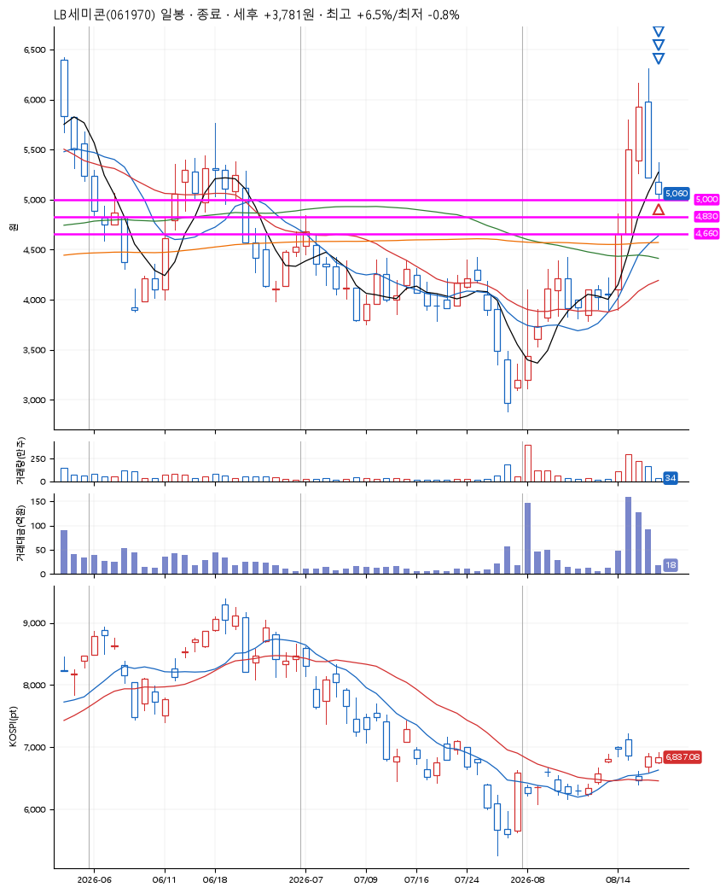

# LB세미콘(061970) · 2026-08-21

**1차 매수 → 3% 익절 → 5% 익절 → 본절 이탈**

진입 2026-08-21 09:03 (D+3) · 청산 2026-08-21 10:40 (D+3) · 보유 1시간 36분

| | |
|---|---|
| 결과 | 익절 |
| 평단 / 수량 | 5,040원 · 28주 |
| 투입 | 141,120원 |
| 세후 손익 | +3,781원 (+2.68%) |
| 최고 / 최저 | +6.5% / -0.8% |
| 당일 등락 | -6.18% |
| 보유기간 | 1시간 36분 |

## 3선

| | |
|---|---|
| 1선 | 5,000원 |
| 2선 | 4,830원 |
| 3선 | 4,660원 |

기준봉 2026-08-18 (D+3)

`#KOSPI하락횡보장` `#시장을이기는종목`

## 차트

## 체결

| 시각 | 구분 | 수량 | 판정가 | 체결가 | 오차 |
|---|---|---|---|---|---|
| 09:03 | 매수 | 28주 | 5,000 | 5,040 | +0.80% |
| 09:07 | 매도 | 11주 | 5,200 | 5,160 | -0.77% |
| 09:08 | 매도 | 14주 | 5,300 | 5,230 | -1.32% |
| 10:40 | 매도 | 3주 | 5,040 | 5,060 | +0.40% |

## 잘한 점

_(미작성)_

## 아쉬운 점

_(미작성)_
