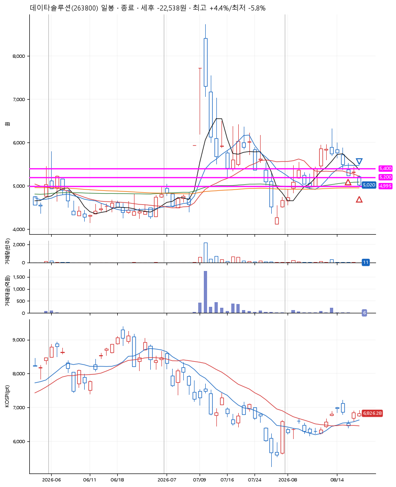
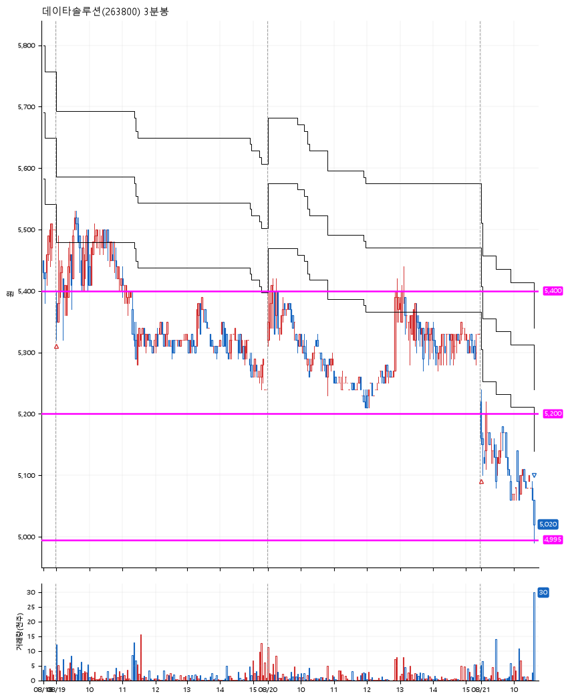

# 데이타솔루션(263800) · 2026-08-21

**2차 매수 → 손절**

진입 2026-08-19 09:00 (D+5) · 청산 2026-08-21 10:38 (D+7) · 보유 3일차

| | |
|---|---|
| 결과 | 손절 |
| 평단 / 수량 | 5,298원 · 76주 |
| 투입 | 402,640원 |
| 세후 손익 | -22,567원 (-5.60%) |
| 최고 / 최저 | +4.4% / -5.8% |
| 당일 등락 | -1.72% |
| 보유기간 | 3일차 |

## 3선

| | |
|---|---|
| 1선 | 5,400원 |
| 2선 | 5,200원 |
| 3선 | 4,995원 |

기준봉 2026-08-11 (D+7)

`#KOSPI하락횡보장` `#시장을이기는종목`

## 차트

**일봉**

**3분봉**

## 체결

| 시각 | 구분 | 수량 | 판정가 | 체결가 | 오차 |
|---|---|---|---|---|---|
| 09:00 | 매수 | 37주 | 5,360 | 5,380 | +0.37% |
| 09:00 | 매수 | 39주 | 5,200 | 5,220 | +0.38% |
| 10:38 | 매도 | 76주 | 4,990 | 5,010 | +0.40% |

## 잘한 점

.

## 아쉬운 점

.
