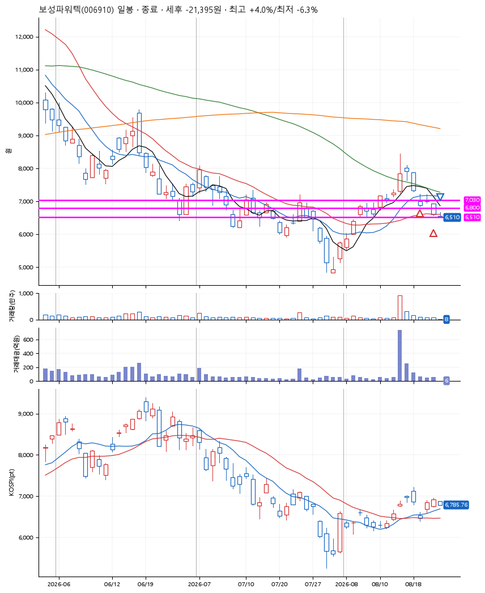
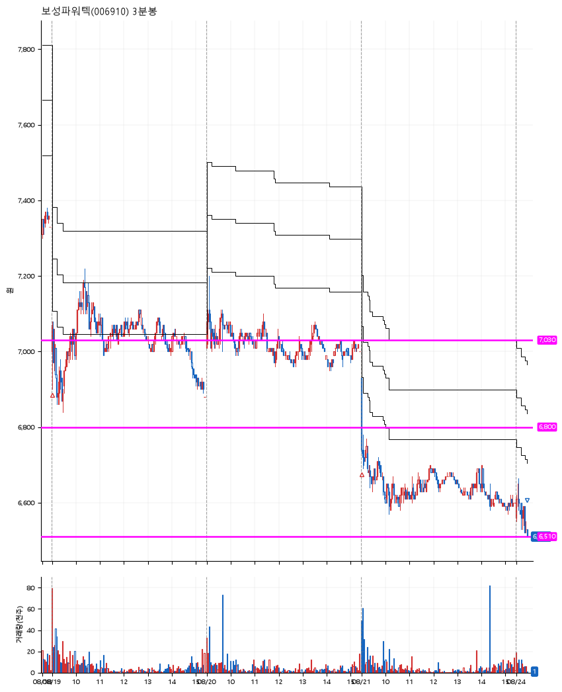

# 보성파워텍(006910) · 2026-08-24

**2차 매수 → 손절**

진입 2026-08-19 09:00 (D+3) · 청산 2026-08-24 09:27 (D+6) · 보유 4일차

| | |
|---|---|
| 결과 | 손절 |
| 평단 / 수량 | 6,945원 · 48주 |
| 투입 | 333,360원 |
| 세후 손익 | -21,444원 (-6.43%) |
| 최고 / 최저 | +4.0% / -6.3% |
| 당일 등락 | +1.22% |
| 보유기간 | 6일차 |

## 3선

| | |
|---|---|
| 1선 | 7,030원 |
| 2선 | 6,800원 |
| 3선 | 6,510원 |

기준봉 2026-08-13 (D+6)

`#KOSPI하락횡보장` `#시장을이기는종목`

## 차트

**일봉**

**3분봉**

## 체결

| 시각 | 구분 | 수량 | 판정가 | 체결가 | 오차 |
|---|---|---|---|---|---|
| 09:00 | 매수 | 28주 | 7,000 | 7,020 | +0.29% |
| 09:01 | 매수 | 20주 | 6,800 | 6,840 | +0.59% |
| 09:27 | 매도 | 48주 | 6,510 | 6,510 | +0.00% |

## 잘한 점

_(미작성)_

## 아쉬운 점

_(미작성)_
