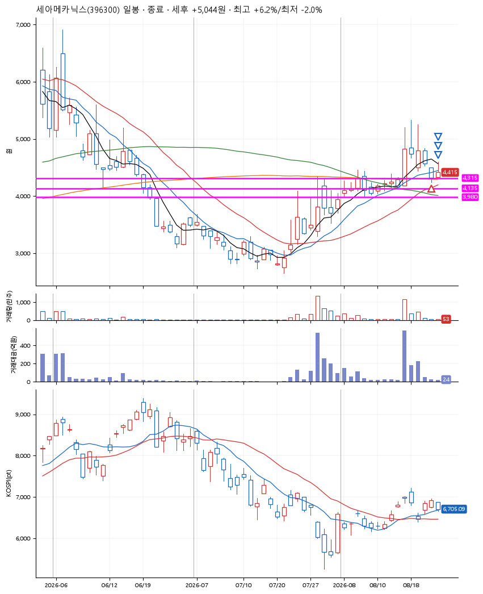
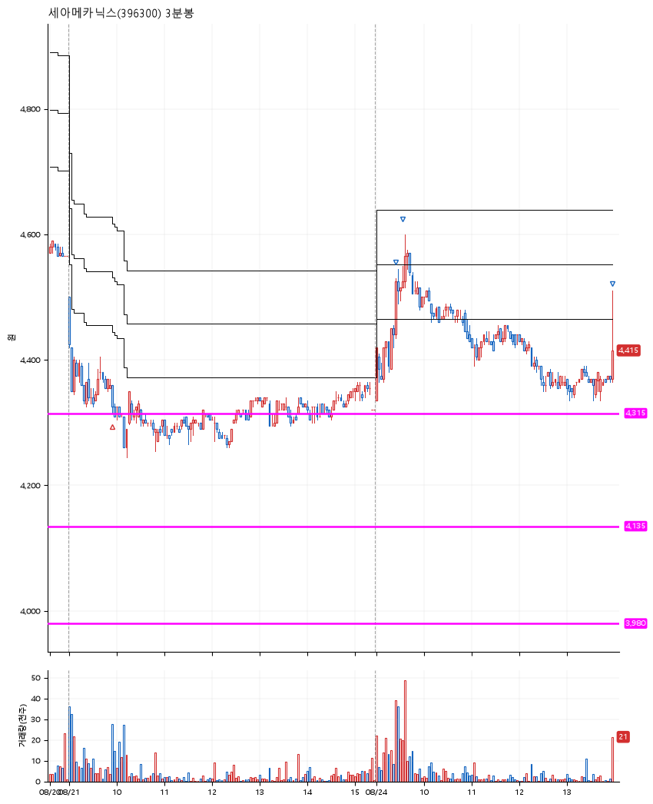

# 세아메카닉스(396300) · 2026-08-24

**1차 매수 → 3% 익절 → 5% 익절 → 수동 청산**

진입 2026-08-21 09:56 (D+4) · 청산 2026-08-24 13:58 (D+5) · 보유 2일차

| | |
|---|---|
| 결과 | 익절 |
| 평단 / 수량 | 4,330원 · 32주 |
| 투입 | 138,560원 |
| 세후 손익 | +5,024원 (+3.63%) |
| 최고 / 최저 | +6.2% / -2.0% |
| 당일 등락 | -0.35% |
| 보유기간 | 4일차 |

## 3선

| | |
|---|---|
| 1선 | 4,315원 |
| 2선 | 4,135원 |
| 3선 | 3,980원 |

기준봉 2026-08-14 (D+5)

`#KOSPI하락횡보장` `#시장을이기는종목`

## 차트

**일봉**

**3분봉**

## 체결

| 시각 | 구분 | 수량 | 판정가 | 체결가 | 오차 |
|---|---|---|---|---|---|
| 09:56 | 매수 | 32주 | 4,315 | 4,330 | +0.35% |
| 09:24 | 매도 | 12주 | 4,460 | 4,455 | -0.11% |
| 09:34 | 매도 | 16주 | 4,550 | 4,545 | -0.11% |
| 13:58 | 매도 | 4주 | 4,410 | 4,415 | +0.11% |

## 잘한 점

.

## 아쉬운 점

.
