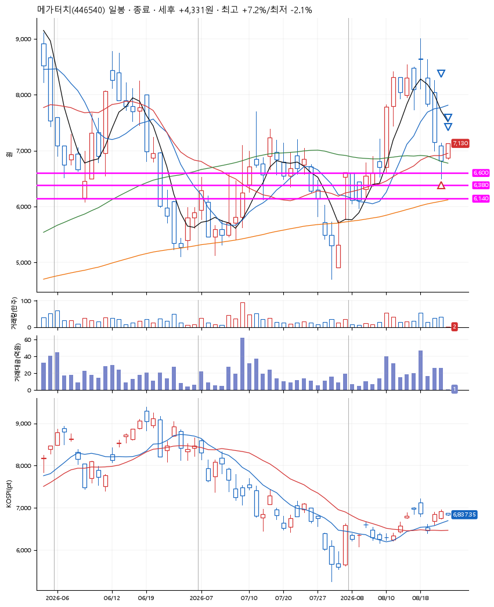
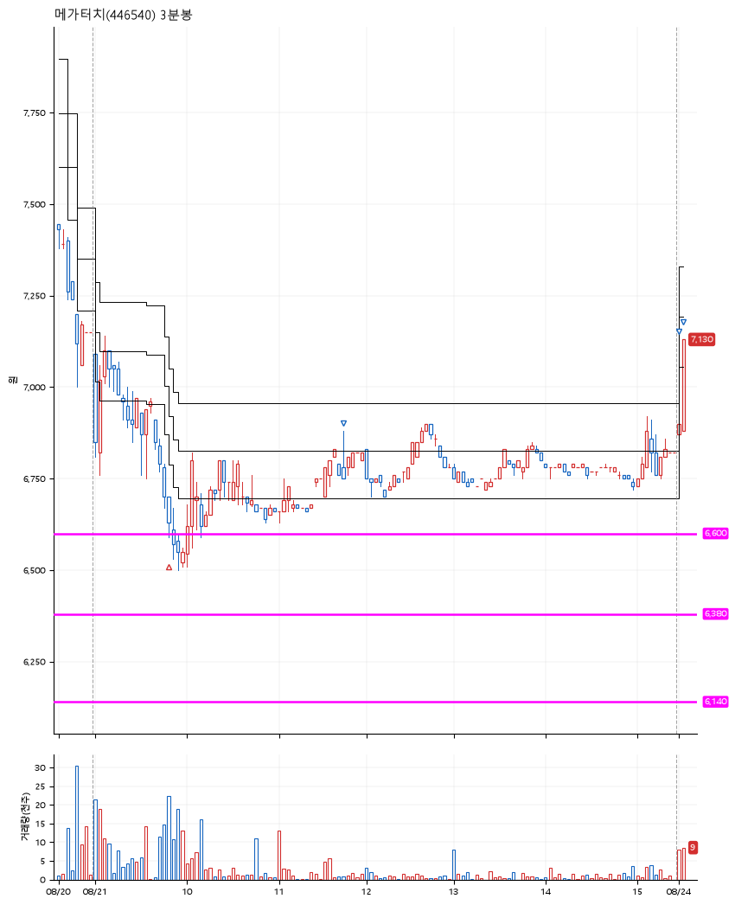

# 메가터치(446540) · 2026-08-24

**1차 매수 → 3% 익절 → 5% 익절 → 7% 익절**

진입 2026-08-21 09:49 (D+8) · 청산 2026-08-24 09:05 (D+9) · 보유 2일차

| | |
|---|---|
| 결과 | 익절 |
| 평단 / 수량 | 6,640원 · 21주 |
| 투입 | 139,440원 |
| 세후 손익 | +5,182원 (+3.72%) |
| 최고 / 최저 | +7.2% / -2.1% |
| 당일 등락 | +3.35% |
| 보유기간 | 4일차 |

## 3선

| | |
|---|---|
| 1선 | 6,600원 |
| 2선 | 6,380원 |
| 3선 | 6,140원 |

기준봉 2026-08-10 (D+9)

`#KOSPI하락횡보장` `#시장을이기는종목`

## 차트

**일봉**

**3분봉**

## 체결

| 시각 | 구분 | 수량 | 판정가 | 체결가 | 오차 |
|---|---|---|---|---|---|
| 09:49 | 매수 | 21주 | 6,600 | 6,640 | +0.61% |
| 11:42 | 매도 | 8주 | 6,880 | 6,760 | -1.74% |
| 09:01 | 매도 | 10주 | 6,980 | 6,950 | -0.43% |
| 09:05 | 매도 | 3주 | 7,110 | 7,100 | -0.14% |

## 잘한 점

.

## 아쉬운 점

.
