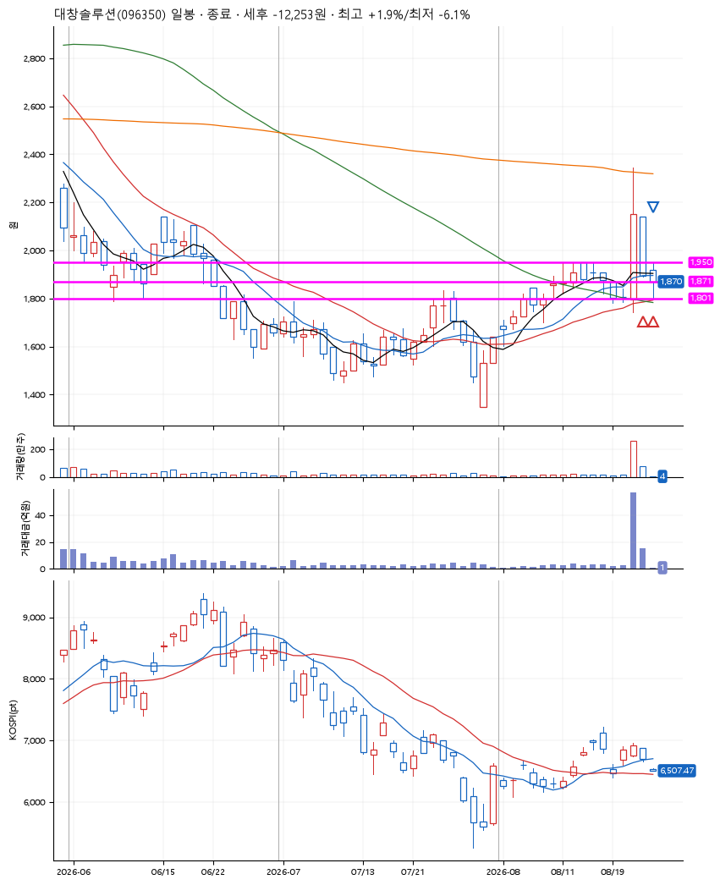
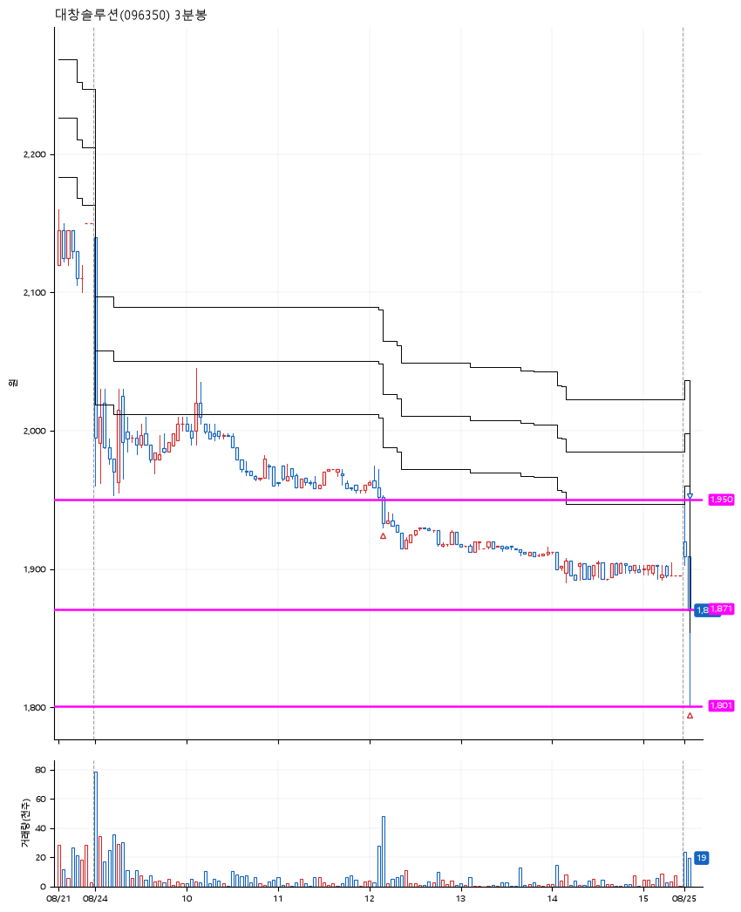

# 대창솔루션(096350) · 2026-08-25

**2차 매수 → 손절**

진입 2026-08-24 12:09 (D+1) · 청산 2026-08-25 09:05 (D+2) · 보유 2일차

| | |
|---|---|
| 결과 | 손절 |
| 평단 / 수량 | 1,917원 · 144주 |
| 투입 | 276,049원 |
| 세후 손익 | -12,273원 (-4.45%) |
| 최고 / 최저 | +1.9% / -6.1% |
| 당일 등락 | +2.08% |
| 보유기간 | 2일차 |

## 3선

| | |
|---|---|
| 1선 | 1,950원 |
| 2선 | 1,871원 |
| 3선 | 1,801원 |

기준봉 2026-08-21 (D+2)

`#KOSPI하락횡보장` `#시장을이기는종목`

> 원전 터빈 특수강

## 차트

**일봉**

**3분봉**

## 체결

| 시각 | 구분 | 수량 | 판정가 | 체결가 | 오차 |
|---|---|---|---|---|---|
| 12:09 | 매수 | 71주 | 1,950 | 1,953 | +0.15% |
| 09:05 | 매수 | 73주 | 1,870 | 1,882 | +0.64% |
| 09:05 | 매도 | 144주 | 1,800 | 1,836 | +2.00% |

## 잘한 점

_(미작성)_

## 아쉬운 점

_(미작성)_
