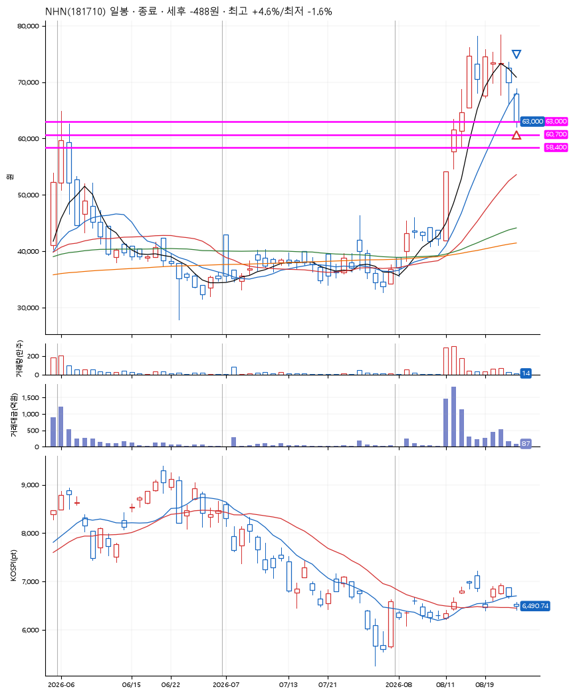
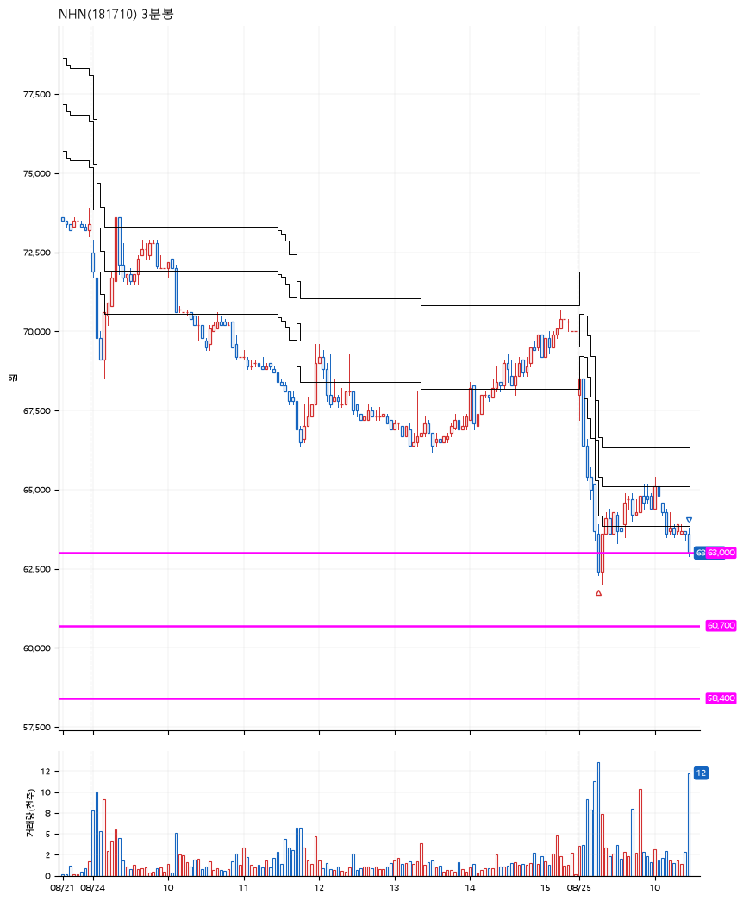

# NHN(181710) · 2026-08-25

**1차 매수 → 3% 익절 → 본절 이탈**

진입 2026-08-25 09:16 (D+6) · 청산 2026-08-25 10:27 (D+6) · 보유 1시간 11분

| | |
|---|---|
| 결과 | 손절 |
| 평단 / 수량 | 63,000원 · 2주 |
| 투입 | 126,000원 |
| 세후 손익 | -488원 (-0.39%) |
| 최고 / 최저 | +4.6% / -1.6% |
| 당일 등락 | -2.94% |
| 보유기간 | 1시간 11분 |

## 3선

| | |
|---|---|
| 1선 | 63,000원 |
| 2선 | 60,700원 |
| 3선 | 58,400원 |

기준봉 2026-08-14 (D+6)

`#KOSPI하락횡보장` `#시장을이기는종목`

> 실적호조

## 차트

**일봉**

**3분봉**

## 체결

| 시각 | 구분 | 수량 | 판정가 | 체결가 | 오차 |
|---|---|---|---|---|---|
| 09:16 | 매수 | 2주 | 63,000 | 63,000 | +0.00% |
| 10:27 | 매도 | 2주 | 63,000 | 62,900 | -0.16% |

## 잘한 점

.

## 아쉬운 점

.
