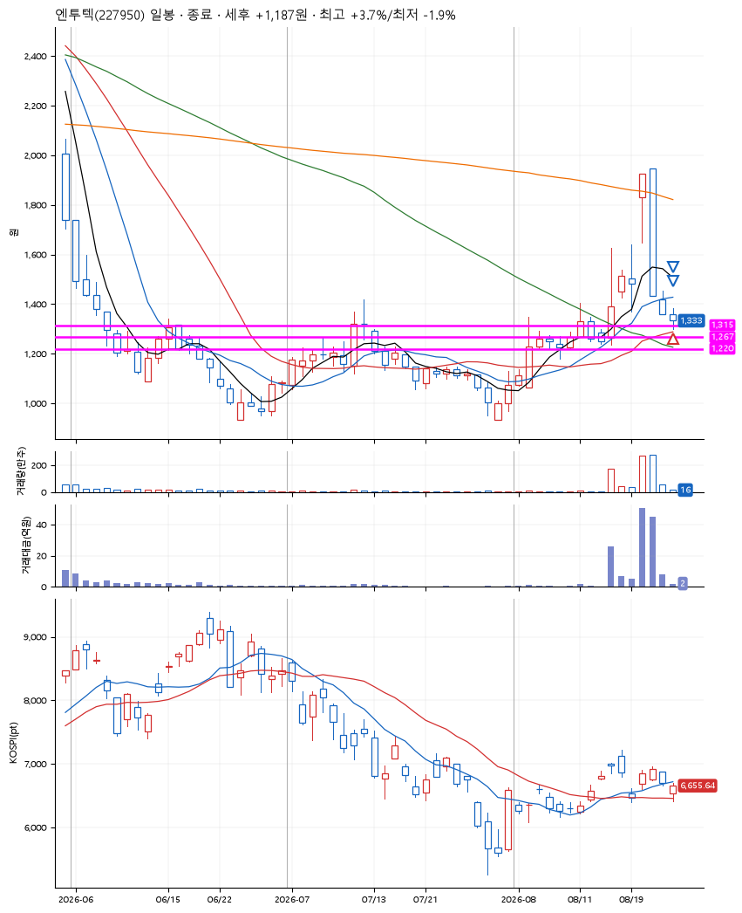
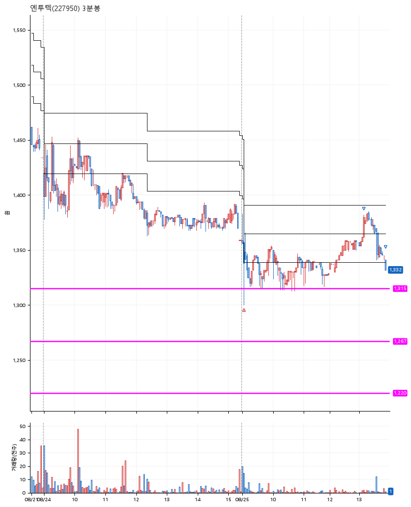

# 엔투텍(227950) · 2026-08-25

**1차 매수 → 3% 익절 → 본절 이탈**

진입 2026-08-25 09:03 (D+3) · 청산 2026-08-25 13:52 (D+3) · 보유 4시간 49분

| | |
|---|---|
| 결과 | 익절 |
| 평단 / 수량 | 1,336원 · 105주 |
| 투입 | 140,280원 |
| 세후 손익 | +1,187원 (+0.85%) |
| 최고 / 최저 | +3.7% / -1.9% |
| 당일 등락 | -1.32% |
| 보유기간 | 4시간 49분 |

## 3선

| | |
|---|---|
| 1선 | 1,315원 |
| 2선 | 1,267원 |
| 3선 | 1,220원 |

기준봉 2026-08-20 (D+3)

`#KOSPI하락횡보장` `#시장을이기는종목` `#상한가` `#테마주` `#섹터주`

> 반도체 모더나

## 차트

**일봉**

**3분봉**

## 체결

| 시각 | 구분 | 수량 | 판정가 | 체결가 | 오차 |
|---|---|---|---|---|---|
| 09:03 | 매수 | 105주 | 1,312 | 1,336 | +1.83% |
| 13:10 | 매도 | 42주 | 1,378 | 1,375 | -0.22% |
| 13:52 | 매도 | 63주 | 1,335 | 1,334 | -0.07% |

## 잘한 점

.

## 아쉬운 점

.
