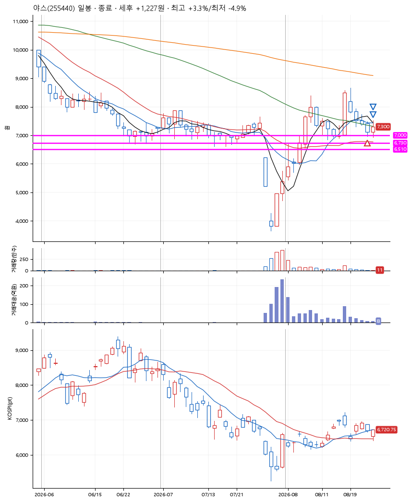
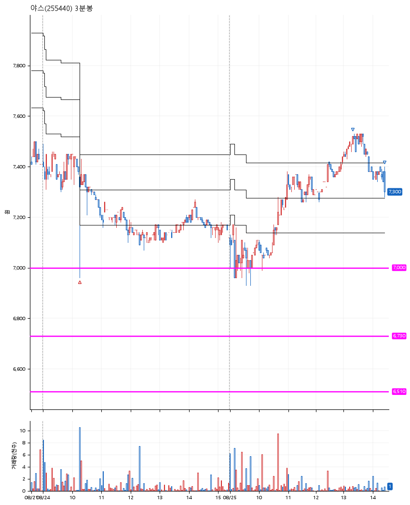

# 야스(255440) · 2026-08-25

**1차 매수 → 3% 익절 → 본절 이탈**

진입 2026-08-24 10:16 (D+4) · 청산 2026-08-25 14:26 (D+5) · 보유 2일차

| | |
|---|---|
| 결과 | 익절 |
| 평단 / 수량 | 7,290원 · 19주 |
| 투입 | 138,510원 |
| 세후 손익 | +1,207원 (+0.87%) |
| 최고 / 최저 | +3.3% / -4.9% |
| 당일 등락 | +4.35% |
| 보유기간 | 2일차 |

## 3선

| | |
|---|---|
| 1선 | 7,000원 |
| 2선 | 6,730원 |
| 3선 | 6,510원 |

기준봉 2026-08-18 (D+5)

`#KOSPI하락횡보장` `#시장을이기는종목`

## 차트

**일봉**

**3분봉**

## 체결

| 시각 | 구분 | 수량 | 판정가 | 체결가 | 오차 |
|---|---|---|---|---|---|
| 10:16 | 매수 | 19주 | 7,000 | 7,290 | +4.14% |
| 13:19 | 매도 | 7주 | 7,510 | 7,491 | -0.25% |
| 14:26 | 매도 | 12주 | 7,290 | 7,300 | +0.14% |

## 잘한 점

_(미작성)_

## 아쉬운 점

_(미작성)_
