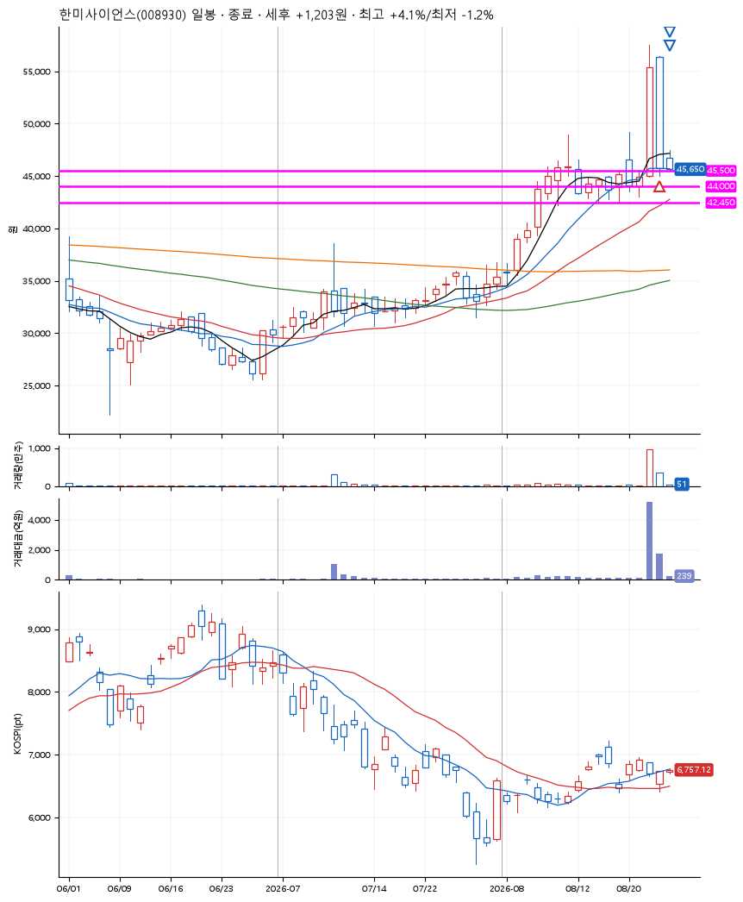
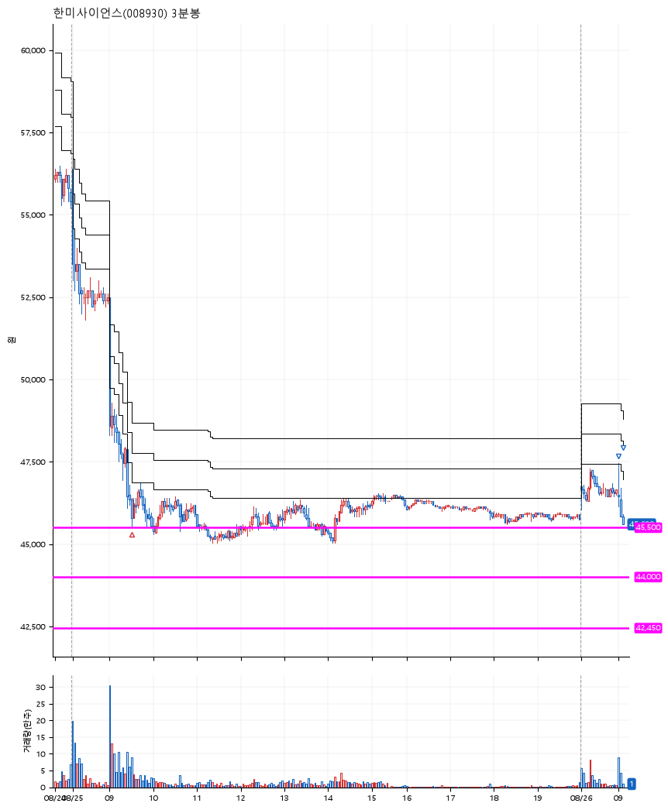

# 한미사이언스(008930) · 2026-08-26

**1차 매수 → 3% 익절 → 본절 이탈**

진입 2026-08-25 09:32 (D+1) · 청산 2026-08-26 09:06 (D+2) · 보유 2일차

| | |
|---|---|
| 결과 | 익절 |
| 평단 / 수량 | 45,600원 · 3주 |
| 투입 | 136,800원 |
| 세후 손익 | +1,183원 (+0.86%) |
| 최고 / 최저 | +4.1% / -1.2% |
| 당일 등락 | -4.52% |
| 보유기간 | 2일차 |

## 3선

| | |
|---|---|
| 1선 | 45,500원 |
| 2선 | 44,000원 |
| 3선 | 42,450원 |

기준봉 2026-08-24 (D+2)

`#KOSPI하락횡보장` `#시장을이기는종목`

> 비만 신약 기술수출

## 차트

**일봉**

**3분봉**

## 체결

| 시각 | 구분 | 수량 | 판정가 | 체결가 | 오차 |
|---|---|---|---|---|---|
| 09:32 | 매수 | 3주 | 45,500 | 45,600 | +0.22% |
| 09:00 | 매도 | 1주 | 47,000 | 47,100 | +0.21% |
| 09:06 | 매도 | 2주 | 45,600 | 45,600 | +0.00% |

## 잘한 점

박스 파악 양호

## 아쉬운 점

급등 급락자리에서 청산이라 많은 슬리피지 발생
