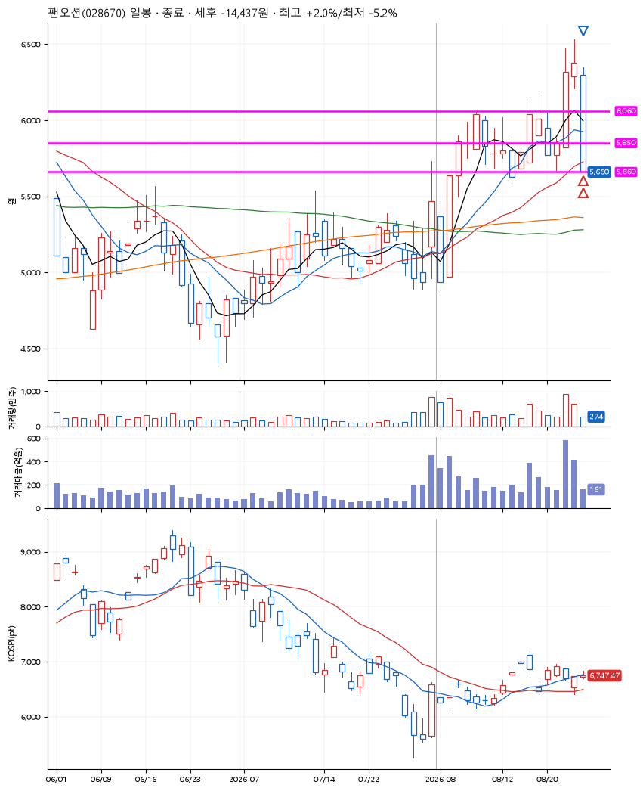
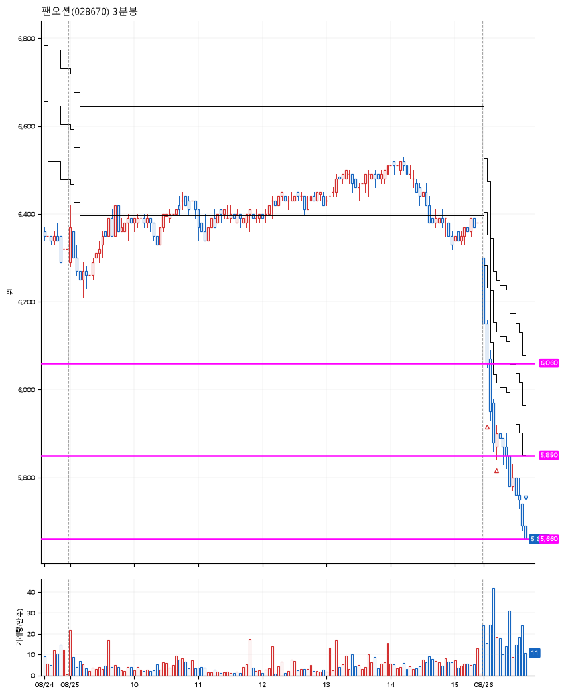

# 팬오션(028670) · 2026-08-26

**2차 매수 → 손절**

진입 2026-08-26 09:05 (D+2) · 청산 2026-08-26 09:41 (D+2) · 보유 35분

| | |
|---|---|
| 결과 | 손절 |
| 평단 / 수량 | 5,968원 · 45주 |
| 투입 | 268,550원 |
| 세후 손익 | -14,437원 (-5.38%) |
| 최고 / 최저 | +2.0% / -5.2% |
| 당일 등락 | -10.95% |
| 보유기간 | 35분 |

## 3선

| | |
|---|---|
| 1선 | 6,060원 |
| 2선 | 5,850원 |
| 3선 | 5,660원 |

기준봉 2026-08-24 (D+2)

`#KOSPI하락횡보장` `#시장을이기는종목`

## 차트

**일봉**

**3분봉**

## 체결

| 시각 | 구분 | 수량 | 판정가 | 체결가 | 오차 |
|---|---|---|---|---|---|
| 09:05 | 매수 | 22주 | 6,060 | 6,070 | +0.17% |
| 09:12 | 매수 | 23주 | 5,850 | 5,870 | +0.34% |
| 09:41 | 매도 | 45주 | 5,660 | 5,660 | +0.00% |

## 잘한 점

_(미작성)_

## 아쉬운 점

박스를 잘못 찾은게 아닐까..
