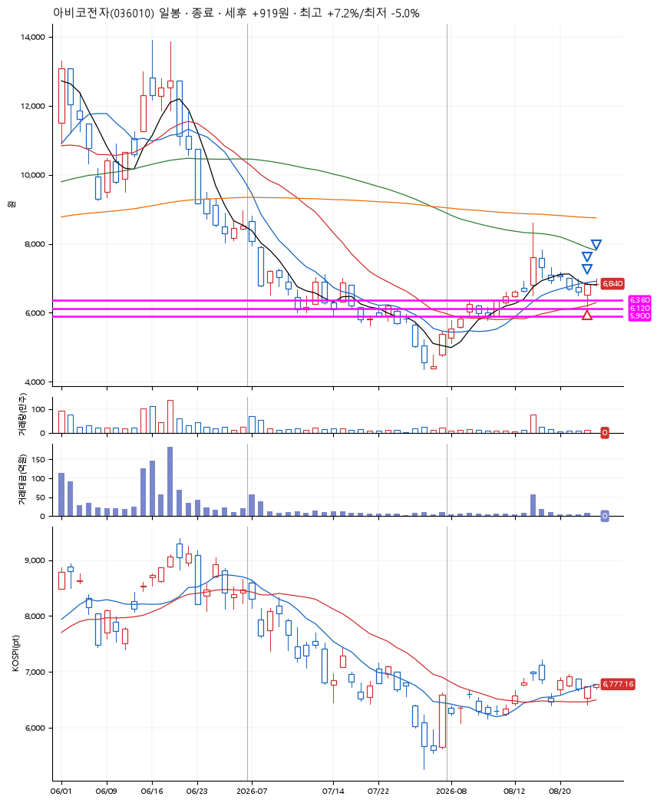
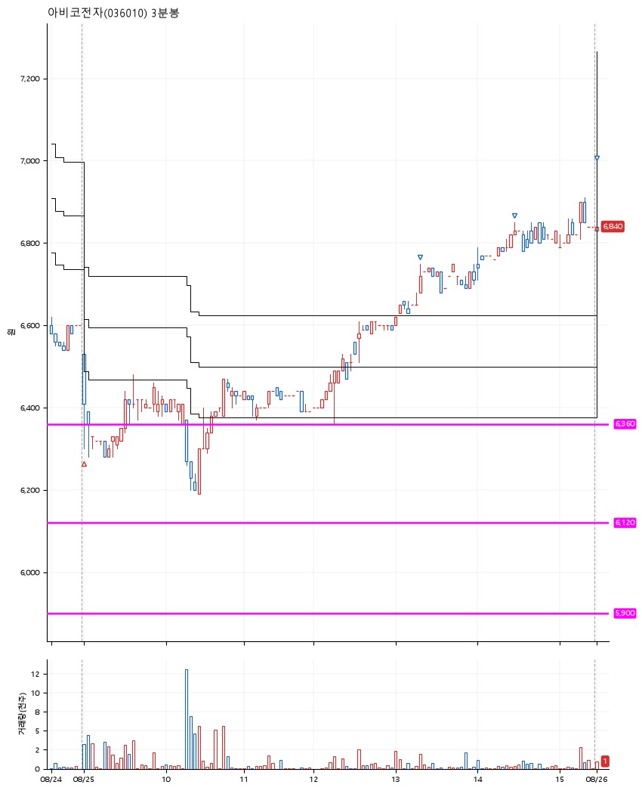

# 아비코전자(036010) · 2026-08-26

**1차 매수 → 3% 익절 → 5% 익절 → 7% 익절**

진입 2026-08-25 09:00 (D+6) · 청산 2026-08-26 09:02 (D+7) · 보유 2일차

| | |
|---|---|
| 결과 | 익절 |
| 평단 / 수량 | 6,519원 · 21주 |
| 투입 | 136,899원 |
| 세후 손익 | +5,037원 (+3.68%) |
| 최고 / 최저 | +7.2% / -5.0% |
| 당일 등락 | -0.29% |
| 보유기간 | 2일차 |

## 3선

| | |
|---|---|
| 1선 | 6,360원 |
| 2선 | 6,120원 |
| 3선 | 5,900원 |

기준봉 2026-08-14 (D+7)

`#KOSPI하락횡보장` `#시장을이기는종목`

## 차트

**일봉**

**3분봉**

## 체결

| 시각 | 구분 | 수량 | 판정가 | 체결가 | 오차 |
|---|---|---|---|---|---|
| 09:00 | 매수 | 21주 | 6,360 | 6,519 | +2.50% |
| 13:19 | 매도 | 8주 | 6,720 | 6,680 | -0.60% |
| 14:28 | 매도 | 10주 | 6,850 | 6,830 | -0.29% |
| 09:02 | 매도 | 3주 | 6,990 | 6,840 | -2.15% |

## 잘한 점

.

## 아쉬운 점

급등 직전의 박스를 잘 찾자.
