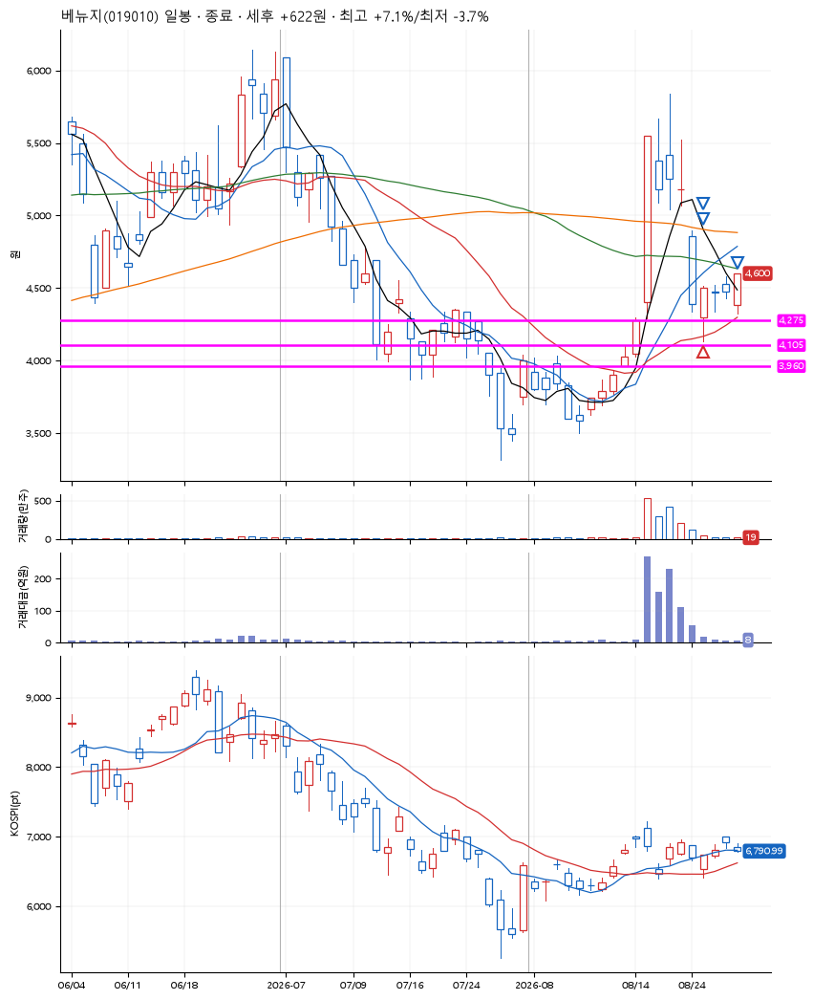
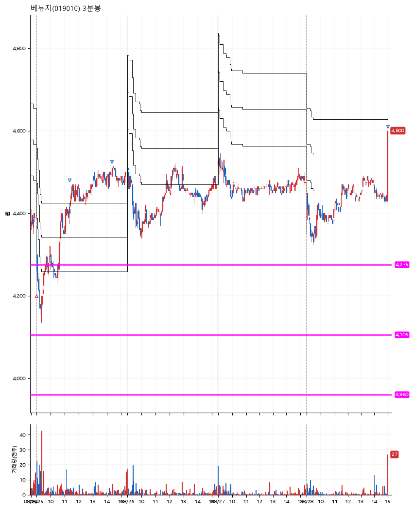

# 베뉴지(019010) · 2026-08-28

**1차 매수 → 3% 익절 → 5% 익절 → 7% 익절**

진입 2026-08-25 09:01 (D+5) · 청산 2026-08-28 15:01 (D+8) · 보유 4일차

| | |
|---|---|
| 결과 | 익절 |
| 평단 / 수량 | 4,295원 · 32주 |
| 투입 | 137,440원 |
| 세후 손익 | +4,875원 (+3.55%) |
| 최고 / 최저 | +7.1% / -3.7% |
| 당일 등락 | +2.05% |
| 보유기간 | 4일차 |

## 3선

| | |
|---|---|
| 1선 | 4,275원 |
| 2선 | 4,105원 |
| 3선 | 3,960원 |

기준봉 2026-08-18 (D+8)

`#KOSPI하락횡보장` `#시장을이기는종목` `#상한가`

## 차트

**일봉**

**3분봉**

## 체결

| 시각 | 구분 | 수량 | 판정가 | 체결가 | 오차 |
|---|---|---|---|---|---|
| 09:01 | 매수 | 32주 | 4,275 | 4,295 | +0.47% |
| 11:23 | 매도 | 12주 | 4,425 | 4,400 | -0.56% |
| 14:23 | 매도 | 16주 | 4,510 | 4,500 | -0.22% |
| 15:01 | 매도 | 4주 | 4,600 | 4,460 | -3.04% |

## 잘한 점

_(미작성)_

## 아쉬운 점

_(미작성)_
