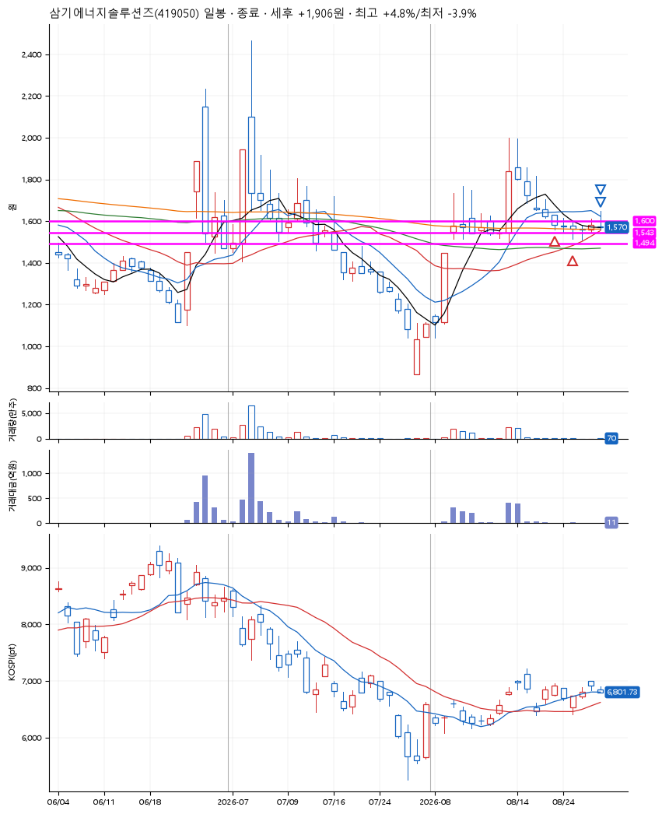
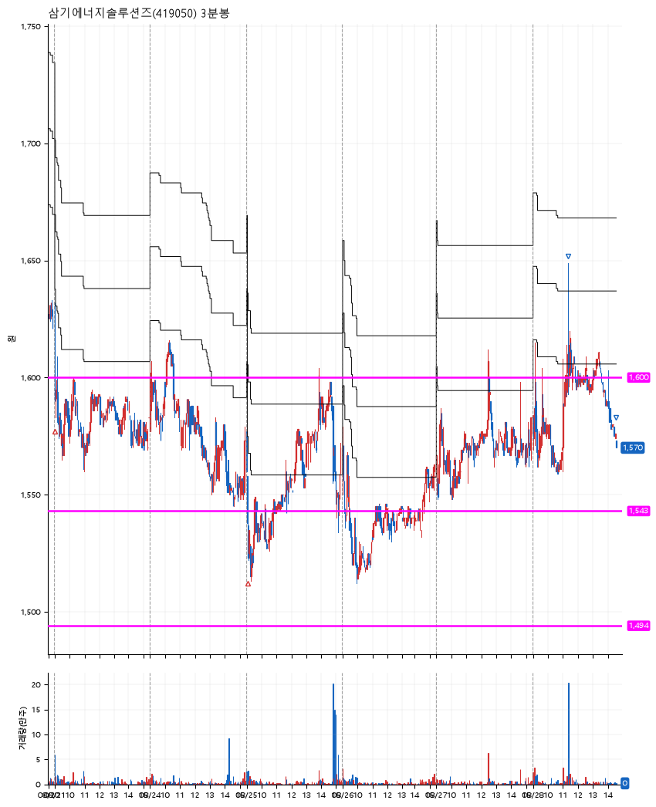

# 삼기에너지솔루션즈(419050) · 2026-08-28

**2차 매수 → 3% 익절 → 본절 이탈**

진입 2026-08-21 09:01 (D+5) · 청산 2026-08-28 14:33 (D+10) · 보유 6일차

| | |
|---|---|
| 결과 | 익절 |
| 평단 / 수량 | 1,574원 · 176주 |
| 투입 | 276,964원 |
| 세후 손익 | +1,866원 (+0.67%) |
| 최고 / 최저 | +4.8% / -3.9% |
| 당일 등락 | +0.25% |
| 보유기간 | 8일차 |

## 3선

| | |
|---|---|
| 1선 | 1,600원 |
| 2선 | 1,543원 |
| 3선 | 1,494원 |

기준봉 2026-08-13 (D+10)

`#KOSPI하락횡보장` `#시장을이기는종목`

## 차트

**일봉**

**3분봉**

## 체결

| 시각 | 구분 | 수량 | 판정가 | 체결가 | 오차 |
|---|---|---|---|---|---|
| 09:01 | 매수 | 87주 | 1,600 | 1,604 | +0.25% |
| 09:04 | 매수 | 89주 | 1,542 | 1,544 | +0.13% |
| 11:21 | 매도 | 70주 | 1,621 | 1,615 | -0.37% |
| 14:33 | 매도 | 106주 | 1,573 | 1,570 | -0.19% |

## 잘한 점

.

## 아쉬운 점

운좋게 익절했지만 2차매수 후 너무 오래 버틴 듯 하다
