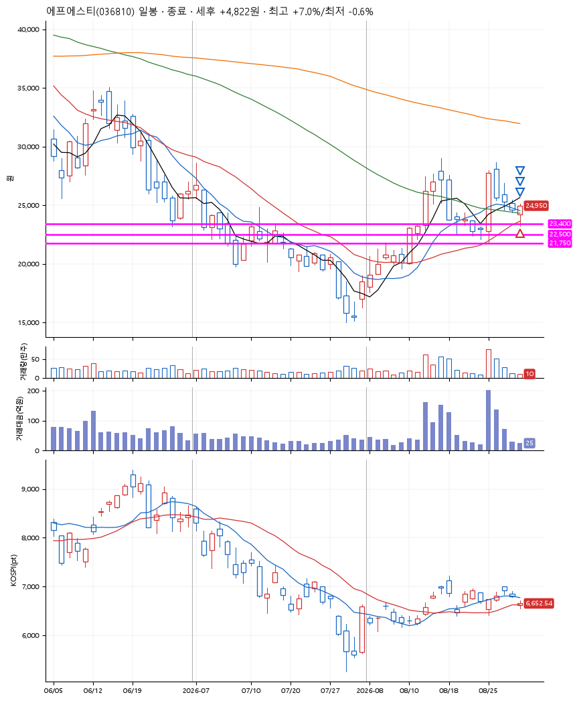
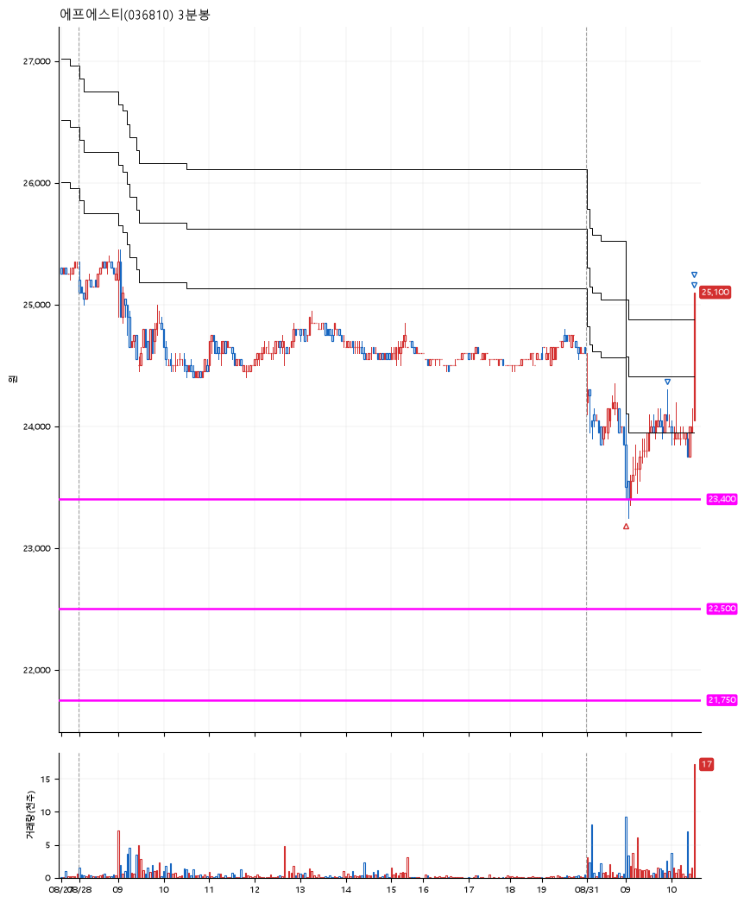

# 에프에스티(036810) · 2026-08-31

**1차 매수 → 3% 익절 → 5% 익절 → 7% 익절**

진입 2026-08-31 09:02 (D+4) · 청산 2026-08-31 10:32 (D+4) · 보유 1시간 29분

| | |
|---|---|
| 결과 | 익절 |
| 평단 / 수량 | 23,450원 · 5주 |
| 투입 | 117,250원 |
| 세후 손익 | +4,822원 (+4.11%) |
| 최고 / 최저 | +7.0% / -0.6% |
| 당일 등락 | +12.79% |
| 보유기간 | 1시간 29분 |

## 3선

| | |
|---|---|
| 1선 | 23,400원 |
| 2선 | 22,500원 |
| 3선 | 21,750원 |

기준봉 2026-08-25 (D+4)

`#KOSPI하락횡보장` `#시장을이기는종목` `#테마주`

> 반도체

## 차트

**일봉**

**3분봉**

## 체결

| 시각 | 구분 | 수량 | 판정가 | 체결가 | 오차 |
|---|---|---|---|---|---|
| 09:02 | 매수 | 5주 | 23,400 | 23,450 | +0.21% |
| 09:54 | 매도 | 2주 | 24,200 | 24,150 | -0.21% |
| 10:31 | 매도 | 2주 | 24,650 | 24,550 | -0.41% |
| 10:32 | 매도 | 1주 | 25,100 | 24,950 | -0.60% |

## 잘한 점

합리적 3선 선택. 정확히 1선에 걸치는 매수가

## 아쉬운 점

.
