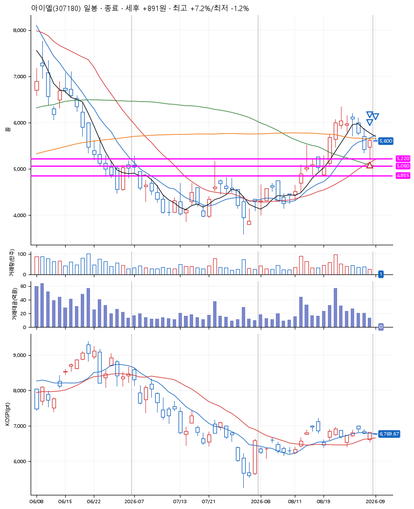
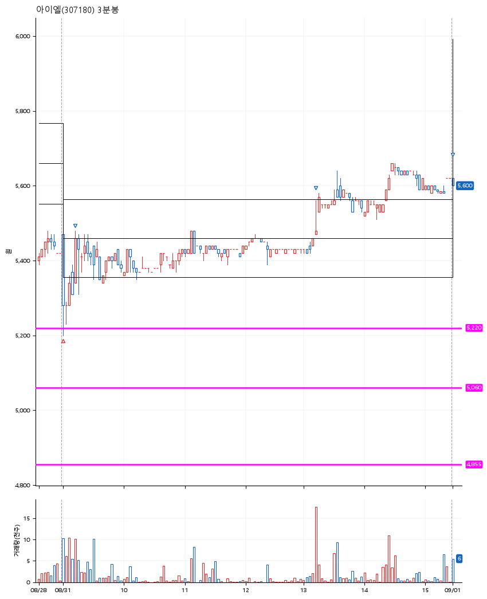

# 아이엘(307180) · 2026-09-01

**1차 매수 → 3% 익절 → 5% 익절 → 7% 익절**

진입 2026-08-31 09:01 (D+7) · 청산 2026-09-01 09:01 (D+8) · 보유 2일차

| | |
|---|---|
| 결과 | 익절 |
| 평단 / 수량 | 5,291원 · 26주 |
| 투입 | 137,566원 |
| 세후 손익 | +5,686원 (+4.13%) |
| 최고 / 최저 | +7.2% / -1.2% |
| 당일 등락 | +2.49% |
| 보유기간 | 2일차 |

## 3선

| | |
|---|---|
| 1선 | 5,220원 |
| 2선 | 5,060원 |
| 3선 | 4,855원 |

기준봉 2026-08-20 (D+8)

`#KOSPI하락횡보장` `#시장을이기는종목`

## 차트

**일봉**

**3분봉**

## 체결

| 시각 | 구분 | 수량 | 판정가 | 체결가 | 오차 |
|---|---|---|---|---|---|
| 09:01 | 매수 | 26주 | 5,220 | 5,291 | +1.36% |
| 09:13 | 매도 | 10주 | 5,450 | 5,450 | +0.00% |
| 13:14 | 매도 | 13주 | 5,560 | 5,560 | +0.00% |
| 09:01 | 매도 | 3주 | 5,670 | 5,600 | -1.23% |

## 잘한 점

합리적 3선 판단. 1선과 정확히 떨어지는 매수가.

## 아쉬운 점

.
