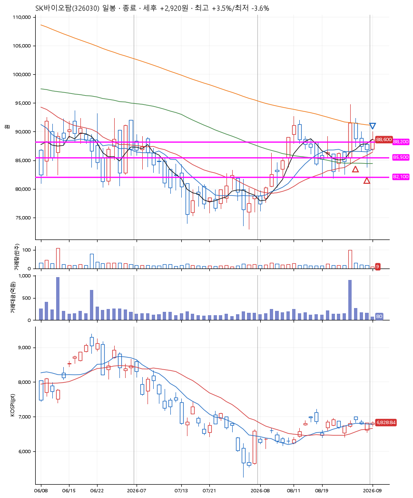
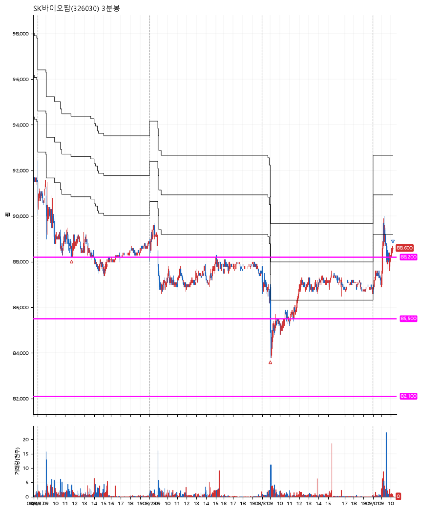

# SK바이오팜(326030) · 2026-09-01

**2차 매수 → 3% 익절 → 수동 청산**

진입 2026-08-27 11:39 (D+1) · 청산 2026-09-01 10:12 (D+4) · 보유 4일차

| | |
|---|---|
| 결과 | 익절 |
| 평단 / 수량 | 86,950원 · 2주 |
| 투입 | 173,900원 |
| 세후 손익 | +2,895원 (+1.66%) |
| 최고 / 최저 | +3.5% / -3.6% |
| 당일 등락 | +2.42% |
| 보유기간 | 6일차 |

## 3선

| | |
|---|---|
| 1선 | 88,200원 |
| 2선 | 85,500원 |
| 3선 | 82,100원 |

기준봉 2026-08-26 (D+4)

`#KOSPI하락횡보장` `#시장을이기는종목`

> 모더나 백신

## 차트

**일봉**

**3분봉**

## 체결

| 시각 | 구분 | 수량 | 판정가 | 체결가 | 오차 |
|---|---|---|---|---|---|
| 11:39 | 매수 | 1주 | 88,200 | 88,400 | +0.23% |
| 09:01 | 매수 | 1주 | 85,500 | 85,500 | +0.00% |
| 10:12 | 매도 | 2주 | 88,700 | 88,600 | -0.11% |

## 잘한 점

안정적인 3선 기준

## 아쉬운 점

소량 매수 종목이라, 분할익절하지 못하였음
