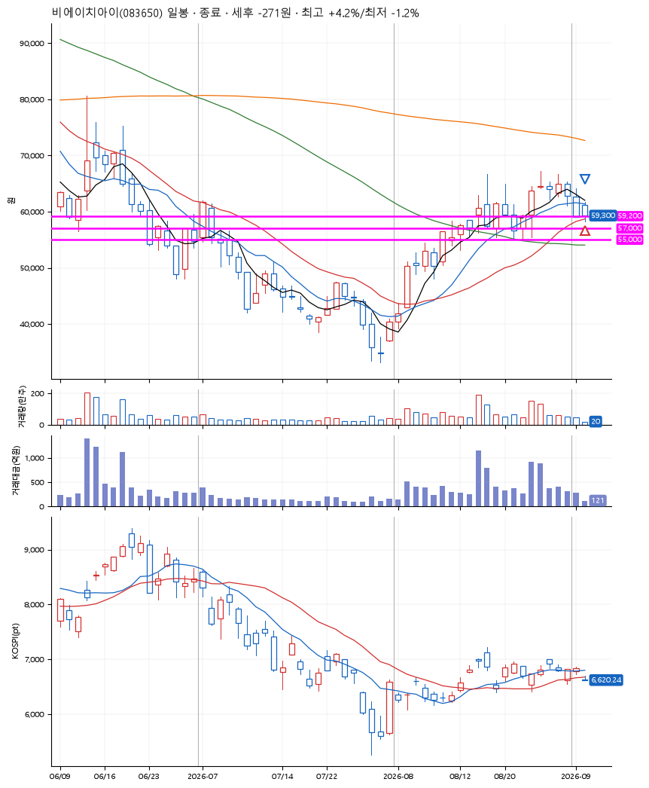
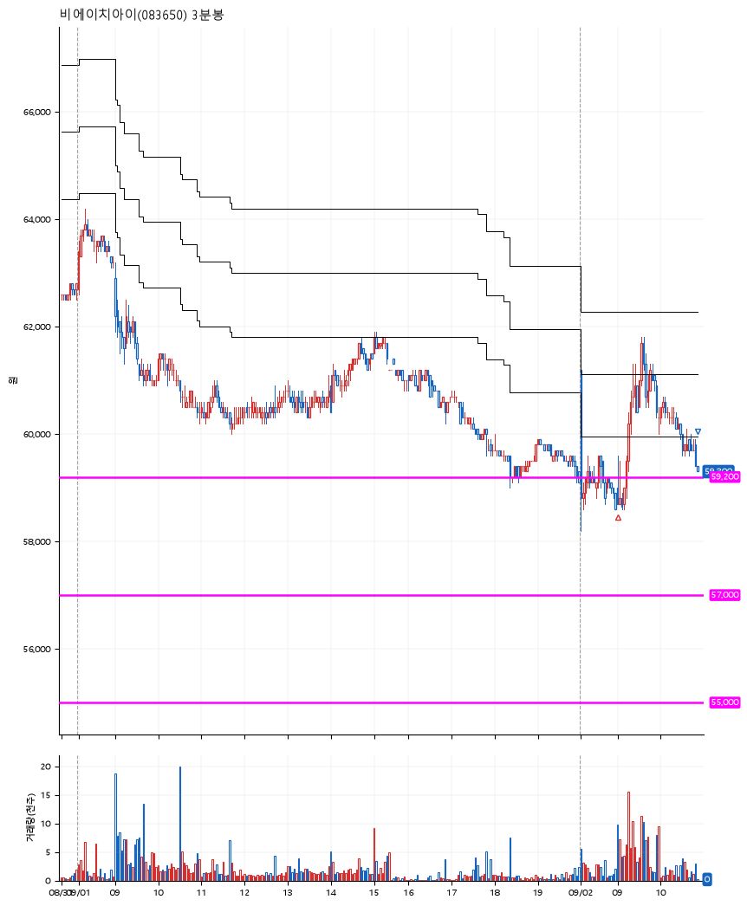

# 비에이치아이(083650) · 2026-09-02

**1차 매수 → 3% 익절 → 본절 이탈**

진입 2026-09-02 09:00 (D+6) · 청산 2026-09-02 10:51 (D+6) · 보유 1시간 51분

| | |
|---|---|
| 결과 | 손절 |
| 평단 / 수량 | 59,300원 · 2주 |
| 투입 | 118,600원 |
| 세후 손익 | -271원 (-0.23%) |
| 최고 / 최저 | +4.2% / -1.2% |
| 당일 등락 | +1.02% |
| 보유기간 | 1시간 51분 |

## 3선

| | |
|---|---|
| 1선 | 59,200원 |
| 2선 | 57,000원 |
| 3선 | 55,000원 |

기준봉 2026-08-25 (D+6)

`#KOSPI하락횡보장` `#시장을이기는종목` `#테마주`

> 원자력발전

## 차트

**일봉**

**3분봉**

## 체결

| 시각 | 구분 | 수량 | 판정가 | 체결가 | 오차 |
|---|---|---|---|---|---|
| 09:00 | 매수 | 2주 | 59,000 | 59,300 | +0.51% |
| 10:51 | 매도 | 2주 | 59,300 | 59,300 | +0.00% |

## 잘한 점

_(미작성)_

## 아쉬운 점

잘한 점 : 안정적인 3선
아쉬운 점 : 소량 매수금액(2주)으로 3% 익절했어도 실제로 익절은 안 함. 소량 매수 종목일 때 매도방안을 정리해야 할 듯.
