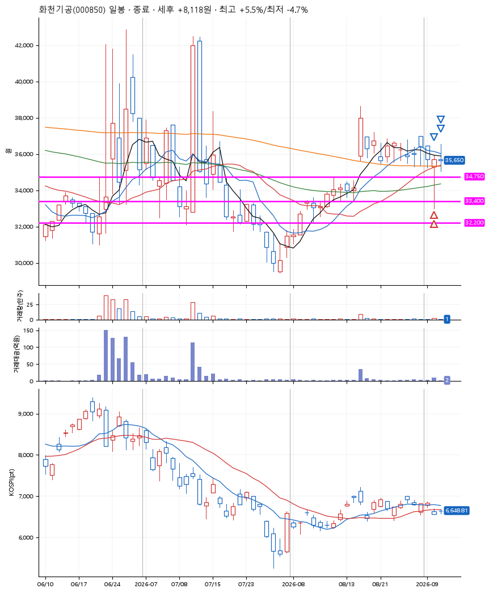
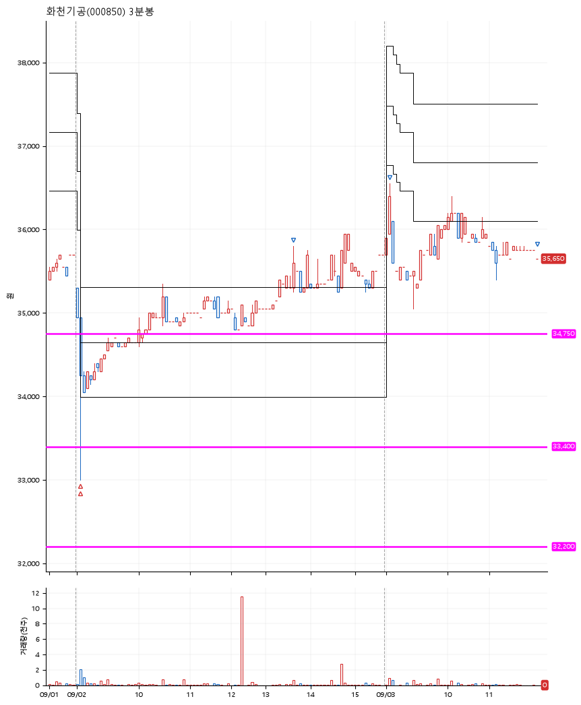

# 화천기공(000850) · 2026-09-03

**2차 매수 → 3% 익절 → 5% 익절 → 수동 청산**

진입 2026-09-02 09:04 (D+11) · 청산 2026-09-03 11:58 (D+12) · 보유 2일차

| | |
|---|---|
| 결과 | 익절 |
| 평단 / 수량 | 34,629원 · 7주 |
| 투입 | 242,400원 |
| 세후 손익 | +9,175원 (+3.79%) |
| 최고 / 최저 | +5.5% / -4.7% |
| 당일 등락 | -0.84% |
| 보유기간 | 2일차 |

## 3선

| | |
|---|---|
| 1선 | 34,750원 |
| 2선 | 33,400원 |
| 3선 | 32,200원 |

기준봉 2026-08-18 (D+12)

`#KOSPI하락횡보장` `#시장을이기는종목`

## 차트

**일봉**

**3분봉**

## 체결

| 시각 | 구분 | 수량 | 판정가 | 체결가 | 오차 |
|---|---|---|---|---|---|
| 09:04 | 매수 | 3주 | 34,650 | 34,800 | +0.43% |
| 09:05 | 매수 | 4주 | 33,300 | 34,500 | +3.60% |
| 13:33 | 매도 | 2주 | 35,700 | 35,250 | -1.26% |
| 09:03 | 매도 | 4주 | 36,500 | 36,500 | +0.00% |
| 11:58 | 매도 | 1주 | 35,750 | 35,650 | -0.28% |

## 잘한 점

갭을 띄운 시가, 지지를 받음

## 아쉬운 점

기준봉이 만들어진 이후로 너무 오래됨
