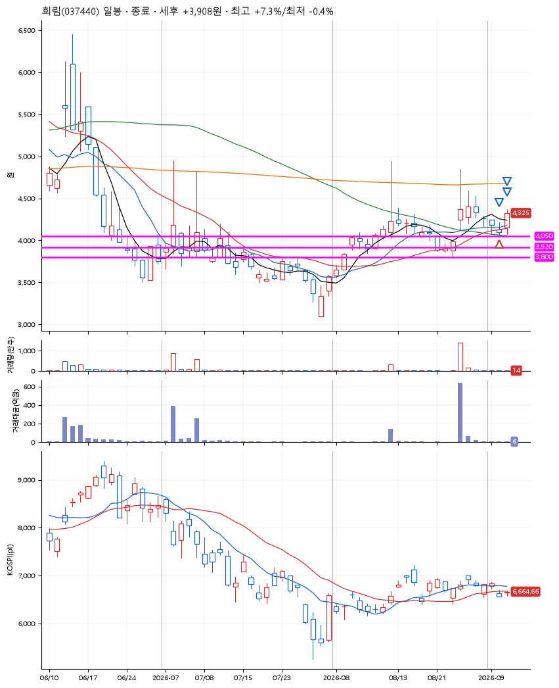
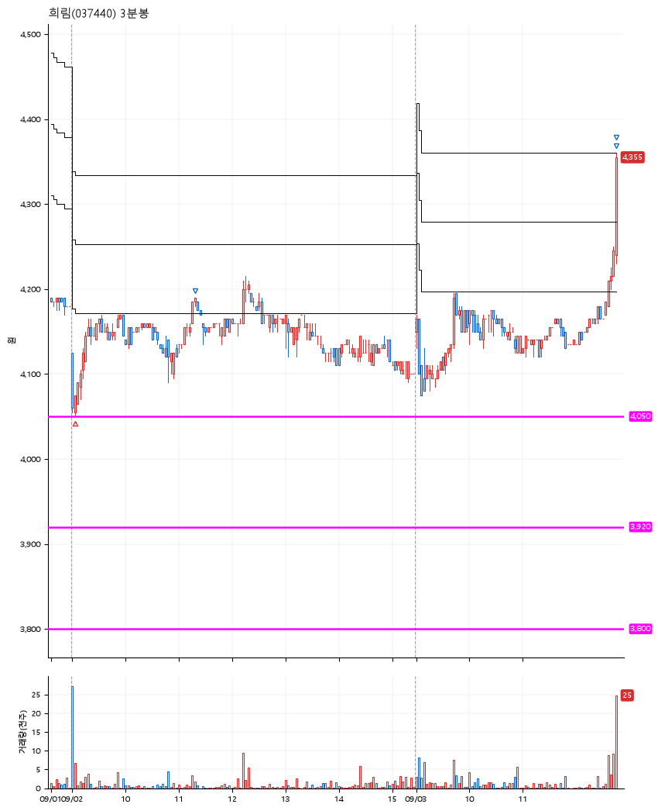

# 희림(037440) · 2026-09-03

**1차 매수 → 3% 익절 → 5% 익절 → 7% 익절**

진입 2026-09-02 09:03 (D+5) · 청산 2026-09-03 12:48 (D+6) · 보유 2일차

| | |
|---|---|
| 결과 | 익절 |
| 평단 / 수량 | 4,065원 · 34주 |
| 투입 | 138,210원 |
| 세후 손익 | +5,332원 (+3.86%) |
| 최고 / 최저 | +7.3% / -0.4% |
| 당일 등락 | +3.25% |
| 보유기간 | 2일차 |

## 3선

| | |
|---|---|
| 1선 | 4,050원 |
| 2선 | 3,920원 |
| 3선 | 3,800원 |

기준봉 2026-08-26 (D+6)

`#KOSPI하락횡보장` `#시장을이기는종목` `#테마주`

> 재건

## 차트

**일봉**

**3분봉**

## 체결

| 시각 | 구분 | 수량 | 판정가 | 체결가 | 오차 |
|---|---|---|---|---|---|
| 09:03 | 매수 | 34주 | 4,050 | 4,065 | +0.37% |
| 11:20 | 매도 | 13주 | 4,190 | 4,185 | -0.12% |
| 12:48 | 매도 | 17주 | 4,270 | 4,245 | -0.59% |
| 12:48 | 매도 | 4주 | 4,350 | 4,325 | -0.57% |

## 잘한 점

7월 초에 많이 다져진 박스에서 지지받은 듯
기준봉이 생기고 첫 번째 반등지점

## 아쉬운 점

.
